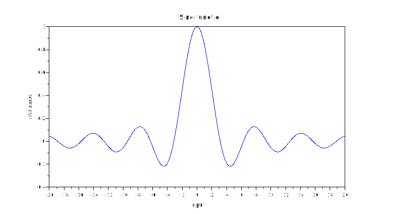
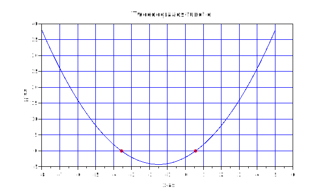
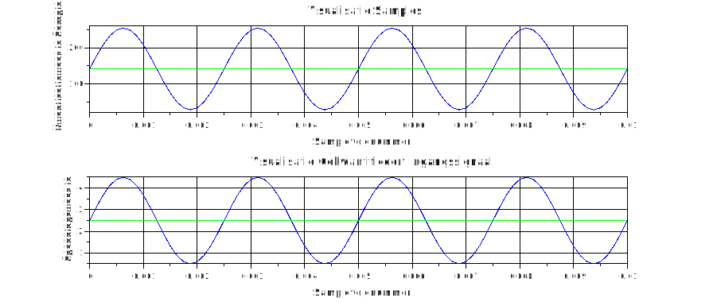
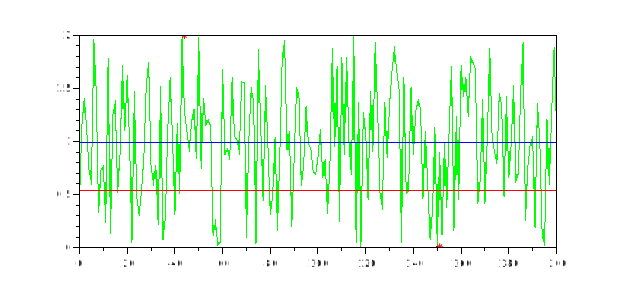

<h2>Opgave reeks 1 Scilab DSP Daan Dekoning Krekels</h2>

[TOC]

Voor iedere opgave geef je de code en grafische weergave weer in een pdf-bestand.  Je stuurt ook voor iedere opgave het codebestand mee.  Code kan je schrijven in SciNotes en bewaren.  Een scilab codebestand heeft de extentie “.sce”.

### Oefening 1

Teken in scilab de functie y=sin(πx)/πx in voor x van -20 tot 20.  Dit is een zogenaamde sinc-functie.  Varianten op deze functie vind je terug bij signaalverwerkingsmethode. Bij het maken van deze opdracht hou je best rekening met het delen van 0.  Als dit voorkomt vervang je de uitkomst met de waarde 1.

```c
// Daan Dekoning - Feb 12, 2022
// Labo 1 oefening 1
// Sinc-functie

clf;
clear;

x = [-20:0.1:20];

function [y]=f(x)
    if x <> 0 then
        y=sin(x)/ x;
    else
        y = 1;
    end
endfunction

xtitle("Sinc-functie", "input", "uitkomst")
plot(x,f)
```

> 

### Oefening 2

Ontwerp een functie die een vergelijking van de tweede graad kan inlezen, de nulpunten bepalen en deze functie kan tekenen? Vang hierbij het eventueel delen door 0 op door een melding te geven “opgelet deling door 0”  Zorg ervoor dat je code in alle omstandigheden werkt (tip hiervoor maak je best een analyse)
Een vergelijking van de tweede graad heeft volgende vorm: y=ax^2+bx+c.  Met a, b en c reëele getallen.

> - [x] Nulpunten bepalen $D = b²-4*a*c$​​ ​ 
> 
> - $D > 0 = n1=\frac{-b-\sqrt{D}}{2a}; n1=\frac{-b+\sqrt{D}}{2a}$​

```c
// Daan Dekoning - Feb 12, 2022
// Labo 1 Oefening 2
// Tweedegraadsvergelijking oplossen

// y=ax^2+bx+c

clf;
clear;

x = [-8:0.1:5];

function [y]=f(x)
    a=1;
    b=3;
    c=-2;
    if a == 0 & b == 0 & c == 0 & x == 0 then
        disp("Opgelet, deling door 0")
        y=0;
    else
        y= (a * x)^2 + (b * x) + c;
    end
    D = b^2 - 4 * a * c;
    if D > 0 then
        n1 = (-b-sqrt(D))/2;
        n2 = (-b+sqrt(D))/2;
        plot(n1, 0, '.r');
        plot(n2, 0, '.r')
    end

endfunction

//disp(f(1,3,7,5))
xtitle("Tweedegraads-functie", "x-as", "y-as")
plot(x,f)
xgrid(2)
```

> 

### Oefening 3

In een digitaal systeem wordt een sinus met amplitude 2 V ingelezen met een 10-bit ADC en een samplefrequentie van 8 kHz. De sinus is gesupponeerd op een DC-spanning van 2,5 V.
Stel dat er vier perioden van het signaal worden ingelezen.
Gevraagd: 
a) Geef de ingevoerde digitalisatie grafisch weer in een grafiek (samplewaarde in functie van de samplenummer) (bv code 255 op moment dat vierde sample wordt ingelezen).  Pas de benaming van de assen van de grafiek aan als volgt: titel grafiek : visualisatie samples; Y-as : kwantisatiewaarde sample; X-as : samplevolgnummer
b) Zet de grafiek van a) om in een amplitude in functie van de tijd grafiek.  Pas de benaming van de assen van de grafiek aan als volgt: titel grafiek : visualisatie  gekwantificeert ingangssignaal; Y-as : spanningswaarde 
c) Bepaal de gemiddelde waarde van het digitaal ingelezen signaal
d) Bepaal de amplitude variatie van het ingelezen signaal

> 1/2 pi f t
> 
> - [x] Digitale weergave
> - [x] Amplitude weergave
> - [x] Gemiddelde waarde
> - [x] Amplitude variatie

```c
// Daan Dekoning - Feb 13, 2022
// Labo 1 Oefening 3
// Analoge spanning

clf;
clear;


t = 0.0 : 0.000125 : 0.01; // 0.01 seconden signaal, fs=8kHz

sin_1Hz = 2*sin(2*%pi*400*t); // 2V amplitude 400Hz signaal

// DC spanning 2.5V
DC = 2.5;

// Het testsignaal bestaat uit de som van de 3 signalen
signal = DC + sin_1Hz;

function gemiddelde(t, sig)
    // Bepalen van gemiddelde waarde van signaal
    gemid = mean(sig)
    disp (gemid, "gemiddelde waarde = ")
    // Maken van rijvector met waarde van gemid
    gemiddelde = gemid*(ones(t));
    // Weergeven van gemiddelde waarde als een lijn op de grafiek in het groen
    plot (t, [gemiddelde], 'g.')
endfunction

subplot(2, 1, 1)
kwantis = (signal/max(signal))*255;
xtitle("Visualisatie Samples", "Samplevolgnummer", "Kwantisatiewaarde Sample")
xgrid(1)
plot(t,kwantis); // (signaal / 4.5)*255
gemiddelde(t, kwantis)

subplot(2, 1, 2)
xtitle("Visualisatie Gekwantificeert Ingangssignaal", "Samplevolgnummer", "Spanningswaarde")
xgrid(1)
plot(t,signal);
gemiddelde(t, signal)

disp("Amplitude variatie= ", stdev(signal))
```

> 
> 
> `"Amplitude variatie= "   1.4142136`

### Oefening 4

Maak een grafiek waarin een uniform randomsignaal (in het groen) met 200 randomwaarden gelegen tussen de waarde 0 en 4.  Iedere ramdomwaarde stelt een bepaalde amplitude voor.
Gevraagd: 
a) Bepaal het maximum en minimum van dit signaal en geef weer in de grafiek waar deze zich bevinden aan de hand van een asterix (*) in het rood.
b) Bepaal de “DC-component” van dit signaal en maak deze zichtbaar in een grafiek via een blauwe lijn.  De DC-component kan gevonden worden door het gemiddelde te bepalen van dit signaal (kijk of hiervoor geen instructie is)
c) Bepaal de deviatie va het signaal tot deze “DC-component”.  Welk is de gemiddelde amplitudegrootte van dit signaal Kijk of je voor deviatie geen instructie vind.  Deviatie geeft de afwijking weer van het randomgetal ten opzichte van het gemiddelde.  Op deze wijze geeft de deviatie de “gemiddelde” amplitude weer van het random signaal

> - [x] Max en min
> 
> - [x] DC-component bepalen
> 
> - [x] Deviatie bepalen

```c
// Daan Dekoning - Feb 13, 2022
// Labo 1 Oefening 4
// Random Signaal

clf;
clear;

t = [0:1:200];

r=(rand(1,201,'uniform')/1)*2 // Random tussen 0 en 2

plot(t, r,'g')
[y, x] = min(r)
plot(x, y, '*r')

[y, x] = max(r)
plot(x, y, '*r')

// Bepalen van gemiddelde waarde van signaal
gemid = mean(r)
//disp (gemid, "gemiddelde waarde = ")
// Maken van rijvector met waarde van gemid
gemiddelde = gemid*(ones(t));
// Weergeven van gemiddelde waarde als een lijn op de grafiek in het groen
plot (t, [gemiddelde], 'b')

st = stdev(r) // Standaard deviatie bepalen
st_line = st * (ones(t)) // Lijn maken om deze stdev weer te geven
plot(t, st_line, 'r') // Lijn plotten
disp("Standaard deviatie=", st)
```

> 
> 
> Gemiddelde = blauw; Standaard deviatie = rood
> 
> `"Standaard deviatie="  0.5952740`
