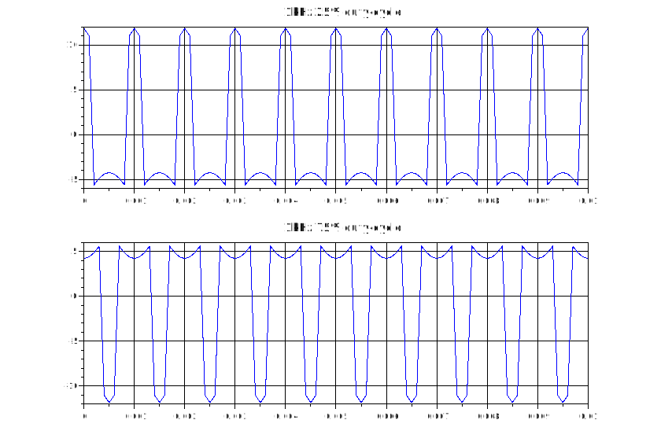
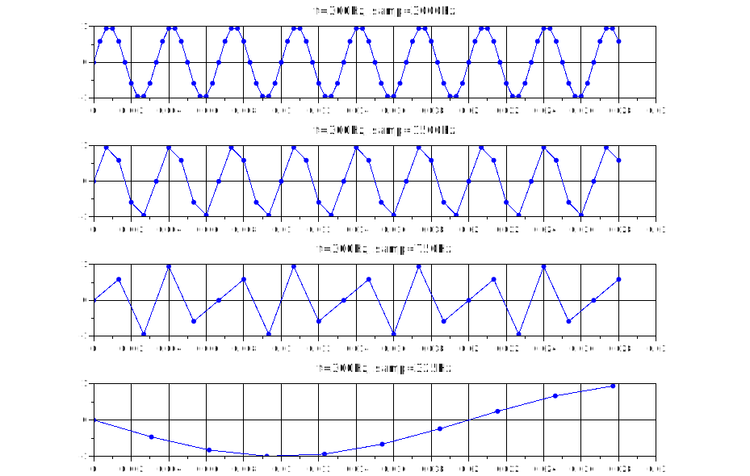
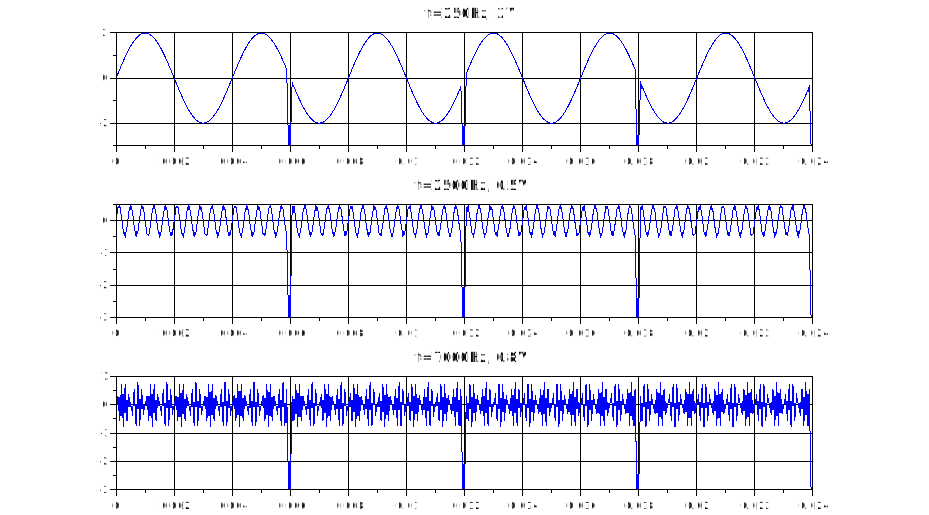
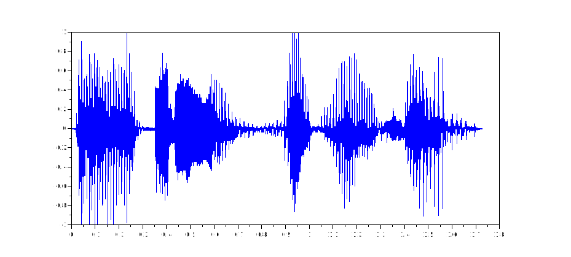

<h2>Opgaven reeks 2 Scilab DSP Daan Dekoning Krekels</h2>

[TOC]

Voor iedere opgave geef je de code en grafische weergave weer in een pdf-bestand. Je stuurt ook voor iedere opgave het codebestand mee. Code kan je schrijven in SciNotes en bewaren. Een scilab codebestand heeft de extentie “.sce”.

### Oefening 1

1. Gegeven de vergelijking om een pulstrein te genereren met een bepaalde duty-cycle:
   
   $u=U_{max}.\frac{\tau}{T}+2U_{max}\times\frac{\tau}{T}[\frac{\sin{\left(\pi\frac{\tau}{T}\right)}}{\pi\tau T}\cos{\left(\omega t\right)}+\ \frac{\sin{\left(2\pi\frac{\tau}{T}\right)}}{2\pi\tau T}\cos{\left(2\omega t\right)}+\frac{\sin{\left(3\pi\frac{\tau}{T}\right)}}{3\pi\tau T}\cos{\left(3\omega t\right)}+...]$​​
   
   Hierbij is $\frac{\tau}{T}$ de duty-cycle van de puls en $T$ de periode van het signaal
   
   Schrijf een code in scilab die een pulstrein weergeeft met duty-cycle 25 % en duty-cycle 75% voor een frequentie van 1 kHz. Om de puls te vormen maak je gebruik van de eerste 7 harmonischen.

> $\omega=2 \times \pi \times f$

```c
// Daan Dekoning - Feb 15, 2022
// Labo 2 Oefening 1
// Pulstrein

clf;
clear;
t = 0.0 : 0.0001 : 0.01;

function [u]=pulstrein(duty_c, t)
    Umax=12 // 12V Umax
    tao=duty_c // Tao is de duty-cycle (0.25 = 25%, ...)
    T=1 // 1 periode
    f=1000 // Frequentie 1 kHz

    tussenR = Umax * (tao/T) + 2 * Umax * (tao/T) // Tussenresultaat van begin van de vergelijking
    i=0; // Teller
    l=0; // Tweede tussenresultaat
    while i<7
        i=i+1; // Teller naar boven
        l=l+(sin(i * %pi * ((tao/T)))/(i * %pi * tao * T)) * cos(i * 2 * %pi * f * t) // Optellen bij tussenresultaat
    end
    u=tussenR * l; // Tussenresultaten vermenigvuldigen
endfunction


subplot(2, 1, 1)
plot(t, pulstrein(0.25))
xtitle("1kHz 25% duty-cycle")
xgrid(1)

subplot(2, 1, 2)
plot(t, pulstrein(0.75))
xtitle("1kHz 75% duty-cycle")
xgrid(1)
```

> 

### Oefening 2

2. A) Geef in scilab onder elkaar in één graphic window weer:
   
   - Een signaal van 300 Hz gesampled met een frequentie van 3000 Hz
   - Een signaal van 300 Hz gesampled met een frequentie van 1500 Hz
   - Een signaal van 300 Hz gesampled met een frequentie van 750 Hz
   - Een signaal van 300 Hz gesampled met een frequentie van 325 Hz
   - Zorg ervoor dat de X-schaal de tijd in ms aangeeft.

```c
// Daan Dekoning - Feb 15, 2022
// Labo 2 Oefening 2
// Samplefrequenties

clf;
clear;

function [x]=t_xHz(f)
    x= 0 : 1/f : 0.028; // xHz samplefrequentie
endfunction

function [y]=sin_300Hz(t)
    y=sin(2 * %pi * 300 * t) // 300Hz sinus, samplefrequentie afhankelijk van de t
endfunction

// f=300Hz, samp=3000Hz
subplot(4, 1, 1)
plot(t_xHz(3000), sin_300Hz)
plot(t_xHz(3000), sin_300Hz, '.b')
xtitle("f=300Hz, samp=3000Hz")
xgrid(1)

// f=300Hz, samp=1500Hz
subplot(4, 1, 2)
plot(t_xHz(1500), sin_300Hz)
plot(t_xHz(1500), sin_300Hz, '.b')
xtitle("f=300Hz, samp=1500Hz")
xgrid(1)

// f=300Hz, samp=750Hz
subplot(4, 1, 3)
plot(t_xHz(750), sin_300Hz)
plot(t_xHz(750), sin_300Hz, '.b')
xtitle("f=300Hz, samp=750Hz")
xgrid(1)

// f=300Hz, samp=325Hz
subplot(4, 1, 4)
plot(t_xHz(325), sin_300Hz)
plot(t_xHz(325), sin_300Hz, '.b')
xtitle("f=300Hz, samp=325Hz")
xgrid(1)
```

> 

​    B) Bij welke samplefrequenties treedt aliasing op? Geef hiervoor een verklaring hoe dit komt.

> Bij een samplefrequentie van 325Hz treedt er aliasing op. Aliasing treedt op vanaf een samplefrequentie lager dan de dubbele frequentie die we willen uitlezen.

### Oefening 3

3. A) Maak een testsignaal dat 24 ms lang duurt bestaande uit een signaal van 250 Hz en 2 V amplitude, een signaal van 2500 Hz en 0.5 V amplitude en een signaal van 7000 Hz en 0.8 V amplitude. Breng hierin een storing aan die telkens twee sampletijden duurt en gelijk is aan waarde -3. Laat de storing terugkomen om de 6 milliseconden. De samplefrequentie bedraagt 16 kHz.
   
   Geef het signaal weer met een tijdsas.
   
   > ​    (niet te pletter zoeken naar een fomule, gewoon in de variabele editor aanpassen)
   
   ```c
   // Daan Dekoning - Feb 15, 2022
   // Labo 2 Oefening 3
   // Testsignaal met storingen
   
   clf;
   clear;
   
   samp_f=16000;
   samp_l=0.024;
   t= 0 : 1/samp_f : samp_l; // 16kHz sample, 24ms
   
   function [y]=sin_xHz(f, U, t)
       y = U * sin(2 * %pi * f * t) // xHz sinus, samplefrequentie afhankelijk van t en Umax afhankelijk van U
   endfunction
   
   sin_250Hz = sin_xHz(250, 2, t); // f=250Hz, Umax=2V
   i=0; // Teller
   // Iedere 6ms een storing toevoegen
   while i<samp_l
       i=i+0.006; // Teller naar boven met 6ms
       sin_250Hz(samp_f * i)= -3; // Storing toevoegen
       sin_250Hz((samp_f * i)+1)= -3; // Storing2 toevoegen
   end
   
   subplot(3, 1, 1)
   plot(t, sin_250Hz)
   xtitle("f=250Hz, 2V")
   xgrid(1)
   
   sin_2500Hz = sin_xHz(2500, 0.5, t); // f=2500Hz, Umax=0.5V
   i=0; // Teller
   // Iedere 6ms een storing toevoegen
   while i<samp_l
       i=i+0.006; // Teller naar boven met 6ms
       sin_2500Hz(samp_f * i)= -3; // Storing toevoegen
       sin_2500Hz((samp_f * i)+1)= -3; // Storing2 toevoegen
   end
   
   subplot(3, 1, 2)
   plot(t, sin_2500Hz)
   xtitle("f=2500Hz, 0.5V")
   xgrid(1)
   
   sin_7000Hz = sin_xHz(7000, 0.8, t); // f=7000Hz, Umax=0.8V
   i=0; // Teller
   // Iedere 6ms een storing toevoegen
   while i<samp_l
       i=i+0.006; // Teller naar boven met 6ms
       sin_7000Hz(samp_f * i)= -3; // Storing toevoegen
       sin_7000Hz((samp_f * i)+1)= -3; // Storing2 toevoegen
   end
   
   subplot(3, 1, 3)
   plot(t, sin_7000Hz)
   xtitle("f=7000Hz, 0.8V")
   xgrid(1)
   ```

> 

### Oefening 4

4. Ga naar volgende website : http://www.wavsource.com/ en download een waf-fille. Tracht deze file in te lezen in scilab en weer te geven in een plotfunctie.
   
   > (iets met een stem kiezen)
   
   ```c
   // Daan Dekoning - Feb 17, 2022
   // Labo 2 Oefening 4
   // WAV audio-file weergeven
   
   clf;
   clear;
   
   [y, f, bit]=wavread('C:\Users\Daan Dekoning\Documents\Vakken\Digital Signal Processing\Labo\Opgave 2 Oefeningen Scilab\buy_two.wav');
   
   t = [1:1:length(y)]*(1/f);
   
   plot(t,y)
   ```
   
   > 

### Oefening 5

5. Probeer het geluid van oefening 4 af te spelen, bekijk hiervoor volgende instructie https://help.scilab.org/docs/5.3.1/en_US/sound.html
   
   ```c
   // Daan Dekoning - Feb 17, 2022
   // Labo 2 Oefening 5
   // WAV audio-file weergeven
   
   clf;
   clear;
   
   [y, f, bit]=wavread('C:\Users\Daan Dekoning\Documents\Vakken\Digital Signal Processing\Labo\Opgave 2 Oefeningen Scilab\buy_two.wav');
   
   t = [1:1:length(y)]*(1/f);
   
   plot(t,y)
   sound(y, f, bit)
   ```

​    B) Verdubbel de samplefrequentie en speel het geluid opnieuw af.

```c
sound(y, f*2, bit)
```

​    C) Halveer de samplefrequentie en speel het geluid opnieuw af.

```c
sound(y, f/2, bit)
```

​    D) Verklaar hetgeen je hoort.

> Bij de verdubbelde frequentie is de toon van de stem veel hoger en sneller. Bij de Halvering van de samplefrequentie is de stem laag en sloom.