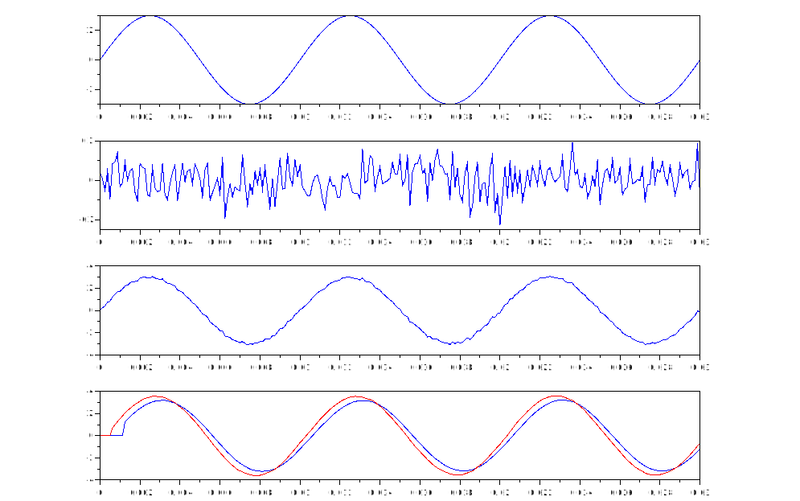
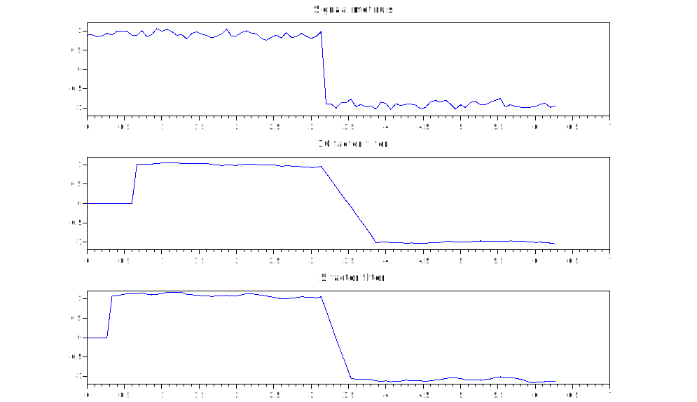

# Opgave 3 Moving Average Filter

Student: Jesse Denaux, Daan Dekoning

## Opgave 1

Onderzoek de invloed van het aantal factoren in een moving average filter om ruis van een signaal zoveel mogelijk weg te filteren.

Hoe ga je te werk?

a. Je creëert in scilab een sinussignaal met amplitude 3V en frequentie 100 Hz Je sampeld deze sinus met een frequentie van 8 kHz en slaat 3 perioden in samples op in een vector.

b.  Je creëert in scilab een ruissignaal met een amplitude rond de 100 mV (pieken kunnen hogere waarden bekomen) 

c. Je voegt beide signalen samen en gebruikt dit als ingangssignaal voor de filter

d. Je ontwerpt een moving average filter met 10 factoren en een moving averagefilter met 5 factoren

e. Je filtert het samengevoegde signaal (sinus 100Hz en ruis) met beide filters en geef het resultaat weer in 1 grafiek.  Links de resultaten van de filter met 10 factoren, rechts de resultaten van de filter met 5 factoren.  In een voorstelling zoals hieronder is weergegeven voor één filter: (volgorde : sinus, ruis, samengesteld signaal , gefilterd signaal

```cpp
// Daan Dekoning - Feb 22, 2022
// Labo 3 Oefening 1
// Moving average filter om ruis weg te filteren

clf;
clear;

//a.    Je creëert in scilab een sinussignaal met amplitude 3V en frequentie 100 Hz Je sampeld deze sinus met een frequentie van 8 kHz en slaat 3 perioden in samples op in een vector.
samp_f=8000; // 8kHz sample frequentie
samp_l=0.03; // 3 periodes van de sinus lang
t= [0 : 1/samp_f : samp_l]; // 16kHz sample, 24ms
sin_ampl=3; // 3V amplitude
sin_f=100; // 100Hz frequentie
sin_100Hz = sin_ampl*sin(2*%pi*sin_f*t);

subplot(4, 1, 1)
plot(t, sin_100Hz);

//b.    Je creëert in scilab een ruissignaal met een amplitude rond de 100 mV (pieken kunnen hogere waarden bekomen)  
r=(rand(length(t),1,'normal'))*0.075 // Random rond 100mv

subplot(4, 1, 2);
plot(t, r);
//c.    Je voegt beide signalen samen en gebruikt dit als ingangssignaal voor de filter

ruis_sin = r' + sin_100Hz; // r wordt eerst omgezet naar een kolom
subplot(4, 1, 3);
plot(t, ruis_sin);

//d.    Je ontwerpt een moving average filter met 10 factoren 

// == 100 punten nemen
filter_10f_output = zeros(length(t),1);
FACTOREN = 10
for i=FACTOREN+1:length(t)
    j=0;
    while j<=FACTOREN
        filter_10f_output(i)=filter_10f_output(i) + (1/FACTOREN)*ruis_sin(i-j);
        j=j+1;
    end
end

subplot(4, 1, 4);
plot(t, filter_10f_output);

// en een moving averagefilter met 5 factoren
filter_5f_output = zeros(length(t),1);
FACTOREN = 5
for i=FACTOREN+1:length(t)
    j=0;
    while j<=FACTOREN
        filter_5f_output(i)=filter_5f_output(i) + (1/FACTOREN)*ruis_sin(i-j);
        j=j+1;
    end
end

t2=(0: 1/8000 : 0.015);
plot(t, filter_5f_output, 'r');

//e.    Je filtert het samengevoegde signaal (sinus 100 Hz en ruis) met beide filters en geef het resultaat weer in 1 grafiek.  Links de resultaten van de filter met 10 factoren, rechts de resultaten van de filter met 5 factoren.  In een voorstelling zoals hieronder is weergegeven voor één filter: (volgorde : sinus, ruis, samengesteld signaal , gefilterd signaal
```

> 

a. Van beide filters maak je de stapresponse zicht baar in 1 grafiek, tezamen met de stap.  Creeer een aantal stappen met een gemaakte blokstpanning van 100Hz. 

Vraag: welk van beide filters heeft de beste stapresponse en hoe zie je dat?

> De filter met 5 facteren heeft een beter stapresponse omdat de helling stijler is dan die van de filter met 10 factoren. Een nadeel van deze filter is dat er met minder factoren ook minder ruis wordt weggehaald. 

b. Geef van beide filters het bodedigram weer in één grafiek met legende.

Vraag: welk van beide filters verdient jouw voorkeur en waarom?

> 

```cpp
// Daan Dekoning - Feb 22, 2022
// Labo 3 Oefening 1
// Moving average filter om ruis weg te filteren

clf;
clear;

// f.	Van beide filters maak je de stapresponse zicht baar in 1 grafiek, tezamen met de stap.  Creeer een aantal stappen met een gemaakte blokstpanning van 100 Hz.  

// zeros() en ones() geburiken
Sample_f_Hz = 15
t = (0:1/Sample_f_Hz:2*%pi)';
squ_100Hz = 0.9*squarewave(t);
subplot(3, 1, 1);


//b.	Je creëert in scilab een ruissignaal met een amplitude rond de 100 mV (pieken kunnen hogere waarden bekomen)  
r=(rand(length(t),1,'normal'))*0.075 // Random rond 100mv

ruis_squ = squ_100Hz + r;
plot(t, ruis_squ);
xtitle("Signaal met ruis");

//      d.	Je ontwerpt een moving average filter met 10 factoren 
filter_10f_output = zeros(length(t),1);
FACTOREN = 10
for i=FACTOREN+1:length(t)
    j=0;
    while j<=FACTOREN
       // disp(i-j)
        filter_10f_output(i)=filter_10f_output(i) + (1/FACTOREN)*ruis_squ(i-j);
        j=j+1;
    end
end

subplot(3, 1, 2);
plot(t, filter_10f_output);
xtitle("10 factor filter");

//      en een moving averagefilter met 5 factoren
filter_5f_output = zeros(length(t),1);
FACTOREN = 5
for i=FACTOREN+1:length(t)
    j=0;
    while j<=FACTOREN
       // disp(i-j)
        filter_5f_output(i)=filter_5f_output(i) + (1/FACTOREN)*ruis_squ(i-j);
        j=j+1;
    end
end

subplot(3, 1, 3);
plot(t, filter_5f_output);
xtitle("5 factor filter");
```

> 


## Opgave 2

Zie apart verslag.