# Kennistoets (50 % punten)

## Overzicht tijdscontinue signalen en systemen

1. Volgende samples worden ingelezen van een analoog signaal.                                       
   x[0] = -3; x[1] = -6; x[2] = 4; x[3] = 2; x[4] = 4; x[5] = -2; x[6] = -1; x[7] = 4 <br/>Bepaal de amplitude, het vermogen en de DC-component van het signaal. 
   - DC-component = gemiddelde $\mu=\frac{\left(x_{0}+x_{1}+\ldots+x_{N-1}\right)}{N}$
   - Amplitude = gemiddelde deviatie = $\frac{abs(x_i - µ)+... abs(x_n - µ)}{N}$
     - De som van de absolute waarde van alle deviaties van de individuele samples en vervolgens te delen door het aantal samples N.
   - Vermogen = Standaard deviatie = $\sigma=\sqrt{\frac{\left(x_{0}-\mu\right)^{2}+\left(x_{1}-\mu\right)^{2}+\ldots+\left(x_{N-1}-\mu\right)^{2}}{N-1}}$
     - Door de amplitude te kwadrateren (P = U2/R) en vervolgens de vierkantswortel te nemen als compensatie van het kwadrateren.
   
2. Verklaar volgende begrippen: 
   
   - Domein 
     - Men spreekt van het tijdsdomein als de tijd als onafhankelijke variabele wordt genomen en frequentiedomein als de frequentie als onafhankelijke variabele wordt gebruikt. Wanneer de samples op de horizontale as gewoon met een nummer zijn gelabeld wordt meestal gerefereerd naar het tijdsdomein.
   - Gemiddelde (µ) 
     - Te bepalen door verschillende waardes op te tellen en te delen door het aantal. Dit wordt ook wel de DC-component genoemd.
   - Standaarddeviatie ($\sigma$) 
     - Beschrijft hoeveel een bepaalde sample afwijk van het gemiddelde in vermogen. Meet enkel het AC-gedeelte.

3. Welk nut heeft het om een histogram-op te stellen van een discreet signaal? Welke informatie kan je hieruit halen? 
   
   - 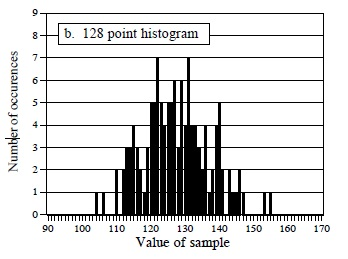
   - Met een histogram kan je gemakkelijk de gemiddelde waarde en de standaard deviatie berekenen. In een histogram kunnen samples met dezelfde waarde gemakkelijk gegroepeerd worden. 

4. Welk nut heeft het om een pmf op te stellen van een discreet signaal? Welke informatie kan je hieruit halen? 
   
   - 
   - Bij een probability mass functie (kansfunctie) geeft de Y-as dezelfde informatie weer maar in verhouding tot het totaal aantal samples 𝑁. Een pmf beschrijft de waarschijnlijkheid (probability) dat een bepaalde waarde zal gegenereerd worden. 

5. Wat is/zijn de verschillen tussen een histogram, pmf en pdf bij digitaal signaal verwerking? Geef ook aan waarvoor ze nuttig zijn. 
   
   - Het histogram en de pmf zijn enkel bruikbaar met discrete data zoals een gedigitaliseerd signaal. De probability density function of kansdichtheidsfunctie, ook wel eens probability distribution functie genoemd, is een functie die hetzelfde doet bij continue signalen als de probabiltiy mass functie bij discrete signalen.
   - Een histogram geeft een blok weer waarvan de hoogte afhankelijk is van het aantal keer dat een bepaalde waarde voorkomt.
   - Een pmf, probability mass functie, kansfunctie geeft hetzelfde weer als een histogram maar dan in verhouding tot het totaal aantal samples.
   - Een pdf, probability density function, kansdichtheidsfunctie is hetzelfde als een pmf maar dan voor een continu signaal dus bestaat niet uit individuele samples. Een pdf wordt 90 graden gedraaid naast het signaal weergegeven. 
   - 
   - 

6. Leg het principe (algoritme) uit hoe je een digitale ruisgeneratie kan bekomen die een Gauscurve benadert. Geef ook aan voor welke toepassing(en) je deze digitale ruisgeneratie kan gebruiken 
   
   - Om ruis te creëren met een Gaussvormige pdf-functie gaat men voor iedere sample 12 random getallen opwekken en er vervolgens 6 van aftrekken. Dit om het gemiddelde gelijk aan 0 te maken. Maak vervolgens een vermenigvuldiging om de gewenste  standaarddeviatie te bekomen en tel tenslotte het gewenste gemiddelde erbij.
   - Digitale ruisgeneratie kan je bekomen door iedere sample 12 random waarden te genereren tussen 0 en 1. Hierdoor zal het gemiddelde van deze 12 waarden 6 zijn en de SD 1 wat een vereiste is om een gauscurve te bekomen. <br/>Een andere methode is om 2 random waarden te genereren en deze te vermenigvuldigen met de gewenste SD en hierbij het gemiddelde bij op te tellen. 
   Het wordt gebruikt bij het verwerken van digitale signalen

   - 

## Analoog en digitaal conversie

1. Een signaal met piekwaarde 2 V wordt aangelegd aan een 12-bit ADC (met bereik 5 V). Indien op dit signaal een ruis van 2 mV piek aanwezig is, bepaal dan de totale hoeveelheid ruis in functie van LSB na kwantisatie. 
   
   - De ADC zelf zal een extra ruissignaal toevoegen met amplitude dat overeenkomt met 0.29/4096 of 1/14000 van het volledige schaalbereik.
   - 5V komt overeen met 4095 𝐿𝑆𝐵. Stel dat de ADC werkt volgens lineaire kwantisatie dan komt 2 mV overeen met 0,002 V × 4095 𝐿𝑆𝐵 = 8.19LSB Willen we nu weten wat de totale ruis (C) is na kwantisatie dan kunnen we deze vinden door de variantie (eerder reeds besproken) van de ruis die reeds aanwezig was is in het analoog signaal (A) op te tellen bij de variantie van de ruis die gegenereerd wordt tijdens het kwantiseren (B). In wiskundige notatie levert dit het volgende op: $\sqrt{A^{2}+B^{2}}=C$ of $\sqrt{8.19^{2}+0,29^{2}}=C$, dat is 8.195. Om te weten te komen hoeveel de ruis in percentage is gestegen ten opzichte van de hoeveelheid ruis die reeds aanwezig was in het signaal kunnen we volgende bewerking toepassen: $\frac{C - A}{A} \times 100\% = \frac{8.195 − 8.19}{8.19} \times 100\% =0,061\%$.

2. Omschrijf het begrip dither 
   
   - Lichte variaties in een signaal kunnen toch opgemerkt worden door een kleine hoeveelheid ruis toe te voegen aan het signaal.
   - 

3. Wat houdt het begrip niquistfrequentie in bij DSP?
   
   - De Nyquist sampling theorema of Shannon samplingtheorema. Deze stelling geeft aan dat een continu signaal enkel goed kan worden gesampled als het geen frequenties bevat boven de **helft** van de samplefrequentie.
   - 

4. Wat wordt bedoeld met aliasing? 
   
   - Het fenomeen van sinusoïden die tijdens het samplen van frequentie veranderen wordt aliasing genoemd. Vergelijk met een persoon die een andere identiteit aanneemt (een alias). De sinusoïde wordt in deze situatie dus opgeslagen met een andere frequentie dan de zijne.

5. Beschrijf beknopt aan de hand van tijd- en frequentiekarakteristieken hoe je digitaal – analoog conversie bekomt. 
   
   - DAC verkrijgen we door het signaal door een laagdoorlaat filter te sturen met afsnijfrequentie de nyquistfrequentie. 
   
   - De sample wordt vastgehouden tot de volgende sample is gearriveerd (nulde-orde hold). Het frequentie domein is dan nog hetzelfde als bij de impulstrein. Hier voeren we dan een sinc functie op waardoor we het analoge signaal terug krijgen en de juiste frequentiekarakteristiek.  
   
   - 

## Lineaire Systemen

1. Omschrijf wat een lineair systeem is en geef drie voorbeelden van een lineair systeem. 
   - De drie eigenschappen homogeniteit, additiviteit en shift invariantie leveren de wiskundige basis om een systeem als lineair te kunnen definiëren. 
     - Homogeniteit:  verandering in de amplitude van het ingangssignaal een overeenkomstige verandering veroorzaakt in de amplitude van het uitgangssignaal.
       
     - Additiviteit: Beschouw een systeem waar een input 𝑥1[𝑛] een output levert gelijk aan 𝑦1[𝑛] . Beschouw eveneens een andere input 𝑥21[𝑛] die een output 𝑦2[𝑛] levert. Dit systeem wordt additief genoemd als dit geldt voor alle mogelijke ingangssignalen.
       
     - Shift invariantie: Met shift invariantie wordt bedoeld dat als er een verschuiving in de tijd gebeurt in het ingangssignaal het uitgangssignaal op een identieke wijze verschuift.
       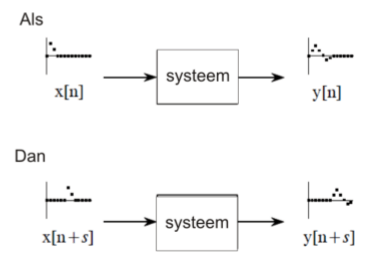
       - Voorbeelden
         - lineaire audio-versterker, thermo-weerstand, piëzo-elektrische sensor
         - Golven zoals geluidsgolven en elektromagnetische golven
         - Elektrische circuits die bestaan uit weerstanden, condensatoren en spoelen
         - Elektronische circuits zoals versterkers en filters
2. Geef 2 voorbeelden van een niet-lineair systeem 
   1. Diode, transformator, logaritmische versterker
   2. Systemen die geen statische lineariteit bevatten zoals bijvoorbeeld de relatie tussen vermogen en spanning over een weerstand
   3. Systemen waarbij aan de ingang een sinus wordt aangelegd en de uitgang deze niet weergeeft zoals piekdetectie, sinus-blokgolfomzettingen, cross-oververvorming, sinusvervormingen (clippen), sweepgeneratie, …
   4. Vermenigvuldigen van een signaal door een ander signaal zoals bijvoorbeeld amplitudemodulatie.

3. Wat wordt bedoeld met een homogeen systeem
   - Verandering in de amplitude van het ingangssignaal een overeenkomstige verandering veroorzaakt in de amplitude van het uitgangssignaal.
     
4. Wat houdt shift invariantie in? 
   - Met shift invariantie wordt bedoeld dat als er een verschuiving in de tijd gebeurt in het ingangssignaal het uitgangssignaal op een identieke wijze verschuift.
     
5. Waarom wordt gebruik gemaakt voor sinusoïden voor het verwerken van signalen in een lineair systeem? 
   - Als de ingang van een lineair systeem een sinus is, is de uitgang van dit systeem eveneens een sinus met exact dezelfde frequentie als de sinus van het ingangssignaal. Sinusgolven zijn de enigen golfvormen die deze eigenschap bezitten.
6. Verklaar wat stapdecompositie inhoud bij decompositie van een lineair systeem. Geef ook aan welke voordelen stapdecompositie biedt. 
   - Stapdecompositie is een manier om te bekijken hoe groot de stap is tussen twee samples. Een stap wordt berekend door de vorige sample waarde af te trekken van de huidige sample waarde. Dit resultaat toont men dan (de rest van de waardes heeft de waarde van de stap) en dit is de stap decompositie tussen deze twee samples. Op deze manier gaat men al de samples af en verkrijgt men de stap. Systemen kunnen onderzocht worden hoe ze reageren op signalen en wat dit mee brengt per stap. 
   - Het beschrijft signalen aan de had van het verschil tussen opeenvolgende samples.
     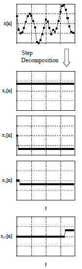
7. Verklaar wat impulsdecompositie inhoud bij decompositie van een lineair systeem. Geef ook aan welke voordelen impulsdecompositie biedt. 
   - Bij impulsdecompositie is iedere sample van het componentsignaal 0 behalve bij zijn eigen specifieke sample. 
   - Signalen kunnen onderzocht worden per samplestap.
   - Systemen kunnen onderzocht worden hoe ze reageren op impulsen. Hierdoor weten we hoe het systeem reageert op een bepaalde impuls. De systeemoutput kan dan berekend worden voor een bepaalde input, wat convolution wordt genoemd.
   - 
8. Verklaar wat interlaced decompositie inhoud bij decompositie van een lineair systeem. Geef ook aan welke voordelen interlaced decompositie biedt. 
   - Het signaal wordt opgesplitst in even en oneven componentsignalen. In de even component worden alle oneven samples op 0 gezet en in de oneven component worden alle even samples op 0 gezet.
   - Het is de basis voor Fast Fourier Transformatie (FFT)
     
9. Omschrijf fourier decompositie en wat is het belang van fourier decompositie binnen DSP? 
   - Ieder N-punt signaal kan gedecomposeerd worden in N+2-signalen, de helft van hun zijn sinussignalen, de andere helft zijn cosinussignalen De laagste frequentiecosinusgolf (xc0[n] ) maakt 0 complete cycli over de N-samples. Hieruit kunnen we afleiden dat dit een DC-signaal is. De volgende cosinus-componenten maken één, twee en 3 volledige cyclussen over de N samples. Een analoge redenering kan men maken voor de sinuscomponent. Vermits de frequentie vastligt, is de amplitude het enige dat kan veranderen van de verschillende signalen (sinus- en cosinusgolven) die moeten gedecomposeerd worden.
   - Belang
     - Een breed scala van signalen zijn samengesteld uit verschillende sinuscomponenten (denk maar aan muziek). De Fourier decompositie geeft een directe analyse van de informatie die in deze signalen vervat zit.
     - Fourier decompositie is de basis voor een breed en krachtig wiskundig gebied: Fourier analyse, Laplace en Z-transformatie De meest geavanceerde algoritmes bij het verwerken van digitale signalen zijn gebaseerd op een bepaald aspect van deze technieken.
       
10. Welk van onderstaande systemen zijn een lineair systeem en welke niet? Verklaar telkens je antwoord. 
    
    1. Dit is een additief systeem en het is lineair.
    2. Dit systeem is lineair omdat een vermenigvuldiging met een constante lineair kan zijn. 
    3. Dit is een niet lineair systeem want verzadigings en saturatieverschijnsels van elektronische versterkers zijn niet lineair.

## Convolutie + eigenschappen convolutie

1. Leg uit wat convolutie inhoud. 
   
   - Convolutie is een wiskundige manier om twee signalen te combineren en alzo een derde signaal te vormen. Convolutie zorgt dus voor het wiskundig kader aangaande digitale signaalverwerking

2. Omschrijf het begrip delta functie δ[n] binnen DSP. 
   
   - Deltafunctie of unit impulse
   - De delta functie is een eenheidsfunctie waarbij al de sample waarden 0 zijn buiten op positie 0. Hier is de waarde 1. Hiermee bouwen we convolutie op. 
     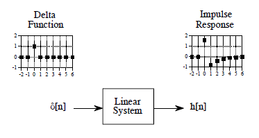

3. Wat wordt bedoeld met impuls responsie binnen DSP? 
   
   - Een impulsresponsie is een signaal dat het systeem verlaat als er een delta functie aan de ingang wordt aangelegd. Als je de impuls responsie kent van een systeem, weet je hoe een systeem op een impuls reageert. 
   
   - Als er een deltafunctie aan een lineair systeem wordt aangelegd, verlaat een impulsresponsie h[n] dit lineair systeem. Beschouw een signaal a[n] dat bestaat uit allemaal nullen behalve uitgang 8. Stel dat uitgang 8 een waarde heeft gelijk aan -3. In formulevorm wordt dit als volgt weergegeven: $a[n] = 3 δ[n-8]$ De notatie geeft weer dat a[n] een impuls is met amplitude 3 en een vertraging heeft van 8 samples. Als δ[n] resulteert in h[n], dan resulteert 3 δ[n-8] in 3 h[n-8]. De uitgang is een versie van de impulsresponsie dat verschoven is en geschaald in dezelfde verhouding als de deltafunctie aan de ingang. Als je de impulsresponsie kent van een systeem, weet je hoe dit systeem reageert op een impuls.

4. Gegeven : volgend ingangssignaal : 
   x[0] = 4, x[1]= -2, x[2] = 8, x[3] = -1, x[4] = -1, x[5] = -2 dit signaal wordt aangelegd aan het hieronder getekend systeem. <br/>
   De convolutiefilter h[n] bestaat uit de samples h[0] = -1, h[1] = 1, h[2] = -0,5, h[3]= +0,5<br/>
   Gevraagd: bepaal y[n]
   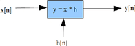
   
   - y[n]:  y[0] = a, y[1]= b, y[2] = c, y[3] = d, y[4] = e, y[5] = f
     
     |       | B0  | B1  | B2  | B3  | B4  | B5  | B6   | B7   | B8  |
     | ----- | --- | --- | --- | --- | --- | --- | ---- | ---- | --- |
     | Y[x0] | -4  | 4   | -2  | 2   | 0   | 0   | 0    | 0    | 0   |
     | Y[x1] | 0   | 2   | -2  | 1   | -1  | 0   | 0    | 0    | 0   |
     | Y[x2] | 0   | 0   | -8  | 8   | -4  | 4   | 0    | 0    | 0   |
     | Y[x3] | 0   | 0   | 0   | 1   | -1  | 0.5 | -0.5 | 0    | 0   |
     | Y[x4] | 0   | 0   | 0   | 0   | 1   | -1  | 0.5  | -0.5 | 0   |
     | Y[x5] | 0   | 0   | 0   | 0   | 0   | 2   | -2   | 1    | -1  |
     | Y[n]  | -4  | 6   | -12 | 12  | -5  | 5.5 | -2   | 0.5  | -1  |

5. **Verklaar met eigen woorden beknopt het begrip discrete afgeleide bij digitaal signaal verwerking. Leg ook uit hoe deze kan worden berekend (formule). Pas discrete afgeleide toe op een voorbeeld**
   
   - Dit kan berekend worden met de formule y[n] = x[n] – x[n-1]

6. **Verklaar met eigen woorden beknopt het begrip discrete integratie bij digitaal signaal verwerking. Leg ook uit hoe deze kan worden berekend (formule). Pas discrete integratie toe op onderstaand voorbeeld:**
   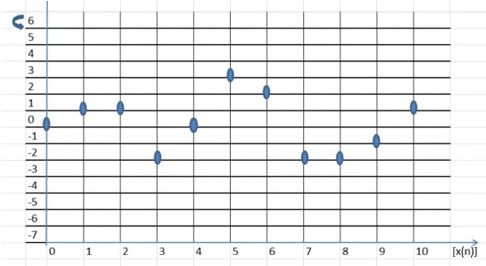

7. Wat is het verband tussen fase en symmetrie van een signaal (na bv convolutie)?  Met andere woorden: hoe kan je zien dat het signaal een faseverschuiving gelijk aan 0° heeft, een lineaire faseverschuiving of een niet-lineaire faseverhuiving heeft? 
   
   - Antwoord ligt in het frequentiespectrum 
     - Bestaat het frequentiespectrum van een signaal uit 2 delen (de omvang en de fase)
     - Het frequentiespectrum van een signaal dat  symmetrisch rond 0 ligt heeft een fase die nul is. Het faseverloop loopt via een rechte lijn => lineaire fase
     - Een niet-symmetrisch signaal heeft een fase die niet volgens een rechte lijn verloopt => heeft een niet-lineaire fase.
   - 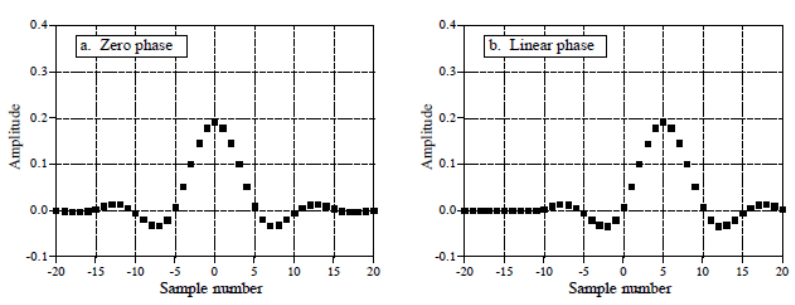
   - 

8. Wat houdt het begrip centrale limietstelling in? 
   
   - Als een puls-vormig signaal meerdere malen met sichzelf wordt convolved *, wordt er een Gausische verdeling geproduceerd.

## Introductie digitale filters

1. Wat zijn de verschillen tussen een digitaal filter en een analoog filter?     
   
   - Digitale filters worden gebruikt voor twee doelen, namelijk de afscheiding van signalen die zijn gecombineerd en het herstel van signalen die zijn vervormd. Deze zijn superieur tov analoge filters. Nadruk ligt op de beperking van signalen.
     Analoge filters zijn goedkoop en hebben een groot dynamisch bereik va zowel amplitude en frequentie maar de nadruk ligt op de nauwkeurigheid en stabiliteit van de gebruikte weerstanden en condensatoren.  
   
   - Analoge filter
     
     - Goedkoop
     - Groot dynamisch bereik zowel amplitude als frequentie
     - Nadruk bij analoge filter ligt op nauwkeurigheid en stabiliteit van de gebruikte weerstanden en condensatoren 
   
   - Digitale filter
     
     - Enorm superieur t.o.v. analoge filter
     - Zijn zodanig goed dat de nadruk ligt op de beperking van de signalen

2. Wat wordt bedoeld met tijdsdomein binnen DSP? 
   
   - Weergave in- en uitgangssignalen
   - Signalen worden gemaakt met samples op regelmatige tijdsintervallen
   - Sampling kan ook plaatsvinden via gelijke signalen in de ruimte 
     - Voorbeeld: sensoren op een vliegtuigvleugel
   - Term tijdsdomein in digitale signaalverwerking kan bijgevolg slaan op samples in de tijd maar ook als een algemene verwijzing naar een domein waar de samples worden genomen

3. Welke responses bevat iedere lineaire filter? 
   
   - Een impuls response,  stap response en frequentie response
   
   - Impulsresponse
     
     - Is de response van een lineair systeem op een impuls

4. Wat is een recursieve filter? 
   
   - Zijn een uitbreiding op het convolutieprincipe: naast punten van de ingang wordt ook gebruik gemaakt van berekende waarden van de uitgang (soort van terugkoppeling)
   - In plaats van een kernel spreekt men van recursiecoëfficiënten
   - Vanwege terugkoppeling aan de uitgang is de impulsresponse theoretisch oneindig lang; spreekt van IIR-filter (Infinite Impuls Response filter)
     

5. **Hoe kan je de impulsresponsie van een recursieve filter vinden?** 
   
   - /

6. Hoe kan informatie vervat zitten in het tijdsdomein? 
   
   - Beschreven wanneer iets plaatsvindt en welke amplitude hetgeen voorvalt heeft 
     - Voorbeeld: experiment om de lichtopbrengst van de zon te bestuderen
       - Meting (sample) 1 keer per seconde Bevat wat er op dat moment plaatsvind, het niveau van de lichtsterkte
       - Doet zich een zonnevlam voor … Signaal bevat volgende informatie Tijdstip start zonnevlam, Hoe lang het duurde, Hoe ontwikkeld in de tijd

7. Hoe kan informatie vervat zitten in het frequentiedomein? 
   
   - Indirecte informatie via meting van een periodieke beweging:
     - Frequentie
     - Fase
     - Amplitude
   - Voorbeeld : trillend glas
     - Aantikken van glas -> rinkelend geluid
     - Grondfrequentie en harmonischen zijn afhankelijk van massa en elasticiteit van het materiaal
       - Elke sample op zichzelf bevat geen informatie over het wijnglas => de informatie is opgenomen in de relatie van een groot aantal punten in het signaal

8. Wat is het belang van stap- en frequentieresponsies? 
   
   - Stapresponse
     - Beschrijft hoe gegevens weergegeven in het tijdsdomein worden gewijzigd door het systeem
   - Frequentieresponse
     - Toont hoe informatie, die weergegeven wordt in het frequentiedomein wordt gewijzigd
   - 
   - Probleem : het is niet mogelijk om een digitaal filter gelijktijdig zowel voor de stapresponse te optimaliseren als voor de frequentieresponse
     - Voorbeeld:
       - Stel dat je een filter moet ontwerpen om het geluid van een ECG-signaal te verwijderen de stap is hier de belangrijke parameter en de frequentierespons van weinig belang
       - Stel dat je een digitaal filter moet ontwerpen voor een hoortoestel (informatie in het frequentiedomein) de frequentierespons is hier belangrijk en de stapresponsie maakt hier niet zoveel uit.

9. Welke stapresponse parameters zijn belangrijk voor digitaal filterontwerp? Noem deze en verklaar hun betekenis (verduidelijk telkens met een figuur) 
   
   - Tijdsdomeinparameters (stapresponse)
     - Stijgtijd
       - Om evenementen in een signaal te onderscheiden, moet de duur van de stapresponsie korter zijn dan de afstand van de gebeurtenissen.
       - 
     - Overshoot
       - Moet vermeden worden omdat het de amplitude van de samples verandert in het signaal; (overshoot leidt tot fundamentele vertekening van de informatie in het tijdsdomein )
       - 
     - Lineaire fase
       - Als de bovenste helft van de stapresponse symmetrisch is met de onderste helft treedt faselineariteit op
       - 

10. Welke parameters in het frequentiedomein geven weer hoe goed een filter is in het frequentiedomein? Noem deze en verklaar deze beknopt. 
    
    - Frequentiedomeinparameters (frequentieresponse)
      - Snelle roll-off
        - Hoe sneller de roll-off, hoe dichter de van elkaar te scheiden frequenties kunnen staan
        - 
      - Doorlaatband
        - Om frequenties zo goed mogelijk door te laten in de doorlaatband mag deze geen rimpel bevatten
        - 
      - Demping in de stopband
        - Om adequaat de frequenties in de stopband te blokkeren moet de stopband een sterke demping hebben
        - 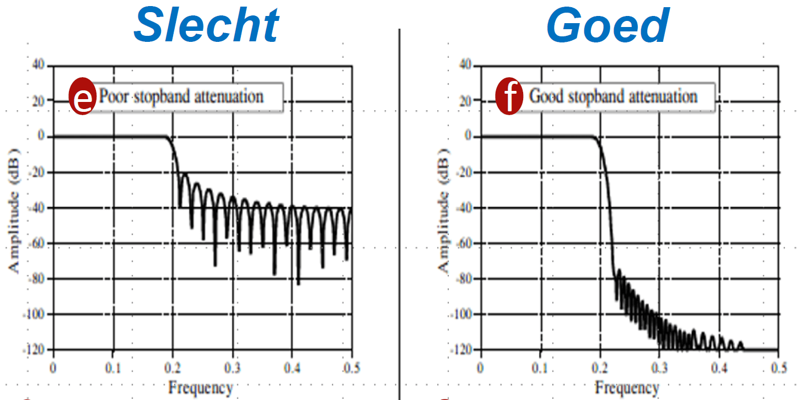

11. Waarom is de faseparameter van minder belang bij frequentiedomeintoepassingen? 
    
    - Fase is niet belangrijk in de meeste frequentiedomein toepassingen. Bijvoorbeeld, de fase van een audiosignaal is nagenoeg volledig willekeurig en bevat weinig nuttige gegevens.
    - Als de fase van belang is, is het zeer gemakkelijk om digitale filters te bouwen met een perfecte fase respons, dwz alle frequenties door een bandfilter sturen met een nul faseverschuiving. Als je dit vergelijkt met analoge filters, zal je merken dat deze slecht zijn hierin.

12. **Stel dat je een frequentieresponse voor een filter hebt opgebouwd met 80 punten. Wat moet je doen opdat je hierop een FFT kan uitvoeren?**

13. Beschrijf hoe je een digitale HD-filter kan opbouwen vanuit LD-filter 
    
    - Ontwerpen van een HD-windowed-sinc filter
      - Stap 1: ontwerp van LD-filter
      - Stap 2 : spectrale inversie van de kernel
        - Alle punten in de kernel inverteren
        - Middelste punt (M/2) de eenheidspuls (1) bijtellen

14. Beschrijf hoe je met een combinatie van LDF en HDF een bandsperfilter kan maken.
    
    - Stap 1: Bepalen van genormaliseerde afsnijfrequenties
    - Stap 2: Bepalen van het aantal punten
      - Bereken de LD-filter kernel met de laagste afsnijfrequentie
        - Normaliseer de LD-filterkernel met de laagste afsnijfrequentie
        - Bereken de LD-filterkernel met de hoogste afsnijfrequentie
        - Normaliseer de LD-filterkernel met de hoogste afsnijfrequentie
        - Vorm de LD-filterkernel met de hoogste afsnijfrequentie om tot HD-filterkernel (via spectrale inversie en 1 bijtellen op punt M/2)
        - Tel de LD- en HD-filterkernels op waarmee een bandsperfilter wordt bekomen.
        - Voer convolutie uit met de kernel van de bandsperfilter
        - Vorm de bandsperfilter om (via spectrale inversie en 1 optellen bij het punt M/2) om een banddoorlaatfilter te bekomen
        - Voer convolutie uit met de kernel van de banddoorlaatfilter

15. Beschrijf hoe je een digitale banddoorlaatfilter (band pass) kan maken vanuit een bandsperfilter. 

## Moving Average Filter

1. Wat is de pricipiële werking van een moving average filter? 
   
   - Bij de moving average filter verplaats je een venster over een aantal samples. Telkens bereken je het gemiddelde van alle waarden binnen het venster. $\frac{som}{N}$

2. Voor de eerste berekening(en) van een moving average filter zijn er geen waarden uit het verleden.  Hoe vermijd je best grote fouten tijdens het startmoment van de filter?  Verklaar je antwoord.
   
   - Door de ontbrekende waarden in de vullen met de waarde van de eerste sample. 

3. Hoe bouw je een 5-punts (gewichten/factoren) moving average filter op? 
   
   - Door 5 gewichten te kiezen die samen 1 vormen.
     - $y=0,25 \cdot x_{n-2}+0,25 x_{n-1}+0,50 x$
   - Of door als de gewichten samen bijvoorbeeld 3 vormen de uitkomst te delen door 3.
     - $y=\frac{0,75 \cdot x_{n-2}+0,75 x_{n-1}+1,5 x}{3}$

4. Waarvoor kan je een moving average filter het best voor gebruiken?  Geef ook aan waarom de moving average filter hiervoor een goede oplossing is. 
   
   - De filter is optimaal voor het verwijderen van willekeurige ruis terwijl een scherpe stap-response behouden blijft.
   - Dit maakt het tot een geschikte filter voor tijdsdomein gecodeerde signalen.

5. Welke stappen (gebruik maken van functies) moet je doorlopen binnen scilab om een moving average filter te kunnen simuleren.  Noem deze stappen/functies en verklaar beknopt hun doel. 
   
   ```C++
   //a.    Je creëert in scilab een sinussignaal met amplitude 3V en frequentie 100 Hz Je sampeld deze sinus met een frequentie van 8 kHz en slaat 3 perioden in samples op in een vector.
   samp_f=8000; // 8kHz sample frequentie
   samp_l=0.03; // 3 periodes van de sinus lang
   t= [0 : 1/samp_f : samp_l]; // 16kHz sample, 24ms
   sin_ampl=3; // 3V amplitude
   sin_f=100; // 100Hz frequentie
   sin_100Hz = sin_ampl*sin(2*%pi*sin_f*t);
   ruis_sin = r' + sin_100Hz; // r wordt eerst omgezet naar een kolom
   // == 100 punten nemen
   filter_10f_output = zeros(length(t),1);
   FACTOREN = 10
   for i=FACTOREN+1:length(t)
    j=0;
    while j<=FACTOREN
        filter_10f_output(i)=filter_10f_output(i) + (1/FACTOREN)*ruis_sin(i-j);
        j=j+1;
    end
   end
   ```
   
   

6. Met welke factor vermindert een 200 punt Moving Average Filter de ruis?
   
   - De hoeveelheid ruisonderdrukking is gelijk aan de vierkantswortel van het aantal punten in het gemiddelde.
   - $\sqrt{200}=14.142$ Een 200 pint moving average filter vermindert de ruis met een factor 14.

## Frequentieselectieve filters

1. Vergelijk een FIR-filter met een IIR-filter.  Wat zijn de voornaamste verschilpunten? 
   
   - Een FIR filter heeft geen terugkoppeling wat een IIR filter wel heeft. Hierdoor is een FIR filter stabieler dan een IIR filter. Een FIR filter heeft meer coëfficiënten nodig (hogere orde) dan een IIR filter om dezelfde eigenschappen te bekomen. Hierdoor heeft een IIR filter maar een kleine signaalvertraging. FIR heeft lineaire faseresponse, IIR heeft een niet lineaire faseresponse.a
   
   - 
   
   - 

2. Hoe wordt de transfertkarakteristiek van een digitaal systeem beschreven? 
   
   - Dit wordt beschreven adhv een verschilvergelijking wat een rekenregel is waarbij de huidige waarde van de output sequence en de huidige waarde van de input en alle vorige waarden van de input en output sequence worden gebruikt. 

3. Geef een voorbeeld van een FIR-verschilvergelijking. 
   
   - $G_{z}=b_{0}+b_{1} z^{-1}+\ldots+b_{n} z^{-n}$

4. Geef een voorbeeld van een IIR-verschilvergelijking. 
   
   - $G_{z}=\frac{b_{0}+b_{1} z^{-1}+\ldots+b_{n} z^{-n}}{1+a_{1} z^{-1}+\ldots+a_{n} z^{-n}}$

5. **Je kan aan verschilvergelijking zien dat het een FIR-of IIR-filter is.** 

6. Welk zijn de eigenschappen van een digitale filter en omschrijf deze beknopt. 
   
   - Er zijn 7 eigenschappen: 
     
     - Afsnijfrequentie: de frequentie met nog de helft van het vermogen (-3 dB)
     
     - Doorlaatband: Zo vlak mogelijk om zo min mogelijk vervorming te bekomen
     
     - Transition band (overgangsband): moet zo klein mogelijk zijn
     
     - Sperband: Zo hoog mogelijke dempingsverhouding
     
     - Filterorde: hoe hoger de orde, hoe beter de filter
     
     - Filtertype: LD, HD, BD, BS
     
     - Filter design procedure: Butterworth, Bessel, Chebychev
     
     - 

7. Wat wordt bedoeld met genormaliseerde frequenties binnen DSP?  Waarom maakt men gebruik van genormaliseerde frequenties?
   
   - Een genormaliseerde frequentie is een frequentie die naar 1.0 Hz wordt gebracht zodat de afsnijfrequentie tussen 0.0 en 0.5 ligt.

8. Welke parameters heeft de wfir() – functie nodig om de filterparameters te kunnen bepalen van een digitale filter?  Noem deze en omschrijf deze beknopt. 
   
   - `[coefficients, amplitude, frequency] = wfir(filter-type, filter-order, [fg1 fg2], windowtype, [par1 par2])`
   
   - `Filtertype`: lp, hp, bp, sb
   
   - `Filterorde`: min 2e orde
   
   - `[fg1 fg2]`: twee afsnijfrequenties tussen 0.0 en 0.5
   
   - `Window-type`: re, tr, hm, kr, ch
   
   - `[par1 par2]`: vector met parameter voor het windowtype

9. Wat zijn de return-waarden van de functie wfir()?  Benoem deze en omschrijf deze beknopt. 
   
   - Coëfficiënten: filter coëfficiënten
   
   - Amplitude: vector met lengte 256 met de amplitudewaarden
   
   - Frequency: vector met lengte 256 met de frequenties in het gebied tussen 0 en 0.5

10. Geef en verklaar de kenmerken (voor/nadelen) van een rectangular window om te gebruiken als window voor een window-sync digitale filter. 
    
    - Eenvoudigste window om alle waarden op nul te krijgen. Alle waarden op nul buiten de n die doorgelaten worden
    
    - Nadeel is plotse overgang tussen doorgelaten en niet doorgelaten, onstaan ongewenste effecten in de DTFT
    - 

11. Geef en verklaar de kenmerken van een triangular window om te gebruiken als window voor een window-sync digitale filter. 
    
    - Kan gezien worden als de convolutie van twee N/2 brede reactangular windows. 
      Niet zo een drastische overgang tussen doorgelaten en niet doorgelaten. Doorgelaten waardes aan de buitenkanten worden minder 
    - 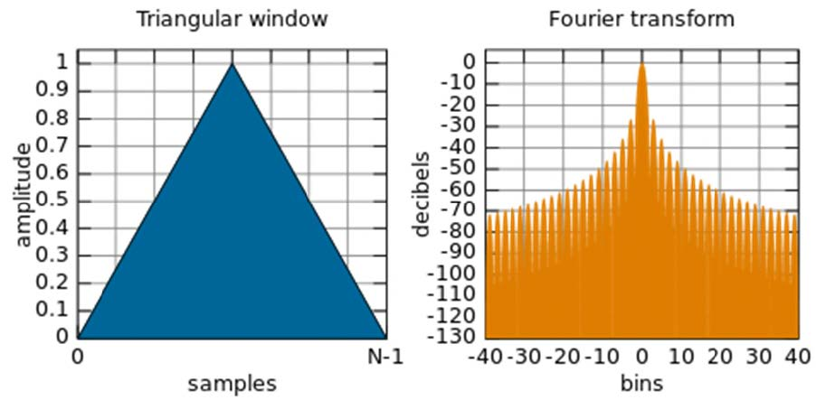 

12. Geef en verklaar de kenmerken van een hamming window om te gebruiken als window voor een window-sync digitale filter. 
    
    - Geoptimaliseerd zodat maximum van zijlob, die het dichtste bij het window ligt, een amplitude heeft van 1/5 van dat van het hamming window
    - 

## IIR en windowed sinc filters

1. Welke parameters heeft de iir() – functie nodig om de filterparameters te kunnen bepalen van een digitale iir-filter?  Noem deze en omschrijf deze beknopt. 
   
   - `IIR_filter = iir(filterorde,'filtertype','filterdesign'[fg1 fg2],[par1 par2])`
   - `filterorde` : orde van filter
   - `filtertype` : 'lp', 'hp', 'bp' en 'sb'
   - `filterdesing` : 'butt', 'cheb1', 'cheb2' en 'ellip'
   - `[fg1, fg2]`
     - 'lp' en 'hp' :0 < $fg$ 1 < 0.5 ; $fg$ 2 = 0
     - 'bp' en 'sb' : $fg$ 1 = $f_{cl}$; $fg$ 2 = $f_{ch}$
   - `[par1, par2]` :
     - par1: enkel voor cheb1 filters
     - par2: enkel voor cheb2 filters
     - par1 en par2 enkel voor ellip filters
   - [iir documentatie](https://help.scilab.org/docs/6.1.1/en_US/iir.html)

2. Hoe ontwerp je een IIR-filter in scilab? (geef aan welke stappen je doorloopt) 
   
   - IIR-filter die de 5de harmonische uit een blokgolf filtert. De blokgolf amplitude: 4V, frequentie: 100Hz. Samplefrequentie 2kHz.
     
     ```C++
     clf;
     clear;
     //sinus 4V amplitude
     //frequentie 100Hz
     //samplefreqientre 2kHz
     t=0:1/2000:(1/100)*16
     sin_100Hz=4*(sin(2*%pi*100*t))
     blok_100Hz=4*squarewave(0.5*sin_100Hz)
     subplot(311)
     plot2d(t,sin_100Hz)
     plot2d(t,blok_100Hz)
     // IIR ontwerp: 5e orde, banddoorlaat, butterworth
     // 0.245 = ( 1 / (frequentie * harmonische) ) - 0.05
     // 0.255 = ( 1 / (frequentie * harmonische) ) + 0.05
     BP_IIR=iir(5, 'bp', 'butt', [0.245 0.255], [0 0])
     // Zichtbaar maken van tijdsdomeinresponse op, de LD-filter op het testsignaal
     BP_resp = flts(blok_100Hz, BP_IIR)
     subplot(312)
     plot2d(t,BP_resp)
     plot2d(t,blok_100Hz)
     ```

3. Hoe kan je de frequentieresponse van een IIR-filter weergeven in scilab? 
   
   - `[hm, fr] = frmag(sys,npts)`
     
     - `hm` : vector van magnitude van de frequentieresponse
     
     - `fr` : aantal punten in de genormaliseerde frequentieresponse die geevalueerd worden binnen het genormaliseerd frequentiedomein
     
     - `sys` : transferfunctie, polynoon of de vector met polynoomcoëfficiënten
     
     - `npts` : integer, het aantal punten in de frequentieresponse
       
       ```C++
       // 8ste orde butterworth banddoorlaat 50-150 Hz fs=1kHz
       BD_IIR_FILTER = iir(8,'bp','butt',[0.05 0.15],[0 0])
       // Frequentierepsonse bepalen
       // Binnen het genormaliseerde frequentiebereik zijn er 256 frequentiewaarden waarvan de magnitude wordt bepaald
       [hm, fr]=frmag(BD_IIR_FILTER,256);
       // Visualiseer frequentierepsonse
       plot(fr,hm)
       ```

4. Wat zijn de kenmerken van windowed-sinc filters? (gebruik – nadeel – voordeel) 
   
   - Gebruik: scheiden van een band van frequenties van elkaar
   - Nadeel: slechte prestaties in het tijdsdomein: overmatige rimpel en overschrijding van de stap-respons
   - Voordeel: Zijn erg stabiel en leveren goede tot zeer goede prestaties
     - Zijn eenvoudig te programmeren indien ze uitgevoerd worden met een standaard convolutie maar zijn langzaam in uitvoering
     - Met FFT verbeteren deze filters drastisch in rekensnelheid

5. Wat is de strategie van Windowed-sinc? 
   
   - De windowed-sinc filter maakt gebruik van de sinc-functie om een ideale frequentiereponse te bekomen. 
   - Omdat de sinc-functie tot in het oneindige doorgaat moeten we een oplossing zoeken voor computersystemen
     - Sinc-functie afkappen tot M+1, alles erbuiten is 0
     - Afgekapte sinc-functie verplaatsen naar rechts zodat deze start op 0
       - Voordeel : Kernel bestaat uit enkel positieve indexen
       - Nadeel: Geen ideale frequentietransponse meer maar een benadering => rimpel in doorlaatband en slechtere demping in stopband

6. Wat is een Blackman en Hamming window? Waarvoor worden ze gebruikt en wat zijn hun onderlinge verschillen? 
   
   - Dit zijn beide filters die elks een specifieke karakteristiek hebben. Hamming heeft een 20% snellere roll off dan Blackman. Blackman heeft een betere stopbandverzwakking en een lager rimpel doorlaat gebied.     
   
   - Roll-of
     
     - Hamming heeft een 20% snellere roll-off dan Blackman
   
   - Stopbandverzwakking
     
     - Blackman (-74 dB) of 0,02%
     - Hamming (-53 dB) of 0,2 %
   
   - Rimpel doorlaatgebied
     
     - Blackman 0,02%; Hamming 0,2 %
       - Blackman verdient voorkeur op Hamming (trage roll-of beter aanpasbaar dan een zwakke
         stopbandverzwakking)
   
   - 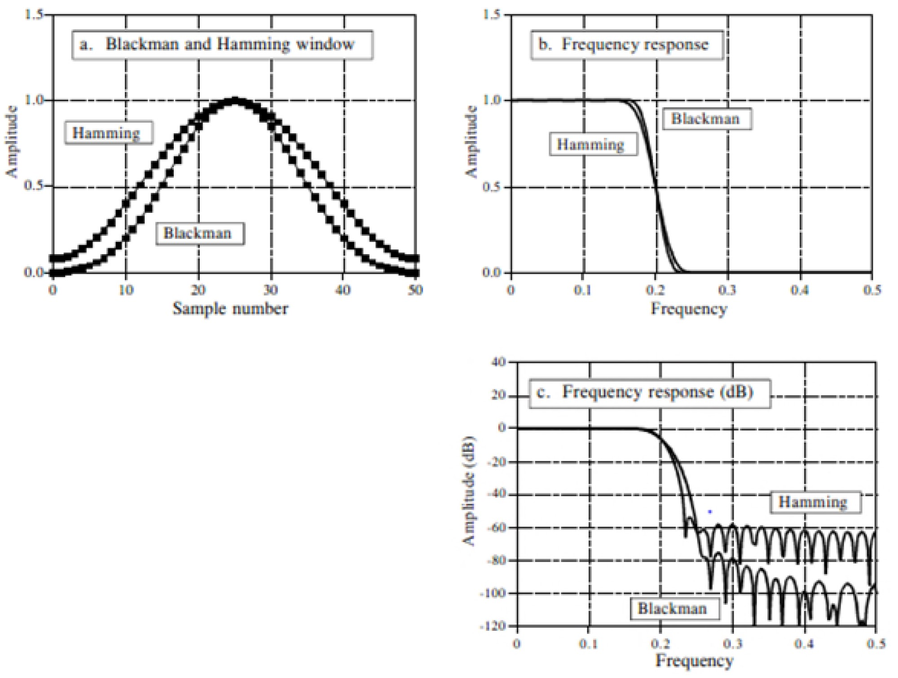

7. Waarom wordt bij een windowed-sinc filter het afsnijpunt bepaald op het halve amplitudepunt in plaats van bij het -3dB punt? 
   
   - Window-sinc frequentieresponse ligt symmetrisch tussen doorlaatband en sperband => faselineariteit
     - Vb. Hamming-window heeft een doorlaatrimpel van 0,2% en een identieke stopbandrimpel van 0,2%
     - Ander type filters vertonen deze symmetrie niet => geen voordeel mee. De symmetrie maakt windowed-sinc ideaal voor spectrale inversie (zie later)

8. Welke stappen doorloop je tijdens het ontwerp van een windowed sync filter? 
   
   - Stap 1 : bepalen type filter en de afsnijfrequentie(s)
     - BV: Filterkernel die een combinatie is van een sinc-functie, Blackman-window en een $M/2$-schift
   - Stap 2 : Bepalen aantal punten $M$ tussen banddoorlaat en bandstop
   - Stap 3 : Berekenen van de filterkernel afhankelijk van het type window
     - $K$ wordt zodanig gekozen dat de som van alle samples gelijk is aan 0 
       - Praktisch: negeer $K$ tijdens de berekeningen en normaliseer alle samples waar nodig
   1. Bepalen van afsnijfrequentie en aantal meetpunten.
      - $78 \mathrm{~Hz}-70 \mathrm{~Hz}=8 \mathrm{~Hz} \& 40 \mathrm{~Hz}-32 \mathrm{~Hz}=8 \mathrm{~Hz}$
      - $\frac{8 \mathrm{~Hz}}{1 \mathrm{kHz}}=8 * 10^{-3}$
      - $M=\frac{4}{B W}=\frac{4}{8 * 10^{-3}}=500$
      - Dichtstbijzijnde macht van 2 is $2^9 = 512$
      - a. f􀭡􀭡= 32 Hz
      - b. f􀭡􀭡= 78 Hz
      - c. M = 500
   2. Bepalen welke soort filter er gebruikt wordt en zijn formule toepassen.
      - $h[i]=K \frac{\sin \left(2 \pi f_{c}\left(i-\frac{M}{2}\right)\right)}{i-\frac{M}{2}}\left[0.42-0.5 \cos \left(\frac{2 \pi i}{M}\right)+0.08 \cos \left(\frac{4 \pi i}{M}\right)\right]$
   3. Twee laagdoorlaatfilterkernels aanmaken.
   4. Deze filterkernels normaliseren.
   5. De 2de filter inverteren (omzetten van Laagdoorlaat naar Hoogdoorlaat).
   6. De waarde van het nulpunt, van de 2de filter, +1 bijtellen.
   7. De 2 filters bij elkaar optellen (verkrijgt bandsperfilter).
   8. De bandsperfilter inverteren (verkrijgt Banddoorlaat).
   9.  De waarde van het nulpunt, van de nieuwe filter, +1 doen.

9. Hoe kan je een windowed sync kernel bestaande uit M = 62 punten aanpassen zodat door een FFT met 256 punten kan gebruikt worden? 
      - Door nullen toe te voegen tot dat M 256 punten heeft.


10. Een signaal is gesampled met een frequentie van 16 kHz. Uit dit signaal wil men een frequentieband filteren met frequenties tussen 0 Hz en 800 Hz. Men wenst een volledige onderdrukking voor frequenties die hoger zijn dan 1 kHz. <br/>Gevraagd : bereken het aantal punten dat deze windowed-sinc kernel nodig heeft om deze filter te realiseren. 
    - Laagdoorlaat filter, afstand is 200Hz, normalisatie 200Hz is $200/16000= 0.0125$, $8kHz = 0.5$, $M = \frac{4}{0.0125} = 320$ -> 321 punten

11. Stel dat je een signaal hebt dat is gedigitaliseerd met een samplefrequentie van 8 kHz en dat je frequenties rond 1 kHz wil isoleren met een band tussen 940 Hz en 1060 Hz. Beschrijf hoe je deze filter moet opbouwen. 
    - Band = 120Hz, normaliseren = $120/8000= 0.015$, $M = \frac{4}{0.015} = 267$

## Matrices

1. Wat is een matrix?  Geef hiervan de definitie.
   
   - Een matrix is een geordend schema van getallen en bezit daarom geen getalwaarde.

2. Omschrijf volgende begrippen bij matrices:  
   
   - Nulmatrix: Alle elementen zijn gelijk aan nul
     - $O=\left(\begin{array}{lll}0 & 0 & 0 \\ 0 & 0 & 0\end{array}\right)$
   - Hoofddiagonaal: Loopt van linksboven naar rechts onder
     - $\left(\begin{array}{lll}a_{11} & & \\ & a_{22} & \\ & & a_{33}\end{array}\right)$
   - Nevendiagonaal: loopt van rechtsboven naar linksonder
     - $\left(\begin{array}{lll} & & a_{13} \\ & a_{22} & \\ a_{31} & & \end{array}\right)$
   - Diagonaalmatrix: Als alle buiten de diagonaal gelegen elementen nul zijn
     - $A=\left(\begin{array}{ccc}1 & 0 & 0 \\ 0 & -2 & 0 \\ 0 & 0 & -3\end{array}\right)$
   - Eenheidsmatrix: Een diagonaalmatrix met n rijen met de diagonaalelementen $a_{ii}$ 
     - $A=\left(\begin{array}{lll}1 & 0 & 0 \\ 0 & 1 & 0 \\ 0 & 0 & 1\end{array}\right)$
   - Driehoeksmatrix: Als alle elementen boven of onder hoofdiagonaal 0 zijn
     - $A=\left(\begin{array}{ccc}1 & 0 & 0 \\ 3 & -2 & 0 \\ 0 & 5 & -3\end{array}\right)$
     - $A=\left(\begin{array}{llll}2 & 5 & 4 & 4 \\ 0 & 5 & 9 & 0 \\ 0 & 0 & 2 & 9 \\ 0 & 0 & 0 & 1\end{array}\right)$

3. Je kan de determinant van een vierkante matrix bepalen (1x1; 2x2 en 3x3) 
   
   - 1x1: getal zelf
   
   - 2x2: $a11 \times a22 – a21 \times a12$, $linksboven \times rechtsonder – linksonder \times rechtsboven$
     
     - $A=\left|\begin{array}{ll}a_{11} & a_{12} \\ a_{21} & a_{22}\end{array}\right| \rightarrow D=a_{11} \cdot a_{22}-a_{21} \cdot a_{12}$
   
   - 3x3: (-1)^1+1*a11*(vierkant rechtsonder) + (-1)^1+1*(links onder en rechtsonder) +  (-1)^1+1*a11*(vierkant linksonder) 
     
     - $A=\left|\begin{array}{lll}a_{11} & a_{12} & a_{13} \\ a_{21} & a_{22} & a_{23} \\ a_{31} & a_{32} & a_{33}\end{array}\right|$
       $D=(-1)^{1+1} \cdot a_{11} \cdot\left|\begin{array}{ll}a_{22} & a_{23} \\ a_{32} & a_{33}\end{array}\right|+(-1)^{1+2} \cdot a_{12} \cdot\left|\begin{array}{ll}a_{21} & a_{23} \\ a_{31} & a_{33}\end{array}\right|+(-1)^{1+3} \cdot a_{13} \cdot\left|\begin{array}{ll}a_{21} & a_{22} \\ a_{31} & a_{32}\end{array}\right|$
       $D=(-1)^{1+1} \cdot a_{11} \cdot\left(a_{22} \cdot a_{33}-a_{23} \cdot a_{32}\right)+(-1)^{1+2} \cdot a_{12} \cdot\left(a_{21} \cdot a_{33}-a_{31} \cdot a_{23}\right)+(-1)^{1+3} \cdot a_{13} \cdot\left(a_{21} \cdot a_{32}-a_{22} \cdot a_{31}\right)$

4. Je kan een som maken en een verschil maken tussen 2 matrices 
   
   - Bij optellen tellen we elke waarde van rij en kolom op met dezelfde waarde van de andere matrix.

5. Je kan een scalair veelvoud bepalen van een matrix 
   
   - Een scalair veelvoud is het vermenigvuldigen van een matrix met een getal.

6. Je definieert het begrip getransponeerde matrix en kan een matrix transponeren
   
   - Een getransponeerde matrix is een matrix waarbij de rijen de kolommen worden en de kolommen de rijen.
   - $A=\left|\begin{array}{lll}a_{11} & a_{12} & a_{13} \\ a_{21} & a_{22} & a_{23} \\ a_{31} & a_{32} & a_{33}\end{array}\right| \quad A^{T}=\left|\begin{array}{lll}a_{11} & a_{21} & a_{31} \\ a_{12} & a_{22} & a_{32} \\ a_{13} & a_{23} & a_{33}\end{array}\right|$

7. Je kan omschrijven wat een scheefsymmetrische matrix is 
   
   - Een scheefsymmetrische matrix is een matrix waarbij $a_{ik} = -a_{ki}$
   
   - $A=\left(\begin{array}{ccc}1 & 3 & -6 \\ -3 & -2 & -5 \\ 6 & 5 & -3\end{array}\right)$

8. Je kan twee matrices met elkaar vermenigvuldigen <br/>
   $C=A \times B=\left(\begin{array}{ll}1 & 5 \\ 2 & 3\end{array}\right) \times\left(\begin{array}{ccc}4 & 1 & 2 \\ 1 & 0 & 3\end{array}\right)$
   
   - Aantal kolommen moet gelijk zijn. De waarden van de rijen worden vermenigvuldigt met de waardes van de kolom en bij elkaar opgeteld. 
   - Eerst wordt de eerste rijvector van A achtereenvolgens met iedere kolomvector van B scalair vermenigvuldigd. Vervolgens wordt de tweede rijvector van A scalair met ieder van de drie kolomvectoren van B vermenigvuldigd=> er wordt in totaal 6 scalaire producten verkregen:
      - c11= (1e rijvector van A)(1e kolomvector van B) = $1 \times 4 + 5 \times 1 = 9$
      - c12= (1e rijvector van A)(2e kolomvector van B) = $1 \times 1 + 5 \times 0 = 1$
      - c13= (1e rijvector van A)(3e kolomvector van B) = $1 \times 2 + 5 \times 3 = 17$
      - c21= (2e rijvector van A)(1e kolomvector van B) = $2 \times 4 + 3 \times 1 = 11$
      - c22= (2e rijvector van A)(2e kolomvector van B) = $2 \times 1 + 3 \times 0 = 2$
      - c23= (2e rijvector van A)(3e kolomvector van B) = $2 \times 2 + 3 \times 3 = 13$
   - $C=A \times B=\left(\begin{array}{ll}1 & 5 \\ 2 & 3\end{array}\right) \times\left(\begin{array}{ccc}4 & 1 & 2 \\ 1 & 0 & 3\end{array}\right)=\left(\begin{array}{ccc}9 & 1 & 17 \\ 11 & 2 & 13\end{array}\right)$

9.  Je kan een inverse matrix bepalen 
   
   - Enkel voor een vierkantsmatrix. De inverse matrix kan bekomen worden met de eenheidsmatrix. En dan via algebra de waardes te vinden.

11. Je kan het verschil verklaren tussen een singuliere en reguliere matrix 
    
    - Wanneer de deteriminant 0 is van een matrix heeft deze geen inverse en is deze singulier. Als de determinant niet 0 is dan heeft deze wel een matrix en is deze regulier. 

12. Je kan matrixberekening toepassen in encryptie.  (Zie labo-opgave; je kan een decodering uitvoeren van een codesignaal via matrixberekening) 

```cpp
function [zin]=decodeer(sleutel, cryp)
    // Deze functie inverteert de sleutel en decodeert de geencrypteerde waarde
    dict = ['A' 'B' 'C' 'D' 'E' 'F' 'G' 'H' 'I' 'J' 'K' 'L' 'M' 'N' 'O' 'P' 'Q' 'R' 'S' 'T' 'U' 'V' 'W' 'X' 'Y' 'Z' '=']; // Alle karakters te vinden via hun index

    antw = cryp; // Antwooord wordt in loop overschreven
    for i=1:length(cryp(1,:))
        x = [cryp(1,i), cryp(2,i)] * inv(sleutel); // Eerste twee waardes van matrix vermenigvuldigen met geinverteerde sleutel
        antw(1,i) = x(1); // Waardes in antwoord-variabele overschrijven
        antw(2,i) = x(2);
    end

    disp("Ontcijfering:", antw); // Ontcijferde integers tonen

    chars = string(antw); // chars wordt in loop overschreven, antw wordt gecast naar strings voor het juiste datatype
    for i=1:length(cryp(1,:))
        chars(1,i) = dict(antw(1,i)); // Vindt het juiste karakter bij het gedecodeerde cijfer
        chars(2,i) = dict(antw(2,i));
    end

    disp("Vertaling:", chars); // Print de karakters in hun matrix
    disp("Verborgen woord:", strcat(chars)) // Print de karakters in één string

    zin= strcat(chars) // Retrourneer de string
endfunction
```

## Genereren van galm

1. Je kan het principe van galmgeneratie met arduino omschrijven 
2. Je kan de werking van de ADC (successive aproximation methode) verklaren 
3. Je kan uitleggen met behulp van de registers (ter beschikking op het examen indien nodig) hoe je de prescaler van een timer kan instellen, 
   - De timer instellen doe je aan de hand van het  `TCCRnA` register. 
4. Je kan uitleggen met behulp van de registers (ter beschikking op het examen indien nodig) hoe je een klok en/of timerfrequentie kan instellen voor een bepaalde PWM-instelling 5. Je kan de principewerking van fast PWM verklaren 
   - Fast PWM is een methode die wordt gebruikt met timers. Hierbij loopt de timer op tot de top waarde en gaat dan terug naar 0. Wanneer de waarde gelijk is met de waarde die wordt ingegeven zal de uitgang verandere van 1 naar 0 of van 0 naar 1. Zo kan de duty cycle(pulsbreedte) van het PWM signaal worden aangepast door een hogere of lagere waarde te kiezen.  

## Capacitieve sensor /Firmata-protocol

1. Verklaar het werkingsprincipe van een capacitieve sensor. 
   - Een capacitieve sensor werkt als volgt. De sensorplaat en het menselijk lichaam vormen samen een capaciteit. De grootte van de capaciteit hangt af van de afstand tussen je hand en de sensorplaat. Door je hand dichterbij of verder weg te brengen vergroot of verklein je de capaciteitswaarde waardoor de lading die het bevat ook wijzigt. 
   - 
2. Geef aan hoe je een capacitieve sensor via arduino kan opbouwen. (wat heb je nodig, hoe bouw je de sensor op?) 
   - Tussen de Send pin en receive pin wordt een bepaalde weerstand geplaatst afhankelijk van de gewenste response. Hoe groter de weerstand hoe gevoeliger de sensor is maar hoe trager de reactie zal zijn. 
3. Wat is firmata en wat kan je er mee doen aangaande arduino-harware? 
   - Firmata is een protocol dat communiceert tussen computers en microcontrollers om gemakkelijk toegang te krijgen tot de arduino-hardware vanuit software op de hostmachine. Berichten worden serieel naar en van de hostcomputer verzonden. 
4. Wat zijn callbacks binnen het firmata-protocol? 
   - Callbacks zijn een routine die aangeroepen wordt wanneer een specifieke actie wordt uitgevoerd. Worden uitgevoerd via een attach()-functie. 
5. Wat zijn System EXcusive (SysEx) berichten? Waarvoor kan je ze gebruiken? 
   - SysEx laat gebruikers toe informatie uit te wisselen en instellingen te maken zoals I2C data of een servomotorconfiguratie. Deze hebben meer info nodig en bevatten 3 parameters

## Aansturen van motoren

1. Wat is het verschil om een motor aan te sturen met een arduinobord tussen het aansturen van een motor via een (MOS)FET en het aansturen via een transitor   
   
   - Een Arduino kan vaak niet genoeg spanning en stroom leveren om een motor rechtstreeks aan te sturen. Daarom gaan we gebruik maken van een MOSFET of transistor. 

   - Een transistor is stroomgestuurd en zal dus, afhankelijk van de stroom door de basis, meer of minder geleiden. Een Arduino kan soms niet genoeg stroom leveren om een transistor in saturatie te brengen zodat deze op zijn best geleid.

   - Een MOSFET is spanningsgestuurd en er zijn veel MOSFETS die al schakelen op een gate-spanning lager dan 5V. Ideaal voor een Arduino dus. Het verlies is afhankelijk van de Rds(on) weerstand en dat is vaak een kleine weerstandsaarde dus weinig verlies.  

2. Waar let je op als je via arduino een motor (of inductieve belasting) met grote stroom wil aansturen? 
   
   - Kunnen spanningspieken veroorzaken die schadelijk zijn voor elektronische componenten en arduino.  
   
   - Diode gebruikt om voeding te beschermen tegen de inverse spanning ten gevolge van zelfinductie van de motor
   
   - Condensator om ruis, veroorzaakt door de motor, weg te filteren

3. Hoe kan je via programmacode van de controller vermijden dat er kortsluitingen ontstaan met H-bruggen als je een motor snel van draairichting wil veranderen? 
   
   - Je moet zien dat je je H-brug juist programmeert anders kan je hardwareschade oplopen. Daarom kan je best bij het veranderen van draairichting steeds eerst de open toestand programmeren zodat bij zeer snel schakelen vermeden wordt dat kortsluiting ontstaat vermits geen enkele schakelaar gedurende een fractie tijd gesloten blijft. 

4. Je kan de functie/aansluiting van de SN754410 quadruple half-H driver omschrijven.  (Je hebt de functietal en inwendig schema van het IC ter beschikking) 
   
   - 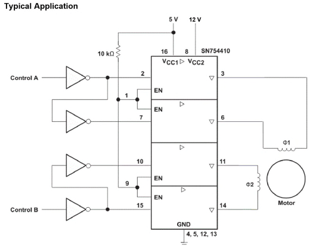
   - 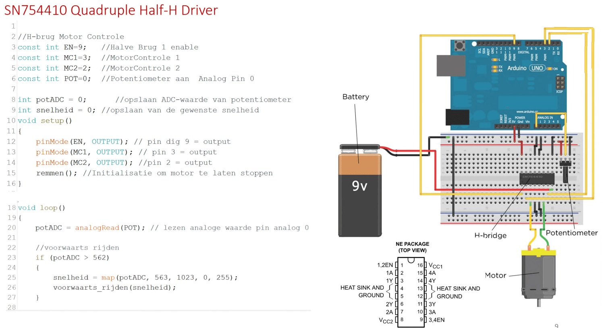
   - 

5. Wat is een servomotor? 
   
   - Een servomotor is een motorassemblage met extra sensoren en logica. Een ingebouwde microcontroller leest de hoek van de uitgangsas en bestuurt twee draden: een voor het vermogen en een voor de grond. 

6. Op welke 2 courante manieren kan je de positie van een servomotor te weten komen? 
   
   - Potentiometer
   
   - Gecodeerd optisch wiel

7. Op welke manier wordt er gebruik gemaakt van PWM om een servomotor aan te sturen? (verwachtingstijd ontvangen van een puls, invloed van de pultsbreedte  op het zetten van een hoek) 
   
   - Een servomotor verwacht elke 20ms een puls. De lengte van de puls instrueer de servomotor om naar een specifieke hoek te gaan. De PWM signalen varieren tussen 0.5 en 2.5 ms. Een puls van 0.5 ms instrueert de servomotor om naar zijn minimale positie te gaan. Een pusl van 2.5 ms maximale positie. Puls 1.25 ms centrale positie.

8. Welke functie hebben de aansluitdraden van een servomotor en hoe kan je ze herkennen? 
   
   - De rode draad is voor de voeding, de zwarte draad voor aan de grond en de laatste draad verbonden met een digitale pin  

9. Hoe kan je een servomotor laten bewegen? 
   
   - `Servo.attach()`
   - `Servo.write()`

10. Teken en verklaar de principewerking van een bipolaire stappenmotor.  Geef ook aan hoe je deze motor een aantal stappen in de voorwaartse of achterwaartse richting kunt laten gaan) 
    
    - De rotor is opgebouwd uit permanente magneten. De stator is opgebouwd uit spoelen. Telkens wanneer een spoel stroom krijgt wordt een pool in de rotor recht tegenover de pool van de stator gedraaid. De motor-as draait dus een stukje. Door de spoelen meerdere pulsen in een bepaalde volgorde te geven gaat de motor-as draaien, hoe sneller de pulsen hoe sneller de motor zal draaien. 

11. Hoe kan je de snelheid van een stappenmotor (stepper) verhogen of verlagen? 
    
    - `setSpeed()`
