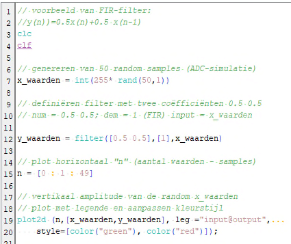

# Vaardigheidstoets DSP (20 % punten) 
 
De vaardigheidstoets DSP bestaat uit twee delen.   

```cpp

```


filterresponse in het tijdsdomein:
`flts`: zie FIR_Opgave2.sce
```cpp
[coeffi, amp, frequ]=wfir('sb', 141, [0.035 0.075], 're', [0 0])
SB_poly = poly(coeffi, 'z', 'coeff');
SB_functie=horner(SB_poly, 1/%z);
SB_sys=syslin('d',SB_functie);
SB_out1 = flts(testsig1, SB_sys)
SB_out2 = flts(testsig2, SB_sys)
SB_out3 = flts(testsig3, SB_sys)
```


filterresponse in het frequentiedomein:
`abs(fft())`: zie FIR_Opgave2.sce
```cpp
N=size(t,"*")
freq_FFT=abs(fft(testsig3))
f=1000*(0:(N/2))/N
n=size(f,"*")
title("frequentie response+ filer response")
xlabel("frequentie (Hz)")
ylabel("vermogen mV")
plot(f,freq_FFT(1:n))
plot(frequ*1000,amp*N,'r')
legend(["testsignaal 3 frequentie response" ,"filter response"])
```

drequentieresponse iir:
```C++
// 8ste orde butterworth banddoorlaat 50-150 Hz fs=1kHz
BD_IIR_FILTER = iir(8,'bp','butt',[0.05 0.15],[0 0])
// Frequentierepsonse bepalen
// Binnen het genormaliseerde frequentiebereik zijn er 256 frequentiewaarden waarvan de magnitude wordt bepaald
[hm, fr]=frmag(BD_IIR_FILTER,256);
// Visualiseer frequentierepsonse
plot(fr,hm)
```

frequentiereponse moving average filter:
`bode`: zie 01_ruis-wegfilteren-staprespons-oplossing.sce
```cpp
param=[1/10,1/10,1/10,1/10,1/10,1/10,1/10,1/10,1/10,1/10]
transp10=poly(param,'z','coeff')
transh10=horner(transp10,(1/%z))
transsys10=syslin('d',transh10)

param=[1/5,1/5,1/5,1/5,1/5]
transp5=poly(param,'z','coeff')
transh5=horner(transp5,(1/%z))
transsys5=syslin('d',transh5)

bode([transsys10;transsys5],["10";"5"])
```

wfir gui:
`wfir_gui`: zie FIR_GUI.sce
```cpp
// [ftype,forder,cfreq,wtype,fpar] = wfir_gui()
wfir_gui()
```

Meerdere grafische windows:

```cpp
scf(0)
clf
// Alle plots
scf(1)
clf
// Nog meer plots
```

Sinus genereren:

```cpp
function [y]=sin_xHz(f, U, t)
    y = U * sin(2 * %pi * f * t) // xHz sinus, samplefrequentie afhankelijk van t en Umax afhankelijk van U
endfunction

sin_2500Hz = sin_xHz(2500, 0.5, t); // f=2500Hz, Umax=0.5V
```

// FIR filter



## Deel 1: 

Het eerste deel bestaat uit het maken van een digitale filter met behulp van scilab.   
-	Moving average filter  

    ```cpp
    // Een moving averagefilter met 5 factoren
    // en gelijkmatig verdeelde gewichten
    filter_5f_output = zeros(length(t),1);
    FACTOREN = 5
    for i=FACTOREN+1:length(t)
        j=0;
        while j<=FACTOREN
            filter_5f_output(i)=filter_5f_output(i) + (1/FACTOREN)*ruis_sin(i-j);
            j=j+1;
        end
    end
    ```

    ```cpp
    //c) siging=sigRan+sig100Hz 
    //d) 
    filter10=zeros(length(siging),1)
    subplot(513)
    plot(t8kHz*10000,siging)
    title("100Hz + ruis") 

    for i=10:length(siging) 
        filter10(i)= ... 
        0.1*siging(i-9)+... 
        0.1*siging(i-9)+... 
        0.1*siging(i-7)+... 
        0.1*siging(i-6)+... 
        0.1*siging(i-5)+... 
        0.1*siging(i-4)+... 
        0.1*siging(i-3)+... 
        0.1*siging(i-2)+... 
        0.1*siging(i-1)+... 
        0.1*siging(i)
    end
    ```

-	FIR-filter 

    Ontwerp een FIR-filter de 7de harmonische uit een blokgolf filtert. De blokgolf heeft een amplitude van 8 V en de frequentie van de blokgolf is gelijk aan 1000 Hz. Gebruik als samplefrequentie 16kHz.

    ```cpp
    clf;
    clear;

    // 16 kHz Samplefrequentie:
    t = [0 : 6.25D-5 : 5D-3];
    sin1kHz = 4 * sin(2 * %pi * 1000 * t)
    stap = 4 * squarewave(0.5 * sin1kHz)
    plot2d(t, sin1kHz)
    plot2d(t, stap, style= [color("red")])
    // 6.5kH7. / 16 kH7. = 0.40625
    // 7kHz / 16 kHz= 0.4375
    // 7.5kHz / 16 kHz= 0.46875
    BD = wfir('bp', 50, [0.41 0.47], 'hm', [0 0]);

    BD = poly(BD, 'z', 'coeff');
    BD = horner(BD, (1/ %z));
    BD = syslin('d',BD);

    BD = 4 * flts(stap, BD)
    plot2d(t, BD, style=[color("blue")])


    // 32 kHz Samplefrequentie:
    t = [0 : 3.125D-5 : 5D-3];
    sin1kHz = 4 * sin(2 * %pi * 1000 * t)
    stap = 4 * squarewave(0.5 * sin1kHz)
    plot2d(t, sin1kHz)
    plot2d(t, stap, style=[ color("red")])

    // 6.5kHZ / 32kHz = 0.2031215
    // 7kHz / 32 kHz= 0.21875
    // 7.5kHz / 32 kHz= 0.234375
    BD = wfir('bp', 50, [0.200 0.235], 'hm', [0 0]);

    BD = poly(BD, 'z', 'coeff');
    BD = horner(BD, (1 / %z));
    BD = syslin('d', BD);

    BD = 4 * flts(stap, BD)
    plot2d (t, BD, style= [ color("blue")])
    ```

-	IIR-filter 

    - IIR-filter die de 5de harmonische uit een blokgolf filtert. De blokgolf amplitude: 4V, frequentie: 100Hz. Samplefrequentie 2kHz.
     
     ```C++
     clf;
     clear;
     //sinus 4V amplitude
     //frequentie 100Hz
     //samplefreqientre 2kHz
     t=0:1/2000:(1/100)*16
     sin_100Hz=4*(sin(2*%pi*100*t))
     blok_100Hz=4*squarewave(0.5*sin_100Hz)
     subplot(311)
     plot2d(t,sin_100Hz)
     plot2d(t,blok_100Hz)
     // IIR ontwerp: 5e orde, banddoorlaat, butterworth
     // 0.245 = ( 1 / (frequentie * harmonische) ) - 0.05
     // 0.255 = ( 1 / (frequentie * harmonische) ) + 0.05
     BP_IIR=iir(5, 'bp', 'butt', [0.245 0.255], [0 0])
     // Zichtbaar maken van tijdsdomeinresponse op, de LD-filter op het testsignaal
     BP_resp = flts(blok_100Hz, BP_IIR)
     subplot(312)
     plot2d(t,BP_resp)
     plot2d(t,blok_100Hz)
     ```

    ```C++
    // 8ste orde butterworth banddoorlaat 50-150 Hz fs=1kHz
    BD_IIR_FILTER = iir(8,'bp','butt',[0.05 0.15],[0 0])
    // Frequentierepsonse bepalen
    // Binnen het genormaliseerde frequentiebereik zijn er 256 frequentiewaarden waarvan de magnitude wordt bepaald
    [hm, fr]=frmag(BD_IIR_FILTER,256);
    // Visualiseer frequentierepsonse
    plot(fr,hm)
    ```


-	Windowed Sync filter 

Ontwerp een windowed sinc filter volgens Blackman die de frequenties 120-150 Hz er uit filtert via het concept HD-filter. De samplefrequentie bedraagt 1 kHZ en 70 Hz is de eerste frequentie die volledig onderdrukt moet worden.

1. Bepalen van afsnijfrequentie en aantal meetpunten.
    - $78 \mathrm{~Hz}-70 \mathrm{~Hz}=8 \mathrm{~Hz} \& 40 \mathrm{~Hz}-32 \mathrm{~Hz}=8 \mathrm{~Hz}$
    - $\frac{8 \mathrm{~Hz}}{1 \mathrm{kHz}}=8 * 10^{-3}$
    - $M=\frac{4}{B W}=\frac{4}{8 * 10^{-3}}=500$
    - Dichtstbijzijnde macht van 2 is $2^9 = 512$
    - a. f􀭡􀭡= 32 Hz
    - b. f􀭡􀭡= 78 Hz
    - c. M = 500
2. Bepalen welke soort filter er gebruikt wordt en zijn formule toepassen.
    - $h[i]=K \frac{\sin \left(2 \pi f_{c}\left(i-\frac{M}{2}\right)\right)}{i-\frac{M}{2}}\left[0.42-0.5 \cos \left(\frac{2 \pi i}{M}\right)+0.08 \cos \left(\frac{4 \pi i}{M}\right)\right]$
3. Twee laagdoorlaatfilterkernels aanmaken.
4. Deze filterkernels normaliseren.
5. De 2de filter inverteren (omzetten van Laagdoorlaat naar Hoogdoorlaat).
6. De waarde van het nulpunt, van de 2de filter, +1 bijtellen.
7. De 2 filters bij elkaar optellen (verkrijgt bandsperfilter).
8. De bandsperfilter inverteren (verkrijgt Banddoorlaat).
9.  De waarde van het nulpunt, van de nieuwe filter, +1 doen.


```cpp
clf;
clear;

// Genormaliseerde afsnij frequentie 78Hz / 1kHz = 0.078
FC=0.078
M=500
HD=zeros(2:M+1)
for i = 1:M+1
    if ((i-M/2)-1)==0 then
        HD(i)=2*%pi*FC;
    else
        HD(i)=sin(2*%pi*FC*((i-M/2)-1))/((i-M/2)-1);
    end
    HD(i)=HD(i)*(0.42-(0.50*cos(2*%pi*i)/M)+(0.08*cos(4*%pi*i)/M));
end


som=0
for i=1:M+1
    som=som+HD(i)
end
for i=1:M+1
    HD(i)=HD(i)/som
end
for i=1:M+1
    HD(i)=-HD(i)
end

HD(M/2+1)=HD(M/2+1)+1


t=[0:1D-3:7D-1]
sin50hz=sin(2*%pi*50*t);
sin70hz=sin(2*%pi*70*t);
sin130hz=sin(2*%pi*130*t);
signaal=sin50hz+sin70hz+sin130hz;

output=zeros(1:length(t))
for i=M+2:length(t)
    for j=1:M+1
        output(i)=output(i)+signaal(i-j)*HD(j)
    end
end
plot(t,signaal, 'k')
plot(t,output, 'r')
```


Van elke filtertype kan je de invloed van de filterresponse in het tijdsdomein en in het frequentiedomein weergeven.  In het tijdsdomein geeft je de response weer aan de hand van testsignalen.  In het frequentiedomein geef je de response weer in functie van het bodediagram en frequenties die vervat zitten in een testsignaal. 
Je kan een FIR-filter via wfir op grafische wijze bepalen (wfir oproepen vanuit console en een bepaalde filterkarakteristiek ontwerpen)  Bv een bandsperfilter tussen 2 kHz en 4 kHz met een onderdrukking van minimaal 30 dB ten opzichte van het signaal dat doorgelaten wordt. 

## Deel 2 

Dit examen wordt op de campus afgenomen.   
Gedurende dit examen genereer je via PWM een blok en/of sinusoidaal signaal waarvan de frequentie al dan niet regelbaar is. 
Je kan de frequentie van een met PWM gegenereerd signaal (blok of sinus) laten variëren aan de hand van beïnvloeding van een capacitieve sensor. 
Je kan een combinatie opdracht aan de hand van twee capacitieve sensoren uitvoeren.  Bijvoorbeeld aangeven of een voorwerp (een hand bv) dichter bij capacitieve sensor 1 is of bij capacitieve sensor 2. 
Je kan een trapspanningsgenerator opbouwen via code en een somversterker als DA-convertor. 
