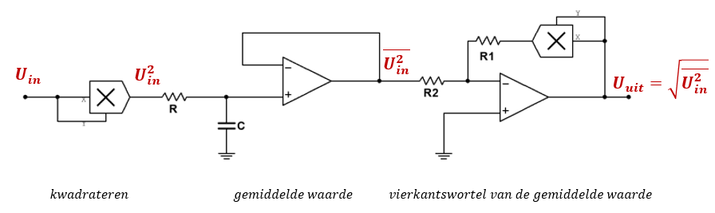

# Te kennen leerstof Electronic Systems Theorie

## Integrator-differentiator 

- Je herkent een integrator principeschema 
  - 
- Je kan de formule (uitgangsspanning in functie ingangsspanning) voor een integrator afleiden vanuit een principeschema van een integrator 
  - $\frac{\Delta \boldsymbol{V}_{\text {out }}}{\Delta \boldsymbol{t}}=-\frac{\boldsymbol{V}_{\text {in }}}{\boldsymbol{R}_{\boldsymbol{i}} \cdot \boldsymbol{C}}$
- Je kan verklaren waarom een weerstand parallel wordt geschakeld met de condensator bij een integrator. 
  - Van zodra er een zeer kleine DC-offset aanwezig is, drijft het de uitgang naar saturatie.
  - De condensator gedraagt zich als een oneindige weerstand voor DC. Hierdoor ontstaat voor DC een niet-
    inverterende versterker met een zeer grote terugkoppelweerstand waardoor een zeer kleine offset heel groot wordt versterkt.
  - Voor de lagere frequenties biedt de parallelweerstand een pad waarlangs de condensator kan ontladen waardoor de
    versterkingsfactor verlaagd.
- Je kan oefeningen oplossen aangaande het spanningsverloop aan de uitgang ten opzichte van een gegeven ingangssignaal. 
  - 
- Je kan toepassingen van een integrator opnoemen. 
  - Het genereren van een driehoeksgolf aan de hand van blokgolven.
- Je herkent een differentiator principeschema 
  - 
- Je kan de formule voor een differentiator afleiden vanuit een principeschema van een differentiator
  - $V_{o u t}=-\frac{V_{C}}{t} \cdot C \cdot R_{f}$
- Je kan verklaren waarom een weerstand in serie wordt geschakeld met de condensator bij een differentiator. 
  - Om de versterking te bepalen komt er een kleine weerstand in serie, deze heeft geen invloed op de differentiator.
- Je kan oefeningen oplossen aangaande het spanningsverloop aan de uitgang ten opzichte van een gegeven ngangssignaal. 
  - 
  - 
- Je kan toepassingen van een differentiator opnoemen
  - Temperatuurscontrole in een oven. In plaats van dat het alarm afgaat bij een bepaalde drempelwaarde zal het alarm kunnen afgaan bij een bepaalde snelheid van temperatuursstijging.

## Actieve filters

- Je verklaart de response van een laagdoorlaatfilter
  - Een laagdoorlaatfilter bestaat uit een weerstand gvolgd door een conensator die naar de masa gaat. Alle frequenties boven de afsnijfrequentie $f_c$ worden hard verzwakt.
  - 
- Je verklaart de response van een hoogdoorlaatfilter
  - Een hoogdoorlaatfilter bestaat uit een condensator gevolgd door een weerstand die naar de masa gaat. Alle freuenties onder de afsnijferquentie $f_c$ worden hard verzwakt.
  - 
- Je verklaart de response van een banddoorlaatfilter
  - Een banddoorlaatfilter is het gevolg van een cascadeschakeling van een hoogdoorlaatfilter met een laagdoorlaatfilter. We hebben een lage afsnijferquentie $f_{cl}$ en een hoge afsnijfersuentie $f_{ch}$​ die gelegen zijn cond de centrale frequentie $f_0$.
  - 
  - 
- Je verklaart de response van een bandsperfilter
  - Heeft een tegenovergestelde respons dan een banddoorlaatfilter. Er wordt een specifieke frequentieband onderdrukt, hogere en lagere frequenties worden doorgelaten.
  - 
- Je beschrijft wat een allpass filter is
  - Een all-pass filter laat alle frequenties door maar veroorzaakt een faseverschuiving
    geassocieerd met bepaalde frequenties.
- Je herkent een chebyshevkarakteristiek
  - Chebyschev vertoont rimpels in zijn doorlaatkarakteristiek en heeft een grotere roll-off dan −20𝑑𝐵/decade per pool.
  - 
- Je herkent een besselkarakteristiek
  - Bessel heeft een lineaire fasekarakteristiek in zijn doorlaatgebied en een roll-off van minder dan −20 𝑑𝐵/decade per pool.
  - 
- Je herkent een butterworthkarakteristiek
  - Butterworth heeft een zeer vlakke doorlaatkarakteristiek en een roll-off van −20 𝑑𝐵/decade per pool.
  - 
- Je kan aan een blokgolfvorm zien of je te maken hebt met een bessel, chebyshev of butterworthfilter
  - 
  - 
  - Besselfilter: 
- Je beschrijft de onderlinge verschillen tussen een bessel, butterworth en chebyshev filter.
  - Butterworth heeft een zeer vlakke doorlaatkarakteristiek en een roll-off van −20 𝑑𝐵/decade per pool. Chebyschev vertoont rimpels in zijn doorlaatkarakteristiek en heeft een grotere roll-off dan −20𝑑𝐵/decade per pool. Bessel heeft een lineaire fasekarakteristiek in zijn doorlaatgebied en een roll-off van minder dan −20 𝑑𝐵/decade per pool.
- Je verklaart het begrip filterorde
  - De filterorde bepaalt de sterkte van de roll-off rate. Een tweede orde filter heeft twee polen en bestaat met andere woorden uit 2 RC netwerken.
- Je bepaald de roll-off rate van een bepaalde filterorde
  - Elke RC netwerk levert een roll-off rate van -20dB/decade. Meerdere RC netwerken geven een veelvoud van deze roll-off rate.
- Je berekent een laag- of hoogdoorlaatfilter via een opgegeven tabel.
  - 
- Je verklaart het begrip dempingsfactor
  - De dempingsfactor bepaalt de responskarakteristiek. Via de dempingsfactor bekom je een specifieke Butterworth- Bessel of Chebyshevfilter.
- Je beschrijft een Sallen-Key filter
  - Een Sallen-Key laagdoorlaatfilter is de meet voorkomende 2de orde configuratie voor een laagdoorlaatfilter. Een andere benaming voor dit type fliter is Voltage Controlled Voltage Source filter of kortweg VCVS-filter.
  - 
- Je berekent een banddoorlaatfilter
  - 
- Je berekent de centrale frequentie van een banddoorlaatfilter
  - $f_{0}=\sqrt{f_{c l} \times f_{c h}}$
  - $f_{0}=\sqrt{\frac{1}{2 \pi R_{F H D} C_{F H D}} \times \frac{1}{2 \pi R_{F L D} C_{F L D}}}$
    $f_{0}=\frac{1}{2 \pi \sqrt{R_{F H D} \cdot R_{F L D} \cdot C_{F H D} \cdot C_{F L D}}}$
- Je berekent de bandbreedte van een banddoorlaatfilter
  - $B W=f_{c h}-f_{c l}$
- Je beschrijft de opbouw en werking van een multifeedback banddoorlaatfilter
  - De twee terugkoppelingen worden verwezenlijkt 𝐶1 en 𝑅2. De weerstandsnetwerk 𝑅1𝐶1 zorgt voor de laagdoorlaatresponse van de bandfilter terwijl het weerstandsnetwerk 𝑅2𝐶2 voor de hoogdoorlaatrespons zorgt.
  - 
- Je beschrijft de opbouw en werking van een state-variable banddoorlaatfilter.
  - Deze filter wordt veel gebruikt als banddoorlaatfilter en bestaat uit een somversterker gevolgd door twee integratorschakelingen met opamp. De integratorschakelingen gedragen zich als 1-pool filters in cascade. Ze vormen op die manier een tweede orde filter. Qualiteitsfactoren tot 100 kunnen worden bereikt.
  - Lage frequenties worden via de terugkoppeking 180° in fase gedraaid waardoor ze elkaar minimaliseren. Hogere frequenties worden door de integrators verzwakt.
  - 
- Je verklaart de opbouw van een state-variablebandsperfilter
- Je lost de (geziene) oefeningen op aangaande banddoorlaatfilters en bandsperfilters
- 
  - 
  - 
  - 
  - 
- Je tekent en beschrijft het principe van RFID in functie van de geziene filters (toepassingsvoorbeeld)
  - De banddoorlaatfilter laat het ASK-signaal, bestaande uit een draaggolf van 123 𝑘𝐻𝑧, door. Dit banddoorlaatfilter reduceert eveneens de HF-ruis en andere signaalbronnen. 
  - De versterker versterkt het zeer kleine signaal afkomstig van de RFID-tag (label). 
  - De gelijkrichter elimineert het negatieve gedeelte van het gemoduleerde signaal terwijl de laagdoorlaatfilter de draaggolf verwijdert en enkel het gemoduleerde digitaal signaal doorlaat. 
  - Een comparator tenslotte vormt de ASK-informatie om tot een bruikbare digitale datastream.
  - 
- Je kan de test jezelf vragen beantwoorden en de voorbeeldoefeningen oplossen. 
  - Test jezelf aangaande algemene filterresponse
    1. Wat bepaald de bandbreedte van een laagdoorlaatfilter?
       - De afsnijfrequentie bepaald de bandbreedte .
    2. Wat begrenst de bandbreedte van een actieve hoogdoorlaatfilter?
       - De roll-off rate van de open-lusversterking beperkt de bandbreedte van de opamp waardoor de hogere frequenties ook beperkt zullen worden.
    3. Hoe verhouden zich de 𝑸-waarden en bandbreedte van een banddoorlaatfilter. Verklaar hoe de selectiviteit wordt beïnvloed door de 𝑸-factor van een filter.
         - De 𝑄-factor en de bandbreedte verhouden zich omgekeerd. Hoe hoger de 𝑄-factor, hoe selectiever de filter en bijgevolg hoe smaller de bandbreedte.
    4. Wat is een all-pass filter en welke eigenschap wordt gebruikt om het te specificeren?
       - Een all-pass filter laat alle frequenties door maar veroorzaakt een faseverschuiving geassocieerd met bepaalde frequenties
  - Test jezelf aangaande de filterresponsekarakteristieken
    1. Verklaar hoe de Butterworth-, Chebyshev- en Besselkarakteristiek van elkaar verschillen.
         - Butterworth heeft een zeer vlakke doorlaatkarakteristiek en een roll-off van −20 𝑑𝐵/decade per pool. Chebyschev vertoont rimpels in zijn doorlaatkarakteristiek en heeft een grotere roll-off dan −20𝑑𝐵/decade per pool. Bessel heeft een lineaire fasekarakteristiek in zijn doorlaatgebied en een roll-off van minder dan −20 𝑑𝐵/decade per pool.
    2. Wat bepaalt de responsekarakteristiek van een filter?
       - De dempingsfactor bepaald de responsekarakteristiek.
    3. Noem de basisdelen van een actieve filter.
       - Frequentieselectief netwerk, versterkerelement en negatief terugkoppelnetwerk zijn de delen van een actieve filter.
  - Test jezelf aangaande actieve laagdoorlaatfilters
    1. Hoeveel polen heeft een 𝟐𝒅𝒆 orde laagdoorlaatfilter? Hoeveel weerstanden en hoeveel condensatoren worden er gebruikt in het frequentie-selectieve netwerk?
         - 2de orde filter heeft twee polen, 2 weerstanden en 2 condensatoren in het frequentieselectief netwerk.
    2. Waarom is de dempingsfactor van een filter zo belangrijk?
       - De dempingsfactor bepaalt de responsekarakteristiek.
    3. Waarom wordt er gebruik gemaakt van cascading bij laagdoorlaatfilters?
       - In cascade plaatsen verhoogt de roll-off rate.
  - Test jezelf aangaande actieve hoogdoorlaatfilters
    1. In hoeverre verschilt een hoogdoorlaat Sallen-Key filter van een laagdoorlaat Sallen-Key filter?
         - De posities van de 𝑅′𝑠 en de 𝐶′𝑠 in het frequentieselectief netwerk zijn omgekeerd voor de hoogdoorlaatfilter in vergelijking van de posities in de laagdoorlaatfilter.
    2. Om de afsnijfrequentie van een hoogdoorlaatfilter te verhogen, zou je dan de weerstandswaarden in het frequentieselectief netwerk van de filter verhogen of verlagen?
         - Verlagen van de 𝑅-waarden verhoogt de afsnijfrequentie.
    3. Als drie 2-pool hoogdoorlaatfilters en één 1-pool hoogdoorlaatfilter in cascade worden geschakeld, wat is dan de resulterende roll-off?
         - −140 𝑑𝐵/decade.
  - Test jezelf aangaande banddoorlaatfilters
    1. Wat bepaalt de selectiviteit in een banddoorlaatfilter?
       - De kwaliteitsfactor.
    2. Een filter heeft een kwaliteitsfactor gelijk aan 5 en een andere filter heeft een kwaliteitsfactor gelijk aan 25. Welk van beide filters heeft de kleinste bandbreedte?
         - 𝑄 = 25; hoe hoger de 𝑄-factor, hoe smaller de bandbreedte.
    3. Uit welke elementen bestaat een state-variable filter?
       - Een somversterker en twee integrators vormen samen een state-variable filter.
    4. Wat is de versterking van de banddoorlaatfilter in figuur 2-35?
       - 1,38.
  - Test jezelf aangaande actieve bandsperfilters
    1. In welke mate verschilt een bandsperresponse van een doorlaatresponse?
       - Een bandsperfilter onderdrukt frequenties binnen de sperband, een banddoorlaatfilter laat de frequenties door binnen het doorlaadband.
    2. Hoe kan je een state-variable banddoorlaatfilter omvormen naar een bandsperfilter?
       - De laagdoorlaatuitgang en de hoogdoorlaatuitgang met een somversterker verbinden. De uitgang van de somversterker levert dan de bandsperresponse op.

## Oscillatoren

- Je beschrijft de verschillen tussen een oscillatie met terugkoppelingsnetwerk en een relaxantieoscillator
  - De oscillator met een terugkoppelingsnetwerk koppelt een deel van het uitgangssignaal terug naar de ingang. Dit terugkoppelen zorgt voor een versterking van het ingangssignaal. Nadat de oscillator is gestart en de gewenste amplitude is bekomen wordt de gesloten lusversteking op een versterkingsfactor gelijk aan één gehouden.
  -  
  - Een relaxatie-oscillator maakt gebruik van een 𝑅𝐶-timing netwerk om een golfvorm te produceren. De geproduceerde golfvorm is meestal blokvormig of een ander niet-sinusoïdale golfvorm.
  -  
- Je somt de voorwaarden tot oscillatie op
  - De faseverschuiving langsheen de terugkoppellus moet 0° zijn.
  - De spanningsversterking langsheen de gesloten lusversterking moet gelijk zijn aan 1.
- Je somt de opstartcondities op voor een oscillator
  - In feite ontstaat het signaal uit thermische ruis of van overgangsverschijnselen die ontstaan door het aanschakelen van de voedingsspanning over de oscillatieschakeling. Voor één bepaalde frequentie zal het teruggekoppelde signaal in fase zijn met het ingangssignaal en dit is de oscillatiefrequentie.
  - Om de oscillatie te kunnen starten moet de gesloten lusversterking van de positieve terugkoppeling in
    eerste instantie groter dan 1 zijn. Van zodra dit gewenst niveau bereikt is dient deze versterking terug te dalen tot de waarde 1 wordt bereikt.
- Je tekent en verklaart de werking van een wienbrugoscillator
  - Het netwerk 𝑅1𝐶1 vormt een laagdoorlaatfilter. De spanning over 𝐶1 is naijlend ten opzichte van de ingangsspanning. Het netwerk 𝑅2𝐶2 vormt een hoogdoorlaatfilter en de spanning over 𝑅2 is voorijlend ten opzichte van de ingangsspanning. 
  - Als de frequentie laag is domineert het 𝑅2𝐶2-netwerk omwille van de hoge reactantie van de condensator 𝐶2. Praktisch alle spanning komt over 𝐶2 te staan en over de uitgang (parallelschakeling 𝑅2 met 𝐶1) staat een zeer kleine spaningsval. Naarmate de frequentie stijgt zal de reactantie 𝑋𝐶2 afnemen waardoor spanning over 𝐶2 zal afnemen en de uitgangsspanning zal stijgen. De responsecurve is de vorm van de stijgende curve vanaf de lage frequenties tot de resonantiefrequentie 𝑓𝑟. Van zodra frequentie een waarde heeft hoger dan de resonantiefrequentie zal de reactantie van 𝐶1 bepalend worden voor de totale impedantiewaarde van de 𝑅2𝐶1-parallelschakeling. Het gevolg is dat totale impedantie van het 𝑅2𝐶2-netwerk kleiner wordt wat resulteert in vooral een grotere spanningsval over 𝑅1 en een kleinere spanningsval aan de uitgang. Hierdoor daalt de responsekarakteristiek bij hogere frequenties dan de resonantiefrequentie. Vermits bij de lage frequenties de condensator 𝐶2 dominerend is verkrijgen we een faseverschuiving aan de uitgang tussen 90° (zo goed als alle spanning over 𝐶2) en 0° (𝑓 = 𝑓𝑟). Bij frequenties hoger dan de resonantiefrequentie is de condensator 𝐶1 dominerend wat betreft de grootte van het uitgangssignaal. Het gevolg hiervan is dat de faseverschuiving verloopt van 0° (𝑓 = 𝑓𝑟) naar −90°. De −90° faseverschuiving wordt bekomen van zodra de uitgangsimpedantie zeer sterk de Ohmse waarde van 𝑋𝐶1 benadert. Vermits de faseverschuiving van +90° naar −90° verloopt is er één frequentie waarbij de totale faseverschuiving gelijk is aan 0°. De frequentie waarbij deze faseverschuiving gelijk is aan 0° is de resonantiefrequentie 𝑓𝑟 van het Wiennetwerk.
  - 
- Je herkent en verklaart de werking van een zelfstartende wienbrugoscillator door gebruik te maken van zenerdioden.
  - Wanneer de voedingsspanning wordt aangeschakeld is de stroom nog zodanig klein dat beide zenerdioden een grote weerstand bezitten en zich als “open” gedragen. Hierdoor staat 𝑅3 enkel in serie met 𝑅5. Dit verhoogt de gesloten lusversterking $A_{g l}=1+\frac{R_{3}+R_{5}}{R_{4}}$. Hoe groter 𝑅5 is, hoe sneller heto scillatiesignaal wordt opgebouwd. Van zodra de spanning van het uitgangssignaal de zenerspanning bereikt, geleiden de beide zenerdioden (een in doorlaat (𝐷2) en een via het bereiken van 𝑈𝑍 (𝐷1)). De geleidende zenerdioden hebben een zeer kleine weerstand waardoor ze de weerstand 𝑅5 praktisch kortsluiten. Het gevolg hiervan is dat 𝐴𝑔𝑙 terugvalt naar $A_{g l}=1+\frac{R_{3}}{R_{4}}=3$.​
  - 
- Je herkent en verklaart de werking van een wienbrugoscillator met JFET.
  - Als de gatespanning 𝑈𝐺 negatiever wordt dan stijgt de drain-source weerstand 𝑟𝐷𝑆. Door de JFET in het negatief terugkoppelnetwerk te plaatsen kan op deze wijze een automatische spanning-versterkingscontrole worden verwezenlijkt. 
  - Bij het opstarten van de oscillator is 𝑈𝑢𝑖𝑡 in eerste instantie gelijk aan 0 𝑉. De diode 𝐷1 is niet in geleiding waardoor de gate via de weerstand 𝑅5 met de massa is verbonden. Er staat dus 0 𝑉 op de gate van 𝑇1 waardoor de  weerstandswaarde van 𝑟𝐷𝑆 minimaal is. De spanningsversterking van de schakeling is gelijk aan $A_{g l}=1+\frac{R_{3}}{R_{4}+r_{D S}}$. Door het feit dat 𝑟𝐷𝑆 minimaal is, is 𝐴𝑔𝑙 maximaal en groter dan 1. De oscillatie begint te oscilleren op de resonantiefrequentie en het uitgangssignaal stijgt snel. Van zodra 𝑈𝑢𝑖𝑡 voldoende groot is om de diode 𝐷1 in geleiding te brengen wordt het uitgangssignaal negatief gelijkgericht en via 𝐶3 afgevlakt. Hierdoor ontstaat een negatieve spanning die aan de gate van 𝑇1 wordt aangelegd. Het gevolg van deze negatieve spanning is dat de weerstand 𝑟𝐷𝑆 stijgt waardoor de versterkingsfactor vermindert.
  - 
- Je tekent en verklaart de werking van een faseverschuivingsoscillator.
  - Elk van de drie 𝑅𝐶-netwerken kunnen zorgen voor een faseverschuiving van maximaal 90°. De oscillatie doet zich voor bij de frequentie waarbij de totale faseverschuiving van de drie 𝑅𝐶-netwerken 180° is zodat de totale faseverschuiving 360° is. De verzwakking 𝐵 van de drie 𝑅𝐶-netwerken bedraagt 1/29. Dit betekent dat om de oscillator te laten starten de versterking groter dan 29 moet zijn.
  - 
- Je tekent en verklaart de principewerking van een Twin-T-oscillator.
  - Een van de twin-T-filters is een laagdoorlaatfilter en de andere een hoogdoorlaatfilter. De gecombineerde parallelfilters vormen samen een bandstopfilter met centerfrequentie gelijk aan de gewenste oscillatiefrequentie.
  - 
- Je bepaalt de resonantiefrequentie van een RC faseverschuivingsoscillator en wienbrugoscillator
  - Faseverschuivingsoscillator: $f_{r}=\frac{1}{2 \pi \sqrt{6} R C}$
  - Wienbrugoscillator: $f_{r}=\frac{1}{2 \pi R C}$
- Je beschrijft hoe een resonantiesignaal wordt opgewekt in een LC-keten.
  - Wanneer er een opgeladen condensator en een spoel in serie met elkaar komen te staan ontstaat er een pin-pong bewegin van de lading van de condensaotr naar de spoel en terug. Om een constante oscillatie te kunnen behouden moet het niveau van de energietoevoer naar het 𝐿𝐶-netwerk nauwkeurig geregeld worden. Hiervoor moet er een vorm van automatische amplitudecontrole gevonden worden die deze constant houdt telkens wanneer de amplitude probeert te variëren ten opzichte van een referentiespanning. Voor een stabiele oscillatie moet de totale versterking van het circuit gelijk zijn aan 1.
  - $f_{r}=\frac{1}{2 \pi \sqrt{L C}}$
  - 
- Je herkent een Colpittsoscillator en kan de resonantiefrequentie ervan bepalen.
  - $f_{r}=\frac{1}{2 \pi \sqrt{L C_{t}}}$
  - 
- Je noemt de condities voor het opstarten van een Colpittsoscillator op.
  - Een van de voorwaarden tot oscillatie is dat 𝐴𝑢 × 𝐵 = 1. Om de oscillator uit zichzelf te laten starten moet 𝐴𝑢 × 𝐵 groter dan 1 zijn. Dit betekent dat de spanningsversterking lichtjes groter moet zijn dan de verhouding van 𝐶1/𝐶2.
- Je verklaart de beïnvloeding van de oscillatorfrequentie door de belasting op het LC-netwerk.
  - Gebruik maken van een FET om de oscillatie te totnen zal een hogere ingangimpedantie creeren. Anders wordt de kwaliteitsfactor van het 𝐿𝐶-netwerk gereduceerd.
- Je herkent een Clapposcillator en kan de resonantiefrequentie ervan bepalen.
  - $f_{r}=\frac{1}{2 \pi \sqrt{L C_{T}}}$
  - 
- Je herkent een Hartleyoscillator en kan de resonantiefrequentie ervan bepalen.
  - $f_{r}=\frac{1}{2 \pi \sqrt{L_{T} C}}$
  - 
- Je noemt de condities voor het opstarten van een Hartleyoscillator op.
  - Om zeker te zijn dat de oscillator opstart moet de spanningsversterking 𝐴𝑢 groter zijn dan 1/𝐵.
- Je verklaart het piëzo-elektrisch effect
  - Legt men een 𝐴𝐶-spanning over het kristal dan vibreert het op de frequentie van de aangelegde spanning. De grootste trilling doet zich voor bij de natuurlijke resonantiefrequentie van het kristal. Deze resonantiefrequentie wordt bepaald door fysische dimensies van het kristal en de wijze hoe het kristal is gesneden.
- Je tekent het equivalent schema van een kristal
  - 
- Je herkent een kristaloscillator werkend op serieresonantie en beschrijft de werking/instelling van het kristal op serieresonantie
  - De impedantie van het kristal is minimaal bij een frequentie gelijk aan de serieresonantiefrequentie 𝑓𝑟𝑠. Dit betekent dat bij 𝑓𝑟𝑠 de terugkoppeling naar de ingang het grootst is. De kristaltuningscondensator 𝐶, die in serie met het kristal staat, wordt gebruikt om 𝑓𝑟𝑠 af te regelen door deze frequentie van het kristal lichtjes naar boven of naar onder te regelen.
  - 
- Je herkent een kristaloscillator werkend op parallelesonantie en beschrijft de werking/instelling van het kristal op parallelresonantie
  - Het schema is in feite een aangepaste Colpitts oscillator waarbij de spoel vervangen is door een kristal. Bij parallelresonantie is de impedantie van het kristal het grootst bij resonantie. Hierdoor ontstaat over de condensatoren 𝐶1 en 𝐶2 de grootste spanning.
  - 
- Je beschrijft hoe je een kristal kan laten oscilleren op een harmonische
  - Overtoon frequenties of harmonischen zijn over het algemeen gehele (integer) vermenigvuldigingen van de fundamentele frequentie. Ze zijn meestal (maar niet altijd) oneven vermenigvuldigingen van de fundamentele frequentie. Om in overtoon te werken moet er een resonantieketen zijn, die bestaat uit de spoel 𝐿1 en de condensator 𝐶1, moet wel resoneren op de gewenste overtoonfrequentie.
- Je tekent en legt het principe uit van een driehoeksoscillator
  - Blokgolfoscillator met integrator erachtergeschakeld die de blokgolf naar een driehoekgolf integreert.
  -   
- Je berkent de oscillatiefrequentie van een driehoeksoscillator.
  - $f=\frac{1}{4 R C} \times \frac{R_{1}}{R_{2}}$
- Je tekent en verklaart de werking van een blokgolfoscillator
  - Een blokgolfoscillator is gebaseerd op een relaxatie-oscllator en maakt gebruik van de $RC$​ tijdsconstante.
  - 
- Je beschrijft wat een SAW-filter is
  - Surface Acoustic Wave filter zet een elektrisch signaal om in een akoestische golf die over een piëzo-elektrische materiaal zoals kwarts wordt geleid. 
- Je kan de test jezelf vragen en multiple-choice vragen beantwoorden en de voorbeeldoefeningen oplossen.
  - Test jezelf aangaande het begrip oscillator
    1. Wat is een oscillator?
       - Een oscillator is een schakeling dat aan zijn uitgang een herhalende panningsgolf creëert met enkel de 𝐷𝐶-voedingsspanning als invoer.
    2. Wat type van terugkoppeling heeft een terugkoppelingsoscillator nodig?
       - Positieve terugkoppeling
    3. Wat is het doel van het terugkoppelnetwerk?
       - Het positief terugkoppelnetwerk voorziet van de nodige verzwakking en  faseverschuiving om aan de voorwaarden tot oscillatie te kunnen voldoen.
    4. Welke zijn de condities (voorwaarden) die nodig zijn om een schakeling te laten oscilleren?
      - De rondgaande faseverschuiving is gelijk aan 0° en de gesloten lusversterking is gelijk aan 1 (na het opstarten van de oscillatie)
    5. Definieer positieve terugkoppeling.
       - Positieve terugkoppeling is wanneer een deel van het uitgangssignaal wordt teruggevoerd naar de ingang van de versterker op een zodanige manier dat het zichzelf versterkt.
    6. Wat is de spanningsversterkingsconditie voor een oscillator?
       - De spanningsversterkingsconditie moet voor het opstarten van een oscillator groter dan 1 zijn.
  - Test jezelf aangaande 𝑹𝑪-oscillatoren met terugkoppeling
    1. Er zijn twee terugkoppelingen in de Wienbrugoscillator. Wat is de functie van iedere
        terugkoppeling?
      - De negatieve terugkoppeling zorgt voor de gesloten lusversterking en de positieve terugkoppeling voor de oscillatiefrequentie.
    2. Een Wiennetwerk bestaat uit twee gelijke weerstanden en twee gelijke condensatoren. Als aan de ingang van het netwerk een spanning wordt aangelegd met als waarde 𝟓 𝑽𝒆𝒇𝒇 wat is dan de effectieve uitgangsspanning van dit netwerk als de frequentie van het ingangssignaal gelijk is aan de resonantiefrequentie van het netwerk?
      - 1,67 $𝑉_{eff}$​
    3. Waarom is de faseverschuiving van een faseverschuivingsoscillator gelijk aan 𝟏𝟖𝟎°?
       - De spanningsversterker van de faseverschuivende oscillator heeft een faseverschuiving van 180°. Hierdoor moeten de drie 𝑅𝐶-netwerken samen voor een faseverschuiving van eveneens 180° zorgen zodat het teruggekoppelde signaal in fase is met het uit ruis opgewekt signaal.
    4. Waarom kunnen frequenties hoger dan de oscillatiefrequentie geen aanleiding geven
        tot oscillaties bij de twin-T oscillator?
      - Omdat deze frequenties met een verkeerde faseverschuiving (niet gelijk aan 0°) aan de ingang worden teruggekoppeld en bijgevolg een demping voor deze frequenties ontstaat.
  - Test jezelf aangaande 𝑳𝑪-oscillatoren met terugkoppellus
    1. Wat is het verschil tussen een Colpitts- en een Hartley oscillator?
      - Bij een Colpittsoscillator bestaat het 𝐿𝐶-netwerk uit twee in serie staande condensatoren die in parallel staan met een spoel terwijl bij een Hartley-oscillator het 𝐿𝐶-netwerk bestaat uit twee in serie staande spoelen die in parallel staan met een condensator.
    2. Wat is het voordeel van een FET-oscillator in een Colpitts- of Hartley oscillator ten opzichte van een transistoroscillator (BJT-oscillator)?
      - De 𝐹𝐸𝑇 heeft een hogere ingangsweerstand dan een 𝐵𝐽𝑇. Hierdoor belast een 𝐹𝐸𝑇 een 𝐿𝐶-resonantiekring minder dan een 𝐵𝐽𝑇.
    3. Hoe kan je een Colpitts oscillator onderscheiden van een Clapp oscillator?
       - De Clapp-oscillator heeft een extra condensator in serie met de spoel in het positieve terugkoppelnetwerk van de oscillator.
    4. Hoe kun je een kristal op zijn 7de overtoon instellen?
       - Door een 𝐿𝐶-keten toe te voegen in het positief terugkoppelnetwerk dat resoneert op de zevende harmonische van het kristal.
  - Test jezelf aangaande relaxatie-oscillatoren
    1. Wat is een VCO en wat doet deze schakeling?
       - Een 𝑉𝐶𝑂 (spanningsgestuurde oscillator) levert een bepaalde frequentie aan zijn uitgang die kan gevarieerd worden met een controlespanning.
    2. Op welk principe werkt een relaxatie-oscillator?
       - Relaxatie-oscillatoren werken op het principe van het laden en ontladen van een condensator.
    3. Wat is een 𝑆𝐴𝑊-filter?
       - 𝑆𝐴𝑊 is een speciale hoogfrequent banddoorlaatfilter dat gebruikt kan worden bij microgolf frequenties.

## Spanningsregelaars 

- Je tekent en verklaart het principeschema van een lineaire regelaar
  - 
  - Lineaire Serieregelaar
- Je kan de principewerking van een serieregulator met discrete componenten tekenen en verklaren.
  - Regelelement bestaat uit een transistor die in serie staat met de belasting tussen in- en uitgang van de regelaar
  - Als het terugkoppelnetwerk een verandering in de outputspanning detecteert, genereert het een bepaald spanningsniveau naar de verschildetectie toe.
  - De verschildetector detecteert het verschil tussen de referentiespanning en de teruggekoppelde spanning van de uitgang (geleverd door het terugkoppelnetwerk).
  - Afhankelijk van het verschil aan de ingang van de verschildetector levert deze een stuursignaal naar het regelelement waardoor de transistor meer of minder in geleiding wordt gebracht en aldus meer of minder stroom naar de belasting toe levert.
- Je kan de uitgangsspanning berekenen van een regelaar.
  - $U_{u i t}=\left(1+\frac{R_{2}}{R_{3}}\right) U_{r e f}$
- Je tekent en verklaart de werking van een serieregelaar met constante stroombegrenzing.
  - De maximale belastingsstroom 𝐼𝐿𝑚𝑎𝑥 is gelijk aan de stroom door 𝑅4 als de spanningsval over 𝑅4 gelijk is aan 0,7 𝑉.
  - 
- Je begrenst de maximale stroom door een serieregelaar
  - $I_{L \max }=\frac{0,7 V}{R_{4}}$
- Je herkent de serieregelaar met fold-back stroombegrenzing en verklaart de principewerking
  - Bij Fold-Back Current Limiting zakt bij een te hoge belasting de uitgangsstroom fors naar beneden om alzo grote vermogendissipatie te vermijden. 
  - R4 heeft hetzelfde doel als bij de constante stroombegrenzing
  - Doordat spanningsdeler R5-R6 in de schakeling staat moet ook de spanningsval over R4 nu ook de spanningsval over R5 overwinnen om 𝑇2 in geleiding te brengen. $𝑈𝑅4 = 𝑈𝑅5 + 𝑈𝐵𝐸$
  - Bij overbelasting of kortsluiting stijgt de belastingsstroom tot een bepaalde maximumstroom die zodanig groot is dat UR4 voldoende groot is om Q2 in geleiding te brengen.
  - Het dalen van de uitgangsspanning resulteert in een proportioneel dalen van de spanning over R5 waardoor er minder stroom door R4 gaat en er ook minder spanning nodig is om Q2 in geleiding te houden => daling van UOUT veroorzaakt een daling van IL.
  - Voordeel van deze methode: regelaar kan werken tot IL(max) ; overschrijden van deze stroom doet de uitgangsstroom dalen zodat oververhitting van componenten wordt voorkomen.
  - 
- Je tekent en verklaart het principe van een lineaire shuntregelaar
  - Als VOUT daalt (Fig. 17-4 a) => terugkoppelspanning via R3-R4 daalt ook => spanning aan niet inverterende ingang van de opamp daalt ook => uitgang van de opamp daalt ook => UB daalt => Collectorstroom Q1 daalt (shunt current) waardoor de collectorspanning stijgt => originele uitgangsspanningsdaling wordt op deze wijze gecorrigeerd.
  - Als VOUT stijgt( Fig 17-4 b) => terugkoppelspanning via R3-R4 stijgt ook => spanning aan niet inverterende ingang van de opamp stijgt ook => uitgang van de opamp stijgt ook => UB stijgt => Collectorstroom Q1 stijgt (shunt current) waardoor de collectorspanning daalt => originele uitgangsspanningsstijging wordt op deze wijze gecorrigeerd.
  - 
- Je tekent en verklaart het werkingsprincipe van een step-down converter
  - Step-Down configuratie of back converter: uitgangsspanning is steeds lager dan de ingangsspanning
  - Principe : Controle-element is een high-speed schakelaar die zeer snel opent en sluit en gestuurd wordt door een controle mechanisme dat de uitgangsspanning bewaakt.
  - Schakelaar gesloten => diode spert en spoel laadt magnetische energie op
  - Schakelaar open => Magnetisch veld verdwijnt en de afnemende energie van dit veld zorgt ervoor dat er een constante stroom door de belasting blijft vloeien. De stroomketen is intact dank zij de diode die in geleiding staat tijdens het open zijn van de schakelaar. (dit op voorwaarde de belastingsweerstand is niet te groot)
  - De condensator vlakt de DC af tot een nagenoeg constant niveau
  - 
- Je tekent en verklaart het werkingsprincipe van een step-up schakelende regelaar.
  - Step-Up configuratie of boost converter: Q1 werkt als schakelaar naar massa toe.
  - Q1 = on => spanning gelijk aan VIN wordt geinduceerd over de spoel met een polariteit zoals in figuur is
    weergegeven
    - Gedurende de “on”-time van Q1 daalt de spanning over de spoel van zijn initial maximum
    - Diode D1 staat dan in sper
    - Hoe langer Q1 aan blijft, hoe lager VL wordt
    - Gedurende de “on”-tijd verliest de condensator maar een klein deel van zijn lading aan de belasting
  - Q1 = off => de spanning over de spoel verandert van polariteit en wordt opgeteld bij VIN
    - Diode D1 staat in geleiding zodat de condensator kan opgeladen worden; vermits VL bij VIN wordt opgeteld, kan de condensator zich opladen met een spanning die hoger is dan VIN zelf.
    - De uitgangsspanning komt overeen met de condensatorspanning;
    - Spanningsregeling wordt bekomen door de variatie van de “on”-tijd van Q1.
      Als VOUT stijgt => “on”-tijd Q1 zal dalen
      Als VOUT daalt => “on”-tijd Q1 zal stijgen
      De regelende actie zorgt ervoor dat VOUT op een constant niveau blijft
  - 
- Je tekent en verklaart het werkingsprincipe van een voltage-inverter schakelende regelaar
  - Voltage-Inverter of back-boost converter: Produceert een uitgangsspanning dat tegengesteld is in polariteit als de ingangsspanning
  - Moment Q1 wordt on => spoelspanning stijgt tot ongeveer VIN – VDS(sat) en het magnetisch veld vergroot snel 
  - Terwijl Q1 = on => diode staat in sper en de spoelspanning daalt
  - Moment Q1 gaat naar toestand off => magnetisch veld stort in en de polariteit van de spanning over de spoel keert om.
    - Diode D1 komt in geleiding => C laadt op en produceert een negatieve uitgangsspanning
  - Het herhalend aan- en uitschakelen van Q1 produceert een herhalend laden en ontladen van de condensator.
    Dit laad- ontlaadpatroon wordt door de LC-filter afgevlakt
  - 
- Je herkent een step-down-, step-up-- en een voltage inverter regelaar
- Je kan de test jezelf vragen en multiple-choice vragen beantwoorden en de voorbeeldoefeningen oplossen
  1. Noem 3 typen op van schakelende regelaars
     - Step-down converter of back converter
     - Step-up converter of boost converter
     - Voltage-inverter of back-boost converter
  2. Wat is het belangrijkste voordeel van schakelende regelaars ten opzichte van lineaire regelaars?
     - Ze bieden een veel groter rendement dan de lineaire regelaar. 
  3. Hoe worden veranderingen in de uitgangsspanning gecompenseerd in de schakelende regelaar?
     - Ze hebben een feedback schakeling die aan-uit tijd van de schakelaar regelt.

## Communiciatieschakelingen (enkel presentatie) 

- Je verklaart hoe principieel je een AM, FM en PM (fasemodulatie) kan verwezenlijken
  - Bij AM varieert de amplitude van de draaggolf (fc ) (ook carrier genoemd) op het ritme van het modulatiesignaal (laagfrequentsignaal). Dit modulatiesignaal (fm) kan een audiosignaal zijn zoals de stem (voice) of muziek.
  - Bij FM verandert de amplitude van het informatiesignaal de frequentie van de draaggolf.
  - Bij PM (Phase (fase) Modulatie varieert Ф op het ritme van het LF-informatiesignaal.
- Je kan een AM-signaal tekenen en de verschillende componenten ervan aangeven
  - 
- Je kan voorbeelden van toepassingen van AM-modulatie opnoemen en omschrijven.
  - Broadcast transmisions: Het is eenvoudig te demoduleren en dit betekent dat de radio-ontvangers goedkoop en eenvoudig te fabriceren zijn.
  - Luchtbandradio: Grond-tot-lucht radiocommunicatie en voor tweeweg radioverbindingen voor grondpersoneel.
  - Enkelzijband: Amplitudemodulatie voor point-to-point HF-koppelingen
  - Kwadratuur amplitudemodulatie: Wi-Fi en mobiele telecommunicatie
- Je kan het blokschema van een superheterodyne AM-ontvanger tekenen en werking van de verschillende blokken principieel verklaren.
  - **Antenne**: pikt de uitgestraalde signalen op en levert ze aan de HF-versterker (RF-versterker) Deze signalen zijn zeer klein
  - **RF-versterker**: kan afgestemd worden op een bepaalde frequentie binnen de AM-band. Enkel de geselecteerde draaggolf en zijn twee zijbanden worden versterkt. (niet altijd aanwezig in een AM-ontvanger)
  - **Lokale oscillator**: genereert een sinusgolf met frequentie 455 kHz hoger dan de afgestemde draaggolf.
  - **Mixer (menger)**: twee ingangen : RF-ingang met draaggolf en oscillatoringang met frequentie 455 kHz hoger. De mixer mengt deze 2 signalen zodat een frequentie gelijk aan het verschil tussen oscillatorfrequentie en draaggolf overblijft. Dit is 455 kHZ en wordt middenfrequentie (If) genoemd.
  - **IF-versterker (MF-versterker)**: De input van deze middenfrequentversterker is 455 kHz (met de 2 zijbanden van de originele draaggolf) Doel van deze versterker is het AM-signaal versterken. Keuze MF-versterker omdat dan de afregeling eenvoudig is (afstemmen op 1 frequentie)
  - **Detector**: Demoduleert het AM-signaal zodat de informatie (stem – muziek, ….) terug beschikbaar is
  - **Audioversterker en vermogenversterker**: versterkt het audiosignaal zodat het aan de luidspreker kan aangelegd worden.
  - **AGC**: Automatic Gain Control : Levert een DC-niveau van de detector dat overeenkomt met de sterkte van het AM-signaal. Op die wijze kan een automatische versterking van het signaal bekomen worden waardoor zwakkere ontvangst (verder afgelegen zenders) meer versterkt worden dan sterkere zenders.
  - 
- Je kan een FM-signaal tekenen en het werkingsprincipe van FM-modulatie verklaren
  - Via een Voltage Controlled Oscillator (VCO) kan een oscillatie frequentie bekomen worden die afhankelijk is van de momentele spanning van het informatiesignaal. 
  - 
- Je kan toepassingen van FM-modulatie opnoemen en principieel verklaren
  - FM-Radio: gortere signaal/ruis-verhouding
  - Telemetrie: Radar en monitoring van pasgeborenen
  - Muzieksynthese
  - Videotransmissie
  - Magnetische bandopnamesystemen
- Je kan het blokdiagram van een superheterodyne FM-ontvanger tekenen en het werkingsprincipe ervan verklaren.
  - **RF-amplifier**: versterkt elke frequentie tussen 88-108 MHZ; heel selectief zodat enkel fc en de zijbandfrequenties die de audio bevatten doorgelaten worden.
  - **Local oscillator**: produceert een sinusgolf met een frequentie die 10,7 MHZ hoger ligt dan de geselecteerde RF-frequentie in de RF-amplifier.
  - **Mixer**: mengt RF-signaal met oscillatorsignaal waardoor verschillende frequenties ontstaan, enkel de verschilfrequentie fosc-fc = 10,7 MHz wordt naar de IF-amplifier doorgelaten IF-amplifier : versterkt het 10,7 middenfrequentsignaal Communication Circuits
  - **Limitter**: verwijdert ongewenste variaties van de amplitude van het FM-signaal en zorgt voor een constante amplitude FM-output op de 10,7 middenfrequentiie (IF-frequentie)
  - **Disciriminator**: zet de verandering van frequentie (FM-zwaai) terug om in een audiosignaal. Ook FM-detector genoemd
  - **De-emphasisnetwork**: in de FM-zender worden hogere f’s sterker versterkt dan de lagere (emphasis-netwerk). Het de-emphasisnetwerk zorgt ervoor dat deze hogere f’s terug hun normale amplitude hebben.
  - **Audio and power amplifiers**: versterkt het audiosignaal en werkt analoog als de versterkers voor AM-signaal. Bij een dual AM/FM-configuratie kunnen deze versterkers voor beide modulatiesystemen gedeeld worden.
  - 
- Je kent de middenfrequenties van AM en FM.
  - AM-band: fc ligt tussen 540 kHz en 1640 kHz
  - FM-band: fc ligt tussen 88 MHz – 108 MHz
- Je omschrijft wat een delineiare vermenigvuldiger (multiplier) is en verklaart zijn werkingsprincipe.
  - $V_{o u t}=\frac{\left(X_{1}-X_{2}\right)\left(Y_{1}-Y_{2}\right)}{SF}$​
  - SF= Scale Factor bv. 10V
- Je definieert het begrip scale-factor bij een multiplier en verklaart waarom dit is ingevoerd.
  - Bij het vermeningvuldigen van spanningen kunnen zeer hoge waardes ontstaan, de scale-factor SF deel de vermeigvuldiging zodat grotere ingangsspanningen toegelaten zijn.
- Je kan de vergelijking voor AM-modulatie neerschrijven en het spectrum tekenen. (Spectrum voor zowel een enkele frequentie informatiesignaal als een frequentieband als informatiesignaal)
  - 
- ==Je verklaart het werkingsprincipe van een gebalanceerde modulator en kan het frequentiespectrum ervan tekenen.==
  - 
- ==Je kan het blokdiagram tekenen van een volwaardige AM-modulator gebasseerd op de gebalanceerde modulator en dit principieel verklaren.==
- Je verklaart wat een mengschakeling is.
  - De mixer in een ontvanger zet het inkomend RF-gemoduleerd signaal om in een middenfrequent gemoduleerd signaal. Hierbij wordt gebruik gemaakt van de frequentie van een lokale oscillator. Tijdens het omvormingsproces worden de boven- en onderzijband van het gemoduleerde AM-signaal behouden.
- ==Je toont aan dat een mixer een productfrequentie en een verschilfrequentie levert==
- Je tekent het blokdiagram van een basic AM-demodulator en ==verklaart de werking ervan==.
  - 
  - 
- Je verklaart het nut van een middenfrequent MF (IF)
  - De middenfrequentversterker (IF) in een ontvanger is een afgestemde versterker met een gespecificeerde bandbreedte en werkend rond de centerfrequentie van 455 kHz voor AM en 10,7 MHz voor FM. Hij zorgt ervoor dat er maar één enkele resonantiefrequentie nodig is die hetzelfde blijft over de ganse band van draaggolffrequenties die ontvangen kunnen worden.
- Je verklaart het begrip AGC en geeft aan waarvoor dit gebruikt wordt.
  - AGC : Automatic Gain Control : Levert een DC-niveau van de detector dat overeenkomt met de sterkte van het AM-signaal. Op die wijze kan een automatische versterking van het signaal bekomen worden waardoor zwakkere ontvangst (verder afgelegen zenders) meer versterkt worden dan sterkere zenders.
- Je tekent het principeschema van een eenvoudige FM-modulator (met capaciteitsdioden) en verklaart de werking ervan.
  - FM wordt bekomen door het variëren van de frequentie van een oscillator met het modulatiesignaal. Een voltage controlled oscillator wordt meestal hiervoor gebruikt. De modulatiespanning Vm wordt gebruikt om de inverse spanning over de dioden te variëren. Zo onstaat een variabele capaciteit waardoor de resonantiefrequentie van de LC-keten eveneens varieert.
  - 
- Je kan de principewerking van FM-modulatie met MAX2606 verklaren.
  - L1 bepaalt de oscillatiefrequentie.
    - Deze fc kan met een beperkte variatie gevarieerd worden (en dus op een bepaalde waarde ingesteld worden) via de aangelegde spanning aan pen (3) met R1 te regelen (Fine Tune) aan de interne capaciteitsdiode (varactor)
  - De frequentie stijgt en daalt in verhouding tot het DC-niveau aan pen 3
  - De input audio level wordt ingesteld via potentiometer R2 en zorgt ervoor dat de capaciteitsdiode het audiosignaal volgt => FM-modulatie.
  - R7 en R8 zijn pull-up weerstanden die verbonden zijn tussen de collector outputs van de verschilversterker (differential amplifier) met VCC. De weerstanden zorgen voor de DC-instelling (bias) van de outputversterker.
  - Het uitgangsvermogen is zeer laag (ongeveer 100 µW) maar het bijvoegen van een vermogenversterker kan dit vermogen gemakkelijk verhoogd worden tot een bepaalde gewenste waarde.
  - 
- Je tekent het blokschema van een PLL en verklaart zijn principewerking.
  - Een PLL is een terugkoppelsysteem dat bestaat uit een fasedetector, een LD-filter en een VCO.
  - PLL beschikt over de mogelijkheid om te synchroniseren (locken) met een inkomend signaal. Als de fase van het
    inkomend signaal verandert of een verandering in zijn frequentie vertoont, zal de uitgang van de fasedetector op
    een zodanige manier stijgen of dalen zodat de VCO- frequentie hetzelfde blijft als de frequentie van het inkomend
    signaal.
  - Principe werking PLL
    De fasedetector vergelijkt het faseverschil tussen het inkomend signaal Vi en het VCO-signaal Vo.
    Als de frequentie van het inkomend signaal fi verschillend is van de frequentie fo van de VCO, is de fasehoek tussen de twee signalen eveneens verschillend. De overeenkomstige spanning met dit faseverschil wordt aan de VCO aangelegd waardoor de VCO-frequentie geforceerd wordt om te bewegen in de richting van de frequentie van het inkomend signaal. Deze beweging houdt aan tot beide frequenties gelijk zijn. Wanneer beide frequenties aan elkaar gelijk zijn is de PLL “locked” aan de inkomende frequentie. Indien fi nu verandert, zal het faseverschil eveneens veranderen en dit faseverschil dwingt de VCO om de inkomende frequentie te volgen (en dus dezelfde frequentiewaarde aan te nemen)
  - 
- Je verklaart de principewerking van de fasedetector die in een PLL vervat zit. (aan de hand van inkomend signaal en VCO-signaal)
  - De fasedetector in een PLL is in principe een lineaire multiplier.
- Je tekent en verklaart de werking van een basic PLL operation (zowel als het faseverschil tussen VCO en inkomen signaal stijgt als daalt)
  - Als fi daalt, stijgt θe tot de waarde θe1. De stijging van θe zorgt ervoor dat de VCO-controlespanning zal dalen waardoor fo eveneens zal dalen tot fo gelijk is aan fi Op deze wijze wordt de PLL in lock gehouden.
  - 
- Je verklaart de begrippen lock-range en capture-range bij een PLL
  - Het bereik van de frequenties waarin de PLL de lock kan handhaven wordt lockbereik of tracking range genoemd.
- Je kan alle test-jezelf vragen oplossen als de multiple-choice vragen (bijgevoegd de pdf-bestanden van de cursus)
  - AM - FM
    1. Wat is de betekenis van AM en FM?
       - 𝐴𝑀 is amplitudemodulatie; 𝐹𝑀 is frequentiemodulatie
    2. In welke mate verschilt AM van FM?
       - Bij 𝐴𝑀 verandert het gemoduleerd signaal door variaties van de amplitude van de draaggolf.
          Bij 𝐹𝑀 verandert het gemoduleerd signaal door variaties van de frequentie van de draaggolf.
    3. Welke zijn de standaard uitzendfrequenties voor AM en FM?
       - 𝐴𝑀 ∶ 540 𝑘𝐻𝑧 − 1640 𝑘𝐻𝑧; 𝐹𝑀 ∶ 88 𝑀𝐻𝑧 − 108 𝑀𝐻𝑧
  - Multipliers
    1. Vergelijk een 4-kwadrant multiplier met een 1-kwadrant multiplier aangaande de ingangen die kunnen worden verwerkt.
       - Een 4-kwadrant vermenigvuldiger (multiplier) kan eender welke combinatie van ingangssignalen (positieve en negatieve ingangssignalen) verwerken. Een 1-kwadrant vermenigvuldiger kan enkel twee positieve ingangssignalen verwerken.
    2. Waarvoor staat SF voor en wat is de waarde hiervan voor AD532?
       - 𝑆𝐹 staat voor Scale Factor. Voor 𝐴𝐷532 is 𝑆𝐹 = 10
    3. Wat definieert de transfertfunctie van een lineaire vermenigvuldiger (multiplier)?
       - De transfertfunctie van een lineaire vermenigvuldiger definieert het uitgangssignaal voor een gegeven set ingangssignalen
  - Frequenties
    1. Wat is amplitudemodulatie?
       - Amplitude modulatie is het proces van het variëren van de amplitude van een draaggolfsignaal met de amplitude van een te moduleren signaal.
    2. Wat is het verschil tussen balanced modulatie en standaard AM?
       - Balanced modulatie produceert geen draaggolf aan zijn uitgang terwijl een standaard 𝐴𝑀 dit wel doet.
    3. Welke twee ingangssignalen worden gebruikt bij AM? Geef het doel aan van ieder signaal.
       - Het draaggolfsignaal is het te moduleren signaal en heeft een voldoend hoge frequentie voor het verzenden van het signaal. Het modulatiesignaal is een signaal met een lagere frequentie dat de informatie bevat. Het modulatiesignaal varieert de draaggolf in functie van de golfvorm van het modulatiesignaal.
    4. Wat wordt verstaan onder uper-side frequency en lower-side frequency?
       - De upper-side frequentie is de som van de draaggolf met de modulatiefrequentie. De lower-side frequentie is het verschil tussen de draaggolf met de modulatiefrequentie.
    5. Hoe kan je een gebalanceerde modulator omvormen tot een standaard amplitude modulator?
       - Door een 𝐷𝐶-spanning, gelijk aan de amplitude van de draaggolf, toe te voegen aan het te moduleren signaal voordat het vermenigvuldigd wordt met de draaggolf.
  - Mixer
    1. Wat is de taak van de mixer in een superheterodyne-ontvanger?
       - De mengschakeling (mixer) produceert (naast andere frequenties) een signaal dat het verschil voorstelt van de inkomende draaggolffrequentie met de frequentie van de lokale oscillator. Dit verschil wordt de middenfrequentie genoemd.
    2. Hoe produceert een mixer zijn output?
       - De mixer vermenigvuldigt het draaggolfsignaal met het signaal van de lokale oscillator.
    3. Als een mixer 1000 kHz heeft op zijn ene input en 350 kHz op zijn andere input, welke frequenties verschijnen er aan zijn output?
       - 1000 𝑘𝐻𝑧 + 350 𝑘𝐻𝑧 = 1350 𝑘𝐻𝑧, 1000 𝑘𝐻𝑧 − 350 𝐻𝑧 = 650 𝑘𝐻𝑧
  - AM-demodulatie
    1. Wat is de taak van het filter in de lineaire multiplier demodulator?
       - Het filter verwijdert alle frequenties behalve de audiofrequenties
    2. Als een 455 kHz middenfrequentsignaal gemoduleerd is met 1 kHz audiofrequentie, welke frequentie(s) verschijnen er dan aan de output van de demodulator?
       - Enkel het 1 𝑘𝐻𝑧-signaal
  - IF en audioverstekrers
    1. Wat is het doel van een IF-amplifier in een AM-ontvanger?
       - Om het 455 𝑘𝐻𝑧 amplitude modulatie middenfrequentsignaal te versterken dat afkomstig is van de mixer.
    2. Wat is de centerfrequentie van een AM IF-versterker (MF-versterker)?
       - De MF-centerfrequentie is 455 𝑘𝐻𝑧
    3. Waarom is de bandbreedte van een IF-versterker in een AM-ontvanger 10 kHz?
       - De 10 𝑘𝐻𝑧-bandbreedte is voldoende om de upper-side- en lower-side-freqenties die de informatie bevatten door te laten.
    4. Waarom moet er een audioversterker volgen op de detector in een ontvanger?
       - De detector is de schakeling die het audio-signaal terug hersteld vanuit het gemoduleerde middenfrequentsignaal. Om dit herstelde signaal voldoende versterking mee te geven is de audioversterker noodzakelijk.
    5. Vergelijk de frequentieresponse van een IF-amplifier met dat van een audio-amplifier.
       - De IF-versterker (middenfrequentversterker) heeft een response van ongeveer 455 𝑘𝐻𝑧 ±5 𝑘𝐻𝑧. De typische audioversterker heeft een maximale bandbreedte van 20 𝐻𝑧 tot 20 𝑘𝐻𝑧. In 𝐴𝑀-o,tvangers kan deze bandbreedte wel iets minder zijn.
  - Frequentiemodulatie
    1. Hoe kan men informatie verzenden via een FM-signaal?
       - De frequentievariatie van een 𝐹𝑀-signaal bevat de informatie.
    2. Waarvoor staat VCO?
       - 𝑉𝐶𝑂 is voltage controlled oscillator
    3. Op welk principe werken de meeste VCO’s die gebruikt worden in FM-schakelingen?
       - 𝑉𝐶𝑂′𝑠 zijn gebaseerd op het principe van spannings-variabele reactantie.
  - Phase-Locked Loop PLL
    1. Noem de drie basiscomponenten in een phase-locked loop
       - Fasedetector, laagdoorlaatfilter en 𝑉𝐶𝑂
    2. Welk is een ander basiscomponent (dan de drie in vraag 1) die in PLL-schakelingen gebruikt kan worden?
       - Soms bevat een 𝑃𝐿𝐿 een versterker in de lus
    3. Wat is de basisfunctie van een PLL?
       - Een 𝑃𝐿𝐿 lockt en volgt een variabele inkomende frequentie.
    4. Wat is het verschil tussen de lock range en de capture range?
       - Het lock-bereik geeft aan hoeveel een op te “locken” frequentie kan afwijken zonder dat de 𝑃𝐿𝐿 dit signaal verliest. Het capture-bereik geeft aan hoe dicht de inkomende frequentie ten opzichte van de vrijloopfrequentie van de 𝑉𝐶𝑂 moet komen opdat de 𝑃𝐿𝐿 deze inkomende frequentie kan “locken”
    5. Wat is het principe opdat een PLL de inkomende frequentie kan volgen?
       - De 𝑃𝐿𝐿 detecteert een verandering in fase tussen het binnenkomende signaal en het 𝑉𝐶𝑂-signaal. Dit faseverschil wordt door de laagdoorlaatfilter omgezet in een spanningswaarde waarmee de 𝑉𝐶𝑂 wordt aangestuurd om een uitgangsfrequentie te bekomen die gelijk is aan de inkomende frequentie. Wanneer de 𝑉𝐶𝑂-frequentie gelijk is aan de inkomende frequentie blijft er nog een klein faseverschil tussen beide signalen dat er voor zorgt dat de 𝑃𝐿𝐿 in lock blijft met het inkomend signaal.

##  Meten en controleren

- Je tekent en beschrijft de principeschakeling om effectieve waarde naar DC te converteren
  - De schakeling neemt voortdurend van het kwadraat van de ingangsspanning het gemiddelde nemen en daarna de vierkantswortel van het resultaat.
  - 
  - 
- Je tekent en beschrijft de principewerking hoe je een kwadraatschakeling kan maken.
  - De kwadraatschakeling bestaat uit een lineaire vermenigvuldiger waarbij het om te vormen signaal aan beide ingangen wordt aangelegd.
  - 
- Je tekent en beschrijft hoe je een gemiddelde waarde schakeling kan maken
  - De eenvoudigste schakeling om een gemiddelde waarde te bekomen is een 1 − 𝑝𝑜𝑜𝑙 laagdoorlaatfilter gevolgd door een spanningsvolger waardoor de uitgang van de filterschakeling niet belast wordt.
  - 
- Je tekent en beschrijft de principewerking hoe je een vierkantswortelschakeling kan maken
  - Een vierkantswortelschakeling (square root circuit) maakt gebruik van een lineaire vermenigvuldiger in de terugkoppeling van een inverterende versterkerschakeling. 
  - 
- Je beschrijft de principewerking van een impliciete effectieve waarde naar DC-convertor
  - Deze methode maakt gebruik van een terugkoppellus waarin de bepaling van de vierkantswortel wordt uitgevoerd. In het eerste blok wordt de ingangsspanning geregeld en gedeeld door de uitgangsspanning. 
  - 
- Je tekent en verklaart het principe om effectieve spanningen te meten.
  - De effectieve waarde naar 𝐷𝐶-convertor levert een 𝐷𝐶-uitgangsspanning op welke overeenkomt met de effectieve waarde van het ingangssignaal. Deze 𝐷𝐶-spanning wordt vervolgens via een 𝐴𝐷𝐶 omgezet naar een digitale waarde. Deze digitale waarde wordt weergegeven op een display.
  - 
- Je tekent en beschrijft de principewerking van een typische synchro.
  - Een synchro is een elektromechanische transducer die wordt gebruikt voor het meten en positioneren van de ashoek. Een synchro bestaat uit een rotor die kan ronddraaien binnen een vaste statorconstructie. Een as is verbonden met de rotor zodat als de as roteert ook de rotor roteert.
  - Wanneer een sinusvormige referentiespanning wordt toegepast over de rotorwikkeling zal de spanning, die geïnduceerd wordt in elk van de statorwikkelingen, evenredig zijn met de sinuswaarde van de hoek 𝜃 tussen de rotorwikkeling en de betreffende statorwikkeling. De hoek 𝜃 is afhankelijk van de aspositie waaraan de rotorspoel is
    verbonden. De spanning die wordt opgewekt tussen twee willekeurige statoraansluitingen is gelijk aan de som of het verschil van de twee statorspanningen.
  - 
- Je tekent en beschrijft de principewerking van een resolver-naar-digitaal converter.
  - Een synchro-naar-digitaal converter (𝑆𝐷𝐶’𝑠) en resolver-naar-digitaal converters (𝑅𝐷𝐶’𝑠) zijn elektronische schakelingen die gebruikt worden om de formaatspanningen van een synchro of resolver om te vormen naar een digitaal formaat.
  - 
- Je beschrijft hoe de hoekmeting in digitale code kan worden weergegeven.
  - De verschillende hoekwaarden worden onderverdeeld over 8 of 16 bits. Afhankelijk welke bit  in dat getal 1 of 0 is zal de som van de hoekwaarde versvchillen.
- Je omschrijft wat een rekstrookje is en verklaart de principewerking ervan.
  - De weerstandswaarde van een materiaal veranderd afhankelijk van de rek op dat materiaal. Een rekstrookje maakt hier gebruik van, zo kan je via de weerstand van het rekstrookje meten wat de druk is op het materiaal waar het strookje mee is verbonden. Voor rekstrookjes die uit metaal bestaan heeft 𝐺𝐹 typisch een waarde van 2. 
- Je omschrijft het begip gage-factor
  - 𝐺𝐹 wordt gedefinieerd als de verhouding van de fractionele verandering van de weerstand tot de fractionele verandering in lengte langs de as van het rekstrookje.
  - $G F=\frac{\frac{\Delta R}{R}}{\frac{\Delta l}{l}}$
- Je tekent en verklaart constante stroommeting en de brugschakeling met opamp als schakeling om de rek van een bepaald materiaal te meten.
  - Figuur (a) toont een inverterende versterkerschakeling waarin het rekstrookje geplaatst is in de terugkoppellus. Het rekstrookje staat bijgevolg in de plaats van de weerstand 𝑅𝑓. Uit de theorie van versterkerschakelingen met opamps weten we dat bij een inverterende opampversterker de stroom door de ingangsweerstand 𝑅𝑖 gelijk maar tegenstelt is aan de stroom door 𝑅𝑓 (rekstrookje). Als de ingangsspanning van de schakeling constant wordt gehouden dan is de stroom door het rekstrookje ook constant. Als bijvoorbeeld een trekkracht wordt toegepast op het rekstrookje, zal zijn weerstandswaarde vergroten waardoor de spanning over het rekstrookje eveneens groter wordt. Op die wijze komt de spanningsverandering over het rekstrookje overeen met de toegepaste trekkracht op dit rekstrookje.
  - Figuur (b) toont een brug van Wheatstone waarbij de twee middelste punten verbonden zijn met een opamp. Als de spanning constant wordt gehouden zal de spanning over 𝑅2 eveneens constant blijven. Wanneer een trekkracht op het rekstrookje wordt uitgeoefend, zal de spanningsval over dit rekstrookje eveneens veranderen waardoor de verschilspanning (𝑈+ − 𝑈−) hiermee evenredig zal veranderen.
  - 
- Je omschrijft het begrip druktransducer.
  - Druktransducers zijn apparaten die een verandering in weerstand vertonen die evenredig is aan een bepaalde drukverandering. In principe wordt drukmeting uitgevoerd met een rekstrookje dat met een fleixibel membraan is verbonden.
  - 
- Je verklaart de principewerking van een absolute druktransducer, overdruktransducer en drukverschilmeter.
  - De absolute druktransducer (a) meet de toegepaste druk ten opzichte van vacuüm zoals weergegeven. 
  - De overdruktransducer (b) wordt toegepast om druk te meten ten opzichte van de omgevingsdruk. 
  - De drukverschiltransducer (c) meet de toegepaste druk ten opzichte van een andere toegepaste druk.
  - 
- Je tekent en herkent de symbolen van absolute druktransducer, overdruktransducer en verschildrukdransducer
  - 
- Je tekent en verklaart het principe om het debiet van een vloeistof te meten met een verschildruktransducer.
  - De drukverschilmethode: een stroombeperkingsapparaat zoals een Venturi-sectie, die wordt gevormd door vernauwing van de buis. Alhoewel de snelheid van de vloeistof toeneemt als het door de vernauwde buis stroom blijft het vloeistofvolume constant in de gehele vloeistofpijp. Aangezien de snelheid van de vloeistof toegenomen is tijdens het doorstromen van het nauwe kanaal is de druk in dit nauwe kanaal dan ook toegenomen. Door de druk te meten in een gedeelte van de brede buis en in een gedeelte van de vernauwde buis kan de stroomsnelheid worden bepaald. Dit vermits de stroomsnelheid evenredig is met de vierkantswortel van het drukverschil van de twee stromen.
  - 
- Je tekent en verklaart het werkingsprincipe van een LVDT.
  - de lineaire variabele differentiaal-transformator (𝐿𝑉𝐷𝑇) is een contact makende sensor die werkt op verandering van inductie bij een verplaatsing. De meetas is verbonden met een bewegende magnetische kern in een speciaal gewonden transformator. De primaire van de transformator is in lijn met de verplaatsingsrichting en bevindt zich tussen twee identiek secondaires. De primaire wikkeling is aangesloten op een 𝐴𝐶-spanning met frequentie meestal tussen het bereik van 1 𝑘𝐻𝑧 tot 5 𝑘𝐻𝑧.
  - De geïnduceerde spanning is in elke secundaire gelijk als de kern gecentreerd is. Als de kern uit het midden beweegt zal de spanning in de ene secundaire groter zijn dan de spanning van de andere secundaire. De demodulatorschakeling zorgt ervoor dat telkens de kern de middenpositie passeert de uitgang van polariteit verandert. De transducer heeft een uitstekende gevoeligheid, lineariteit en herhaalbaarheid.
  - 
- Je tekent en verklaart het principe van een glasvezel nabijheidsdetector.
  - Glasvezelsensoren zijn uitstekende nabijheidsdetectoren voor korte afstanden. Reflecterende sensoren gebruiken twee vezelbundels. Eén voor het overbrengen van het licht en de andere voor het ontvangen van het weerkaatste licht van een reflecterend oppervlak. Licht wordt doorgelaten in de vezelbundel zonder enige significante verzwakking. Wanneer het de zendvezelbundel verlaat vormt het een lichtspot op het reflecterend oppervlak. De sterkte van de lichtspot op het oppervlak is omgekeerd evenredig met het kwadraat van de afstand.
  - 
- Je tekent en verklaart het werkingsprincipe van een eenvoudige accelerometer.
  - Acceleratie of versnelling wordt meestal gemeten met behulp van een door veren ondersteunde seismische massa. Demping wordt geleverd door een trillingsdemper (dashpot). Dit is een mechanisch apparaat dat geplaatst wordt om de vibratie te verminderen. De relatieve beweging tussen de behuizing en de massa op veren is evenredig met de versnelling. Een secundaire transducer zoals een resistieve verplaatsingstransducer of een 𝐿𝑉𝐷𝑇 wordt gebruikt om de relatieve beweging om te zetten in een elektrische uitgangssignaal. 
  - 
- Je tekent de opbouw van een SCR en verklaart het werkingsprincipe ervan aan de hand van een I-U-karakteristiek. (aan- en uitschakelen van SCR)
  - Een thyristor is een halfgeleiderschakelaar die bestaat uit vier of meer lagen afwisselend 𝑃𝑁𝑃𝑁-materiaal. De 𝑆𝐶𝑅 of Silicon Controlled Rectifier is een van de belangrijkste componenten binnen de thyristorfamilie vermits het zich gedraagt als een diode dat kan aangeschakeld worden wanneer het nodig is. 
  - 
- Je verklaart het werkingsprincipe van een triac aan de hand van zijn I-U-karakteristiek.
  - De 𝑡𝑟𝑖𝑎𝑐 is een thyristor met het vermogen om bidirectioneel door te geven. Hierdoor is deze component geschikt als een 𝐴𝐶-vermogensregelapparaat. Net zoals in het geval van de 𝑆𝐶𝑅 is gate-triggering de gebruikelijke methode voor het inschakelen van een 𝑡𝑟𝑖𝑎𝑐. Een strooompuls op de gate van de 𝑡𝑟𝑖𝑎𝑐 initieert het vergrendelingsmechanisme op analoge wijze als bij de 𝑆𝐶𝑅. Zowel tijdens de positieve halve periode als tijdens de negatieve halve periode kan een stroompuls op de gate de 𝑡𝑟𝑖𝑎𝑐 in geleiding brengen. Dit heeft als voordeel dat de 𝑡𝑟𝑖𝑎𝑐 nuttig is als wisselstroomregelaar. 
  - 
- Je tekent en verklaart het werkingsprincipe van een nulspanningsschakelaar (zero-voltage switch)
  - Door de 𝑆𝐶𝑅 of 𝑡𝑟𝑖𝑎𝑐 aan te schakelen op het moment dat de spanning erover gelijk is aan nul, wordt de plotselinge toename van de stroom voorkomen. Zero voltage switching voorkomt ook thermische schokken naar de belasting toe. Thermische schokken naar de belasting toe kunnen, afhankelijk van het type lading, de levensduur van de belasting verkorten. De nulspanningsschakelaar maakt gebruik van een sensorcircuit om te bepalen wanneer de stroom moet worden ingeschakeld. 
  - 
  - 
- Je kan alle test-jezelf vragen oplossen en de multiple-choice vragen beantwoorden
  - Test jezelf aangaande effectieve waarde naar 𝑫𝑪-converters
    1. Wat is het basisdoel van een effectieve waarde naar 𝑫𝑪-converter?
       - Een effectieve waarde naar 𝐷𝐶-converter produceert een 𝐷𝐶-uitgangsspanning dat overeenkomt met de effectieve waarden van het 𝐴𝐶-ingangssignaal.
    2. Wat zijn de drie interne functies die worden uitgevoerd door een effectieve waarde naar 𝑫𝑪-converter?
      - Intern een effectieve waarde naar 𝐷𝐶-converter bevindt zich een kwadraatschakeling, een gemiddelde waarde schakeling en een schakeling die de vierkantswortel bepaald.
  - Test jezelf aangaande hoekmeting
    1. Hoe noemt men een transducer die de positie van een asrotatie omzet in een elektrisch signaal?
      - Synchro
    2. Wat type van ingangssignalen accepteert een 𝑅𝐷𝐶?
       - Een 𝑅𝐷𝐶 accepteert resolver formaat-spanningen aan zijn ingang.
    3. Wat type van uitgangssignaal produceert een 𝑅𝐷𝐶?
       - Een 𝑅𝐷𝐶 produceert een digitale code die overeenkomt met de positie van de verdraaide as van de resolver.
    4. Wat is de functie van een 𝑅𝐷𝐶?
       - Een 𝑅𝐷𝐶 converteert de hoekpositie van de as van een resolver in een digitale code.
  - Test jezelf aangaande rek-, druk en bewegingsmeting
    1. Beschrijf een eenvoudig rekstrookje.
       - Een rekstrookje is in principe een weerstandselement waarvan zijn fysische afmetingen gewijzigd kunnen worden ten gevolge van een aangelegde kracht en daardoor er een verandering in zijn weerstandswaarde ontstaat.
    2. Beschrijf een eenvoudige drukmeter.
       - Een eenvoudige drukmeter is opgebouwd uit een rekstrookje dat zich bevindt op een flexibel membraan (diafragma).
    3. Noem drie types van drukmeter.
       - Absolute druktransducer, overdruktransducer en verschildruktransducer
    4. a) Wat is een 𝐿𝑉𝐷𝑇?
        b) Wat meet een 𝐿𝑉𝐷𝑇?
      - a) een lineair variabele differentiaaltransformator
        b) verplaatsing
  - Test jezelf aangaande het regelen van vermogen
    1. Hoe verschilt een 𝑺𝑪𝑹 van een 𝒕𝒓𝒊𝒂𝒄 in termen aangaande het leveren van vermogen aan een belasting?
      - Een 𝑆𝐶𝑅 is unidirectioneel en laat daarom de stroom naar de belasting door tijdens een halve periode. Een 𝑡𝑟𝑖𝑎𝑐 is bidirectioneel en laat stroom toe naar de belasting gedurende de ganse periode.
    2. Verklaar het doel van de nulspanningsschakelaar (zero-voltage switching).
       - Nulspanningsschakelen (zero-voltage switching) elimineert snelle stroomovergangen naar de belasting toe waardoor EMI-stoorsignalen en thermische schokken in het belastingselement worden vermindert.
    3. In welk soort systeem verwacht je een 𝑺𝑪𝑹 aan te treffen of een 𝒕𝒓𝒊𝒂𝒄?
       - In een systeem waarbij vermogen wordt gecontroleerd.

