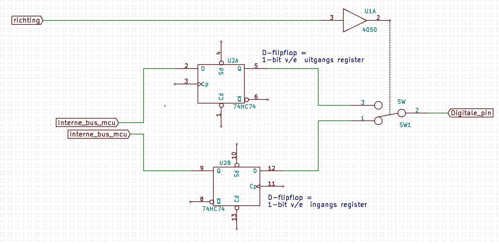

## PWM en analogWrite

Geeft een PWM signaal en **geen analoge spanning**.

PWM = Pulse Width Modulation

Periode is de tijd die een signaal `aan` en `uit` is.

Duty cycle is de de `aan` tijd tegenover de `uit` tijd in percenten.

- Bij 100% brandt een led volledig
- Bij 50% brandt de led maar 50% van de tijd. Hij zal dus minder fel lijken.


analogWrite(0) → duty-cycle 0%
analogWrite(127) → duty-cycle 50%
analogWrite(255) → duty-cycle 100%

### PWM naar een analoge spanning

Met een laagdoorlaatfilter zal het signaal analoog lijken.

Tijdsconstante $ \tau = R \times C $

- Als Tau te groot is duurt het te lang voor een verandering weer te geven.
- Als Tau te klein is is de rimpel te groot en zal de output geen mooie analoge spanning zijn.

**Settling time**: De tijd nodig om van 0% naar 90% van de gemiddelde uitgangsspanning te komen.

**Peak to peak rimple voltage**: Rimpel spanning op het uitgangssignaal.

Analog Write werkt niet op elke pin.

### Clamper

Een clamper kan de ingangsspanning inverteren en dus bv van +5V, -5V maken. Dit kan door een combinatie van een condensator en een diode te gebruiken.


## Hardware opbouw Arduino

### Interne opbouw


De CPU staat centraal. 

De CPU communiceert via ‘bussen’
Dit zijn verzamelingen aan lijnen (‘draadjes’) waarover informatie kan getransfereerd worden.

- De CPU praat met het geheugen waar in de programma code is in opgeslagen.
- De CPU praat aan de andere kant met de I/O wat we kennen als de ‘digitale pinnen’ van de microcontroller
- Ten slotte praat de CPU via de databus met de ADC, de timers, de communicatie-mogelijkheden en met het geheugen, dit keer echter gaat het om opslagdata.

Vroegere ontwerpen ( de “von nuemann architectuur” ) hadden slechts één bus voor alle communicatie die dan ook al snel de bottleneck in het systeem bleek te zijn.

De CPU in deze ATMega328p microcontroller van AVR is gebouwd volgens een 8-bit RISC architectuur

- RISC staat hier voor "**<u>Reduced Instruction Set Computing</u>**":
  - Dit is een architectuur waarin slechts een klein aantal instructies gebruikt worden intern de CPU.
  - Dankzij weinig bewerkingen kan hij sneller communiceren met minder transistoren.

### Instructieset

De instructieset is de verzameling van alle bewerkingen die een CPU kan uitvoeren.

Instructies worden weergegeven als hexadecimale nummer. CPU's kunnen enkel werken met éénen en nullen.

Een instructie noemt een opcode.

Een programma komt uiteindelijk neer op een reeks opcodes.

> E4 6A B9 73 20 69 7C 20 CC 6F 6D 65 20 70 72 6F 67 72 61 6D ...

##### mnemonic

opcodes krijgen een alias zodat ze beter leesbaar zijn door mensen.


##### Assembler code

Als we code schrijven in mnemonics noemen we dat assembler code. Onderstaande code schakelt een interrupt vector in.

````assembly
Move_interrupts:
; Get MCUCR
in r16, MCUCR
mov r17, r16
; Enable change of Interrupt Vectors
ori r16, (1<<IVCE)
out MCUCR, r16
; Move interrupts to Boot Flash section
ori r17, (1<<IVSEL)
out MCUCR, r17
ret
````

### MCU Geheugen


Register is een 1Byte geheugen. 

R/W geeft aan of we willen lezen of schrijven.

Enable geeft aan of we de geheugencomponent willen gebruiken.

Carry ins en carry outs komen terecht in het "Flag" Register. (1 byte geheugen)

Interne registers van een CPU. 1 byte geheugen waar tussenresultaten in kunnen worden opgeslagen. Het is sneller dan telkens naar het ram te schrijven en lezen.

#### Opbouw RAM geheugen

DSEG, Data seg

Registers van CPU zelf

Eerste 32 register zitten in CPU zelf.

#### I/O Registers

Ze hebben te maken met de inputs en outputs.

GPIO: General Purpose Input Output

Een poort is een verzameling pinnen

Een poort intern is een register van één byte groot, een poort bevat in dit geval 8 pinnen. 8 uitgangspinnen aan elkaar gekoppeld zijn een uitgangs poort register.

Omdat een poort een register is kan de MCU het schrijven of lezen.

Een GPIO poort is dus voor de CPU van de microcontroller een register, dit register is echter ook met de buitenwereld verbonden.

#### GPIO Ports & Registers




Dit is een digitale pin van de MCU, zo heeft de ATMega er 8.

Nemen we nu alle 8 de <u>uitgangs flipflops</u> uit de vorige schakeling en voegen we die samen dan krijgen we het **uitgangs poort-register**

- Richting MCU naar digitale pin
- De ATMega heeft 3 uitgangs poort registers: `PORTB`, `PORTC` en `PORTD`

Nemen we nu alle 8 de <u>ingangs flipflops</u> uit de vorige schakeling en voegen we die samen dan krijgen we het **ingangs poort-register**

- Richting digitale pin naar MCU
- De ATMega heeft 3 ingangs poort registers `PINB`, `PINC` en `PIND`

Nemen we nu alle <u>digitale pinnen</u> uit de vorige schakeling dan krijgen we een **GPIO Poort**

- De ATMega heeft 3 GPIO poorten
- We duiden die aan met `PB`, `PC` en `PD`
- Merk op: deze GPIO poorten zijn onafhankelijk van de richting!

Nemen we nu alle besturingspinnen van de richtings schakelaars uit de vorige schakeling dan krijgen we we het **DDR** register

- DDR = Digital Direction Register
- Hun naam noemen we volgens de Poort waar ze betrekking op hebben `DDRB`, `DDRC` en `DDRD`
- In het DDR register van een poort kan men dus per bit van die poort kiezen of deze ingang of uitgang is
  - Daar waar pinMode() dit voor één pin deed kunnen we met het DDR-register dit doen voor 8-pinnen in één keer
    - bvb: `DDRB = 0b00101110;`
      → `1` wordt een uitgang
      → `0` wordt een ingang


`DDRn` → Direction Register
`PORTn` → Output Register
`PINn` → Input Register
n = B, C of D


Toggling the Pin
Writing a '1' to `PINxn` toggles the value of `PORTxn`, independent on the value of `DDRxn`. The SBI instruction can be used to toggle one single bit in a port.


## Bouwen eigen hardware


## Microcontroller’s Flashen: AT328p en ATTiny


## Seriële protocollen

Bij parallelle communicatie zal er voor iedere bit een data lijn moeten zijn zodat de binaire woorden in 1x kunnen verstuurd worden. Bij seriële communicatie kan er, na bepaalde afspraken, data verstuurd worden via minimaal 1 datalijn waar de bits één voor één passeren.  


### RS232


Een van de oudste protocollen in gebruik. Vaak maar een gedeeltelijke implementatie.

Asynchrone communicatie

- Eén start-bit: datalijn is altijd hoog, bij starten is de datalijn één bit-duratie laag.
- Twee stop-bits: twee bit-duraties lang geeft een einde aan.

Heeft error check voor middel van een *parity-bit* en volgens de afspraken 'even' of 'odd'.

​	Even: als de som van de bits oneven is wordt deze bit 1 en is de uiteindelijke som even.

​	Oneven: als de som van de bits even is wordt deze bit 1 en is de uiteindelijke som oneven.

Elektrische eigenschappen:

- Digitale `0` = +3V tot +15V
- Digitale `1` = -15V tot -3V

Bv.:

- Arduino terminal
- Verbinding met Cisco routers
- Industriële actuatoren

### UART

Hoe gaan we van de te versturen data tot de signalen conform het protocol ?
- Deze taak zal de UART vervullen
- UART staat voor: “**Universal Asynchronous Receiver-Transmitter**”

- De UART zorgt dat de data omgezet wordt in seriële data
	- Heeft een clock volgens een bepaalde snelheid ( bvb 9600, 19200, …, 115200 baud)
	- Berekent de parity-bit en voegt deze toe aan de bitstroom
	- voegt start en stop-bits toe,
- UART instellingen schrijft men volgens een specifieke notatie:
<pre>9600 8N1 = 9600 Baud - 8 Data Bits - No Parity - 1 Stop Bit
115200 8E2 = 115200 Baud - 8 Data Bits - Even Parity - 2 Stop Bits
19200 8O1 = 19200 Baud - 8 Data Bits - Odd Parity Bit - 1 Stop Bit</pre>

Een UART bestaat als losse chip maar is meestal als onderdeel in een grotere chip geïntegreerd

We hebben massa, TX en RX nodig als aansluitingen.

MAX232 als driver.


### RS422

Dit volgende protocol maakt meteen duidelijk waarom het nuttig is de opsplitsing te maken tussen UART en DRIVER.
- RS232 werkt op een maximale afstand van 15m.

- RS422 lost dit op door transmissie over 4 draden in twisted pairs.

- De maximale afstand stijgt bij RS422 hierdoor tot **1200 meter** bij 9600 baud.

Mogelijke stoorsignalen komen op gelijktijdig op beide draden van het twisted pair terecht waardoor deze elkaar neutraliseren.

Twisted pair zorgt voor een kleiner spanningsverschil afkomstig van inductie en storingen. 

RS422 en RS232 is enkel elektrisch verschillend. De UART kan behouden worden maar de driver moet worden aangepast.


### RS485

Klein verschil met RS422.

RS485 kan met meerdere apparaten werken.

Via master-slave principe. Max 32 slave apparaten.

Slaves zijn niet noodzakelijk adresseerbaar. Dit is iets dat je zelf zal moeten ontwikkelen.


### I²C

> i kwadraat c

Ontwikkeld door Philips in 1982.

Oplossing om IC's met elkaar te laten communiceren met een lage complexiteit.

Gemaakt voor korte afstanden (max 1m 100kbps)

​	Maar aangepast kan deze werken tot 10m op 10kbps.

Synchroon protocol en maakt gebruik van een klok.

I²C ondersteunt 

- Master - Slave
- Mulit-Master - Slave
- Multi-Master - Multi-Slave

Maar 2 verbindingen nodig.

​	SCL : Serial CLock

​	SDA : Serial DAta

100kbps, 400kbps, 1mbps

SLA en SCL zijn open-collecor uitgangen.

Gedeelde verbinding kan gedeeld worden met meerdere apparaten.

Iedere lijn heeft een pull-up weerstand nodig. Weerstand mag niet lager zij dan 2kOhm. Meerdere pull-up weerstanden zorgen voor een te lage weerstand waardoor het niet werkt. Vaak wordt 4,7k gebruikt.


- **De i²c communicatie stappen:**
  
  1. Idle State
  2. Start Signal
  3. Clock Signal
  4. Send Address
  5. Read / Write
  6. Acknowledge
  7. Data Transfer
  8. Acknowledge
  9. Stop Signal
  
  

1. Idle State
	- CLK lijn is permanent hoog door Master
	- De SDA of datalijn is eveneens logisch hoog
2. Start signal
	- Start aangeven -> SDA lijn wordt laag terwijl SCL hoog blijft
	- <u>Master start altijd communicatie</u>
3. Clock signal
	- SCL lijn laag wanneer SDA ook laag is.
	- Het kloksignaal zal starten op de gekozen snelheid.
4. Send Address
	- Op de SDA lijn volgen 7 tot 10 bits die het adres van het aan te spraken apparaat representeren.
5. Read / Write
	- Na het adres volgt één bit die aangeeft of data verwavcht wordt of er verstuurd wordt
	- Write = `0`; data van Master -> Slave
	- Read = `1`; data van Slave -> Master
6. Acknowledge
	- Slave antwoordt met `1` (ACK) of `0` (NACK) of de vraag goed is aangekomen
7. Data Transfer
	- Data frame komt binnen. Steeds 8 bits.
9. 8. Acknowledge
	- Dataframe wordt bevestigd door de te ontvangen partij met `1` (ACK) of `0` (NACK).
	- Stap 7 en 8 herhalen telkens totdat de volledige payload aan frames is verzonden/ontvangen.
9. Stop Signal
	- Master stuurt stop signaal
	- SDA en SCL zijn hoog op hetzelfde moment. 


**Maximale afstand:** 

- 100kbps → afstanden tot max. 1 meter
- 10 kbps → afstanden tot max. 10 meter

**I²C apparaten**

- PCA9685 heeft 16 PWM pinnen om leds aan te sturen. Via I²C kan het communiceren met een Arduino.

- 24LC512-I/P is een 512kbit EEPROM en is te lezen en schrijven via I²C.

- PCF8574A Remote 8-bit I/O expander. 3 adreslijnen en 8 I²C adressen.
  - De Sainsmart 2004CLD module gebruikt de PCF8574A en maakt het mogelijk een LCD te besturen via I²C.
- MCP23017 I/O expander. 16 digitale in of uitgangne met interruptmogleijkheden.
- ADS1000-Q1 is ene low-power 12bit Analoog naar digitaalconverter.
- TC74 is een temperatuursensor. Geen mogelijkheid om een adres in te stellen.

Meerdere chips individueel aanspreken? Geen apparaten met hetzelfde adres aansturen.

- Meerdere I²C bussen geburiken
- Chips die adres-translation uitvoeren 

**Adress-Translation**

- Single channel: één chip per apparaat (LTC4316)
  - Adres-bit wordt vervangen

- Multi channel: meerdere apparaten per chip (PCA9...)
  - Multiplexer 
  - Ieder apparaat krijgt een nieuwe SCL en SDA lijn.
  - Voordeel: er is maar één extra chip nodig
  - Nadeel: per Slave 2 draadjes dus voordeel van I²C vervalt

**TWI**

TWI staat voor “Two Wire Interface”.

Officieel een ander protocol dan I²C.

I²C is een handelsmerk van Philips.

TWI is hetzelfde maar heeft een andere naam om patentinbreu-ken te vermeiden.

### SPI

Serial Peripheral Interface

Door Motorolla voor **full-duplex** communicatie.

Synchrone communicatie

Master / Slave model, master bepaalt wanneer data wordt verzonden.

Adressering van slaves is hardwarematig, ze hebben geen adres zoals bij I²C.

**4 communicatielijnen**

- SCL -> Serial CLoK
- MOSI -> Master Out Slave In (data output van master)
- MISO -> Master In Slave Out (data output van slave)
- <SPAN STYLE="text-decoration:overline">SS</span> -> Slave Select (adressering) [Meestal active low]


Voordelen

- Hoge snelheden 10-20Mbs
- Full-duplex communicatie
- Verschillende snelheden per slave mogleijk
- Geen adresconflicten

Nadelen

- Slechts één master mogelijk
- Slave-Select nodig per slave


Alternatieve mogelijkheid tot adressering: gemeenschappelijke Slave-Select lijn door een daisy-chain configuratie. 

**Werking:**

Ring topologie

Ring moet gesloten zijn om data over te kunnen brengen.

Data wordt in de ring gestuurd door een aaneenschakeling van shiftregisters waarbij de “carry-out” aan de most-significant-bit (MSB) van één shiftregister verbonden wordt met de “carry-in” aan de least-significant-bit (LSB) kant van ‘n ander shiftregister. De snelheid waarmee de data door de ring wordt geshift wordt bepaald door de klok die altijd aan de ‘master’ kant zit.


SPI Daisy-Chain

Verbinding tussen slaves is MISO naar MOSI.


Om data bij een verdere slave te krijgen, moet eerst de shiftregister van de vorige slaves volledig worden geshift.


**SPI Klok:**

Het is niet strikt omschreven wanneer op welk moment juist de data wordt gelezen en geshift.

Klok Fase

- `clock-phase`/`cpha = 0` Data wordt gelezen/geschreven bij begin van klok-cyclus.
- `clock-phase`/`cpha = 1` Data wordt gelezen/geschreven in het midden van de klok-cyclus.

Klok Polariteit

- `clock-polarity`/`cpol = 0` Klok-cyclus start bij stijgende flank
- `clock-polarity`/`cpol = 1` Klok-cyclus start bij dalende flank

Deze 4 werkingen worden met mode0-mode3 aangeduidt.

SPI Modes

- Mode 0: `cpha=0` `cpol=0`
- Mode 1: `cpha=0` `cpol=1`
- Mode 2: `cpha=1` `cpol=0`
- Mode 3: `cpha=1` `cpol=1`


With non-inverted clock polarity
(i.e., the clock is at logic low when slave select transitions to logic low):

- **Mode 0**: <u>Clock phase</u> is configured such that data is sampled on the <u>rising edge</u> of the clock pulse and shifted out on the falling edge of the clock pulse. This corresponds to the first blue clock trace in the above diagram. Note that data must be available before the first rising edge of the clock.
- **Mode 1**: <u>Clock phase</u> is configured such that data is sampled on the <u>falling edge</u> of the clock pulse and shifted out on the rising edge of the clock pulse. This corresponds to the second blue clock trace in the above diagram.

- **Mode 2**: <u>Clock phase</u> is configured such that data is sampled on the <u>falling edge</u> of the clock pulse and shifted out on the rising edge of the clock pulse. This corresponds to the first orange clock trace in the above diagram. Note that data must be available before the first falling edge of the clock.
- **Mode 3**: <u>Clock phase</u> is configured such that data is sampled on the <u>rising edge</u> of the clock pulse and shifted out on the falling edge of the clock pulse. This corresponds to the second orange clock trace in the above diagram.

**3wire vs 4wire SPI**

- 4wire heeft MOSI en MISO lijnen 
- 3wire SPI heeft een lijn namelijk SISO (Slave in/Slave out) Bidirectionele lijn maar niet tegelijkertijd. Half-Duplex.

**Kiezen tussen SPI en I²C**

Argumenten

- Snelheid
- Adressering
- Beschikbaarheid (als andere poorten al in gebruik zijn)

**SPI apparaten**

- Waveshare OLED Display 128x128px.
- SCP1000 druksensor
- AD5206 6 channel digital poeteniometer
- NCV7535 SPI Controlled H-bridge


## Een diepere kijk in de AVR C/C++ toolchain

Een toolchain bestaat uit meerdere elementen, voert specifieke taken uit en produceert tussenliggende bestanden met  specifieke bestandsformaten.
- De typische elementen van zo’n toolchain zijn alsvolgt:
	- Pre-processor
	- Compiler
	- Assembler
	- Linker

### De pre-processor

Voor de code naar de compiler gaat passeert deze door de pre-processor. Zo’n pre-processor beidt de mogelijkheid om:
- Header-files toe te voegen aan de code
- Uitvoeren van Macro Expansies (#define, #include ...)
- Aan Conditionele compilatie te doen ( #ifdef, #endif … )

### De compiler

Hogere programmeertaal omzetten naar assembler instructies.

Belangrijk is efficiëntie. 

- Vaak zijn verschillende oplossingen mogelijk, een goede compiler zal op zoek gaan naar de efficiëntste.

Wanneer een compiler in staat is uitvoerbare code te generen voor een ander platform dan waar de compiler zelf wordt uitgevoerd spreken we van een <u>cross compiler</u>.

### De assembler

De assembler zal vervolgens de assembler code geproduceerd door de compiler nemen en omzetten naar hex code conform de memory layout van de doel-hardware.
De assembler zal hier tevens de nodige stukken geheugen voorzien voor library functies gebruikt door de broncode.

### De linker:

De linker zal de nodige code uit de libraries halen en op de juiste plaats toevoegen in de aangeleverde hex-code van de assembler.
Het resultaat is een binair bestand dat direct uitvoerbaar is op het doelplatform.

### De gcc toolchains

- We bekijken dit nu wat praktischer en bespreken de gcc toolchain:
“gcc” stond voor “gnu c-compiler”
Sindsdien kan gcc ook C++, Objective-C, Fortran, Java en Ada compileren en is de betekenins aangepast naar “gnu compiler collection”
- De gcc toolchain is de basis compiler voor alle Linux distributies, MacOS en nog andere platformen.

gcc toolchain bestaat typisch uit volgend drie elementen:
- gcc
  - De compiler zelf.
- binutils
  - Collectie van elementen van de toolchain zoals de assembler, de linker en de gdb debugger.
- glibc
  - Bevat de c-bibliotheek functies die de linker aan de hex code kan toevoegen.

### De AVR toolchain

- ATMega328p is een product van AVR die eveneens een toolchain heeft.
- Dit is de AVR toolchain en is op de gcc toolchain gebaseerd.
- Deze AVR toolchain bestaat uit volgende elementen:
	- binutils
	  - Bevat -zoals de standaard gcc- de linker, de assembler, ...
	- gcc-avr
	  - Dit is de gcc compiler specifiek aangepast met de instructie-sets van de AVR microcontroller CPU’s.
	- avr-libc
	  - Dit is de bibliotheek van C commando’s, specifiek aangepast met C-commando’s voor de AVR microcontrollers. Het is dus de “AVR C-library”
	- avrdude
	  - Dit is een tool om de code in de microcontrollers te flashen. Je kan ook de fuses van de MCU te branden.

De Arduino IDE is met andere woorden niet meer dan een front-end voor de gcc-avr compiler en avrdude.

```sh
$> avr-gcc -g -Os -mmcu=atmega328 -c led.c
$> avr-gcc -g -mmcu=atmega328 -o led.elf led.o
$> avr-objcopy -j .text -j .data -O ihex led.elf led.hex avr-size --format=avr --mcu=atmega32 led.elf
```

Deze commando's leveren ons de uitvoerbare binaire code voor de ATMega328 op. Dit doet hetzelfde als op de compile knop drukken in de Arduino IDE.

We kunnen gebruikmaken van avrdude om deze binaire code in de chip te laden.

```sh
$> avrdude -c arduino -p m328 -P /dev/ttyUSB0 -b 19200 -U flash:w:led.hexvrc
```

Het is ook mogelijk om de fuses te branden met avr-dude:

```sh
$> avrdude -c arduino -p m328p -P /dev/ttyUSB0 -b 19200 -U lfuse:r:con:r -U hfuse:r:con:r -U efuse:r:con:r
```

r:con:r vervang je dan door hexcode voor de fuse settings.

### De STM toolchain

Voor de STM32 bestaat ook een complete ontwikkel omgevingen. 

De meest bekende IDE oplossingen zijn hier de:
- STM32CubeIDE
- SW4STM32

#### STM32CubeIDE :

- Door ST Micro-electronics zelf ontworpen. Alles-in-één ontwikkeltool.
- Deze IDE maakt deel uit van het STM32Cube software-ecosysteem

- Het is een geavanceerd C/C++ ontwikkelings-platform veel configuratie mogelijkheden, codegeneratie, codecompilatie en debugfuncties voor STM32 microcontrollers en microprocessoren.
- Gebaseerd op de Eclipse IDE. Ecllipse is een oude IDE, met support voor heel veel programmeertalen.
- De CubeIDE is in principe gratis, doch mogelijks zijn elementen van het ecosysteem dat niet.

- STM32CubeIDE is gebouwd op de gcc compiler.
- Maakt gebruik van GDB voor het debuggen. GDB staat voor gnu debugger.
- Ondersteunt plugins en is cross-platform.

#### SW4STM32 :

- De “System Workbench toolchain”, SW4STM32 is een gratis multi-OS software ontwikkelomgeving gemaakt door het Franse bedrijf AC6.
- Deze IDE ook gebaseerd op Eclipse.
- Ook deze SW4STM32 ondersteunt het volledige gamma van STM32 microcontrollers en aanverwante boards zoals bvb. de Nucleo boards.
- Men kan de SW4STM32-toolchain gratis downloaden vanop www.openstm32.org

- De belangrijkste features van deze IDE zijn:
	- Ondersteuning voor STM32 microcontrollers, STM32 Nucleo boards, Discovery kits en Evaluation boards, alsook STM32 firmware (Standard Peripheral library of STM32Cube HAL)
	- GCC C/C++ compiler
	- GDB-based debugger
	- Eclipse IDE met team-work management
	- Compatibel met de vele bestaande Eclipse plug-ins
	- ST-LINK support ( debug feature van STM32 )
	- Geen limiet op code-grote ( soms een commerciële truuk )
	- Multi-platform: zowel op Windows, Mac OS als Linux


## Bitwise operaties

Stel register `PORTB = 0b00101101`
en we willen énkel bit5 `1` maken dan kunnen we dit doen door een bitwise OR toe te passen

| Symbool | Operator    |
| ------- | ----------- |
| &       | Bitwise AND |
| \|      | Bitwise OR  |
| ^       | Bitwise XOR |
| <<      | Left shift  |
| >>      | Right shift |
| ~       | Bitwise NOT |

<pre>
0b001<b>0</b>1101 OR
0b000<b>1</b>0000 =
________
0b001<b>1</b>1101
<br>
11001000 &
10111000 = 
________
10001000
<br>
11001110 |
10011000 = 
________
11011110
<br>
11001110 ^
10011000 = 
________
01010110
<br>
~ 11001110
= 00110001
<br>Left shift
11001110 << 1
= 10011100
11001110 << 5 
= 11000000
<br>Right shift
11001110 >> 1
= 01100111
11001110 >> 5 
= 00000110
</pre>

| Symbool | Operator               |
| ------- | ---------------------- |
| `&=`    | Bitwise AND assignment |
| `|=`    | Bitwise OR assignment  |
| `^=`    | Bitwise XOR assignment |
| `<<=`   | Left shift assignment  |
| `>>=`   | Right shift assignment |
| `~=`    | Bitwise NOT assignment |

````c
byte a = 0b00110101;
a &= 0b00001111
# a : 00000101
````

| Wat          | Instructie            |
| ------------ | --------------------- |
| Set a bit    | `byte a |= (1 << n)`  |
| Clear a bit  | `byte a &= ~(1 << n)` |
| Toggle a bit | `byte a ^= (1 << n)`  |
| Test a bit   | `a & (1 << n)`        |


## Interrupts op microcontroller niveau

Theorie 4


Algemeen principe:

- Bij interrupt wordt de gewone programma uitvoering onderbroken
- De code van de “Interrupt Sub-Routine” wordt uitgevoerd
- Na het “return” commando gaat de uitvoer van het gewone programma verder <u>op de plaats waar de uitvoer onderbroken was</u>

In Arduino code:

````c++
void setup ( ) {
	// Werkt enkel met D2 en D3.
	attachInterrupt( digitalPinToInterrupt(pin), mijnISR, mode );
}
void mijnISR ( ) {
	…
	return;
}
void loop(){
    dettachInterrupt ( );	// → int pin terug ‘losmaken’
	interrupt ( ); 			// → alle interrupts inschakelen
	nointerrupt ( ); 		// → alle interrupts uitschakelen
}
````

###  SREG Status Register

Vlag Register


Bit 7 `I` Global Interrupt Enable: Must be set for interrupts to be enabled.

````c++
sei( ); // → zet deze bit7 op "1" = enable
cli( ); // → zet deze bit7 op "0" = disable
````

### Interrupt Vectors


The list goes on.

Bij gebruik registers gaan we niet zelf de naam kiezen voor de ISR functie. Géén “void” maar “ISR” + de vector

We gebruiken:

````c++
// "pin2" = PD2 = int0 → 
ISR ( INT0_vect ) { … }
// "pin3" = PD3 = int1 → 
ISR ( INT1_vect ) { … }
````

### Direct Interrupt


`INT1`: External Interrupt Request 1 Enable

`INT0`: External Interrupt Request 0 Enable

When the INT1 bit is set and the I-bit in the Status Register (SREG) is set, the external pin interrupt is enabled. The Interrupt Sense Control1 bits 1/0 (ISC11 and ISC10) in the External Interrupt Control Register A (EICRA) define whether the external interrupt is activated on rising and/or falling edge of the INT1 pin or level sensed. Activity on the pin will cause an interrupt request even if INT1 is configured as an output. The corresponding interrupt of External Interrupt Request 1 is executed from the INT1 Interrupt Vector.


ISC1n: Interrupt Sense Control 1: The External Interrupt 1 is activated by the external pin INT1 if the SREG

ISC0n: Interrupt Sense Control 0: The External Interrupt 0 is activated by the external pin INT0 if the SREG


````c++
/**
 * INT0
 */
void setup ( ) {
    						// DDRD : Port D Data Direction Register
    DDRD &= ~(1 << DDD2); 	// bit DDD2 op “0” → pin2 = input
    						 // EICRA : Ext. Interrupt Control Register A
    EICRA |= (1 << ISC00);  // mode bit’s ISC00 en 01 op “1”
    EICRA |= (1 << ISC01);	// => int0 = ‘rising’

						     // EIMSK : External Interrupt Mask Register
    EIMSK |= (1 << INT0);	// bit INT0 op “1”
						    // → int0 verbinden met pin2
}
ISR ( INT0_vect ) {
	// ...
}
````

### External Interrupt Flag Register


 `INTF1` External Interrupt Flag 1: When an edge or logic change on the INT1 pin triggers an interrupt request, INTF1 will be set.  If the I-bit in SREG and the INT1 bit in EIMSK are set, the MCU will jump to the corresponding Interrupt Vector.

### Pin Change Interrupt


The Pin Change Interrupt Request 2 (PCI2) will trigger if any enabled PCINT[23:16] pin toggles. The Pin Change Interrupt Request 1 (PCI1) will trigger if any enabled PCINT[14:8] pin toggles. The Pin Change Interrupt Request 0 (PCI0) will trigger if any enabled PCINT[7:0] pin toggles. The PCMSK2, PCMSK1 and PCMSK0 Registers control which pins contribute to the pin change interrupts. Pin change interrupts on PCINT are detected asynchronously. This implies that these interrupts can be used for waking the part also from sleep modes other than Idle mode.


#### Pin Change Interrupt Control Register


#### Pin Change Interrupt Flag Register


#### Pin Change Interrupt Voorbeeld

````c++
void setup ( ) {
						// DDRD : Port D Data Direction Register
DDRD &= ~(1 << DDD5);  // bit DDD5 op “0” → pin5 = input
						// PCICR : Pin Change Interrupt Control Reg.
PCICR |= (1 << PCIE2); // bit PCIE2=“1” → PCint2 = enable
							// PCMSK2 : Pin Change Mask Register 2
PCMSK2 |= (1 << PCINT21);  // bit PCINT21=”1” → pin PCint21
						    // zal PCINT2-vector activeren
}
ISR ( PCINT2_vect ) { // PCINT2-vector is aangeroepen
					  // was het bit5 m.a.w PCint21 ?
    byte status = PIND;
    if ( status & B00010000 ) {
    	// ...
    	// ja: run dan interrupt code
    }
}
````


### Oplossing Voorbeeldoefneing LED on/off via interrupts

```c++
/* Microcontrollers Sessie7
 * Voorbeeld oefeningen op registers
*/ 
// --- opdracht -----
// We willen twee drukknoppen die een led aan en uit doen maar die echter ook direct moeten reageren. 
// We kiezen dus voor interrupts en gebruiken hiervoor INT0 en INT1
// We sturen de led aan met het flag register

// --- oplossing -----
void setup() {

  // output pin voor de LED, we kiezen digital pin D4 = pin PD4 op poort D.

  DDRD |=  (1 << PD4);

  // input voor de interrupt ingangen INT0 en INT1

  DDRD &= ~(1 << PD2);
  DDRD &= ~(1 << PD3);

  // we zetten globaal interrupts even af tot alles geconfigureerd is
  cli();

  // De voorkeur gaat naar actief laag dus een dalende flank moet een interrupt activeren
  // In het EICRA - External Interrupt Control Register A - kiezen we de wat een interrupt zal genereren:
  // dalende flank = bit code 10 voor ISC bits

  // dalende flank voor INT0
  EICRA |=  (1 << ISC00);
  EICRA &= ~(1 << ISC01);

  // dalende flank voor INT1
  EICRA |=  (1 << ISC10);
  EICRA &= ~(1 << ISC11);

  // Normaal activeren we hier nu de interrupt functie van de twee pinnen.
  // Dit enablen doen we normaal gesproken in het EIMSK - External Interrupt Mask Register

  // activeren van INT0
  // EIMSK |=  (1 << INT0);

  // activeren van INT1
  // EIMSK |=  (1 << INT1);

  // de vraag is echter om het flag register te gebruiken. 
  // Bij de uitleg van het flag register in de datasheet lezen we het enablen in het EIMSK
  // het aanroepen van de isr(INT_vect) activeert. Deze hebben we echter niét nodig nu.
  // We hebben immers enkel de vlag nodig in het vlag register.

  // we zetten globaal interrupts terug aan
  sei();
  
}

// normaal worden deze interrupt vectoren aangeroepen bij een interrupt:
// ISR(INT0_vect) { }
// ISR(INT1_vect) { }
// de vraag is echter om het flag register te gebruiken hiervoor

// als de ISR(INT_vect) aangeroepen worden wordt de int vlag gewist op het einde van de ISR
// deze staan echter niet actief wat wil zeggen dat we zelf de interrupt vlag moeten wissen.
// Dit wissen doen we vreemd genoeg door een '1' naar deze bit te schrijven - datasheet pagina 91


void loop() {

  // testen van de interrupt vlag INT0  
  if ((EIFR >> INT0) && 1) {
    // LED aan zetten 
    PORTD |=  (1 << PD4);
    // wissen van de vlag INT0
    EIFR |=  (1 << INT0);
  }

  // testen van de interrupt vlag INT1 
  if ((EIFR >> INT1) && 1) {
    // LED uit zetten 
    PORTD &=  ~(1 << PD4);
    // wissen van de vlag INT1
    EIFR |=  (1 << INT1);
  }
}
```


## ADC convertors

Theorie 5


- 10-bit Resolution
- 13 - 260μs Conversion Time
- Optional Left Adjustment for ADC Result Readout
- 0 - VCC ADC Input Voltage Range
- Selectable 1.1V ADC Reference Voltage
- Free Running or Single Conversion Mode
- Interrupt on ADC Conversion Complete
- Sleep Mode Noise Canceler


### ADC Registers


`MUXn` Analog channel Selection: value selects which analog input is connected to the ADC.


`REFSn` Reference Selection: values select the voltage reference for the ADC.


`ADLAR`: ADC Left Adjust Result: The ADLAR bit affects the presentation of the ADC conversion result in the ADC Data Register. Write one to ADLAR to left adjust the result. Otherwise, the result is right adjusted.

ADCH + ADCL registers
- Digitale uitgang:
	- Binaire voorstelling van de analoge ingang
	- 10 bit’s resolutie
		→ 8 bits = te weinig
		→ 16 bits = te veel
			2 bit’s in ADCH en 8 bit’s in ADCL
		of
			8 bit’s in ADCH en 2 bit’s in ADCL

<div style="display: flex;">
    <div style="flex:50%;">
	
    </div>
    <div style="flex:50%;text-align:right">
    
    </div>
</div>

<div style="display: flex;">
    <div style="flex:50%;">
	
    </div>
    <div style="flex:50%;text-align:right">
    
    </div>
</div>


### ADCSR registers

ADCSR = ADC Control and Status Register

- Conversie moet gestart worden:
  - "Manueel" → single
  - "Automatisch" → free running
- Conversie duurt enkele stappen:
	- Hoe snel volgen de stappen elkaar op ?
	  → conversion timing

#### ADCSRA


`ADEN` ADC Enable: Enables the ADC.

`ADATE` ADC Auto Trigger Enable: Enables Auto Trigger fo the ADC.

`ADCSC` ADC Start Conversion: In Single Conversion mode, write this bit to one to start each conversion. In Free Running mode, write this bit to one to start the first conversion.

`ADIF` ADC Interrupt Flag: This bit is set when the ADC conversion completes.

`ADIE` ADC Interrupt Enable: Activates the ADC Conversion Complete Interrupt.

`ADPSn` ADC Prescaler Select: These bits determine the divison factor between the system clock and input clock of the ADC.


ADC Prescaler Select
De ADC conversie werkt optimaal bij een kloksignaal tussen de 50 kHz en 200 kHz. Bij hogere klokfrequenties is het meetresultaat mogelijks niet meer correct. Bij 16 MHz moet dus N=64 of hoger zijn.


#### ADCSRB


`ACME` Analog Comparator Multiplexer Enable

`ADTSn` ADC Auto Trigger Source: If ADATE in ADCSRA is written to one, the value of these bits selects which source will trigger an ADC conversion.


Bij opdrachten op ADC: `ADCSRB = 0x00;`

### ADC Voorbeeld

````c++
void setup(){
    // instellen mux
    // bvb: ADC5 = ADC MUX op 0101
    ADMUX &= ~(1 << MUX3);
    ADMUX |=  (1 << MUX2);
    ADMUX &= ~(1 << MUX1);
    ADMUX |=  (1 << MUX0);

    // left / right adjust
    // bvb: 10 bit’s gebruiken → right adjust d.w.z. adlar=0
    ADMUX &= ~(1 << ADLAR);

    // kloksnelheid adc conversie
    // bvb: adc prescaler N=128 → ADPS = 000
    ADCSRA |= (1 << ADPS0);
    ADCSRA |= (1 << ADPS1);
    ADCSRA |= (1 << ADPS2);

    // referentie spanning
    // bvb: Vref = Vcc
    ADMUX |=  (1 << REFS0);
    ADMUX &= ~(1 << REFS1);

    // conversie start manueel / automatisch
    // bvb: auto trigger off
    ADCSRA &= ~(1 << ADATE);

    // adc activeren ..
    // = ADC enable
    ADCSRA |= (1 << ADEN);

    // GPIO richting !
    // ADC5 = PC5 → input
    DDRC &= ~(1 << PC5);

    // Manueel starten conversie
    ADCSRA |= (1 << ADSC);

    // Wachten tot de conversie klaar is
    while (!(ADCSRA & (1 << ADIF))){ }

    // Lezen resultaat
    byte L = ADCL; // → eerst “L” ...
    byte H = ADCH; // → dan pas “H”

    // Samenstellen bytes
    int adcresult = (L + (H << 8));
}
````


## De analoge comparator

Les 10

De Analog Comparator vergelijkt de ingangs waardes op de positive pin AIN0 en de negative pin AIN1 net zoals een OPAMP dit zou doen.

Als de spanning op de positive pin AIN0 hoger is dan deze op de negative pin AIN1 dan wordt de Analog Comparator uitgang “ACO” = 1

- De uitgang van de AC kan twee zaken triggeren:
	- Een AC specifieke interrupt (ACI)
	- De “Input Capture” functie van Timer/counter1

- De negative ingang AIN1 kan verbonden worden met de analoge MUX van de ADC convertor.
- Elke analoge ingangs-pin kan hierdoor dienen als negative ingang van de analoge comparator.
- De positive ingang AIN0 kan verbonden worden met een interne referentie-spanning (band-gap reference).


### AC Registers


#### ACSR


**ACIE: Analog Comparator Interrupt Enable**: When the ACIE bit is written logic one and the I-bit in the Status Register is set, the Analog Comparator interrupt is activated.

**ACI: Analog Comparator Interrupt Flag**: This bit is set by hardware when a comparator output event triggers the interrupt mode.

**ACO: Analog Comparator Output**: The output of the Analog Comparator is synchronized and then directly connected to ACO.

**ACBG: Analog Comparator Bandgap Select**: When this bit is set, a fixed bandgap reference voltage replaces the positive input to the Analog Comparator. When this bit is cleared, AIN0 is applied to the positive input of the Analog Comparator.

**ACD: Analog Comparator Disable**: When this bit is written logic one, the power to the Analog Comparator is switched off. 

**ACISn: Analog Comparator Interrupt Mode Select**: These bits determine which comparator events that trigger the Analog comparator interrupt.


**ACIC: Analog Comparator Input Capture Enable**: When written logic one, this bit enables the input capture function in Timer/Counter1 to be triggered by the Analog Comparator.


#### ADCSRB


**ACME: Analog Comparator Multiplexer Enable**: When this bit is written logic one and the ADC is switched off (ADEN in ADCSRA is zero), the ADC multiplexer selects the negative input to the Analog Comparator.


#### ADCSRA


**ADEN: ADC Enable**: Writing this bit to one enables the ADC. **By writing it to zero, the ADC is turned off.** 


#### Selectie ingang - AC

- Het bepalen welke externe pin op de negative ingang van de analog comparator terechtkomt is een combinatie van de ACME en ADEN bit’s samen met de MUX[2:0] keuze-bit’s uit het ADCMUX register.


#### Power Management


**AIN1D: AIN1 Digital Input Disable**
**AIN0D: AIN0 Digital Input Disable**: When this bit is written logic one, the digital input buffer on the AIN1/0 pin is disabled. 


- Doordat de AC een interrupt kan veroorzaken is hij geschikt om de MCU wakker te maken of om de MCU in een sleep mode te plaatsen
- De typische toepassing is hier het controleren van de batterijspanning die zorgt voor de voeding:
	- Indien die spanning te laag wordt kan de MCU zichzelf uit zelfbehoud te slaap leggen (“winterslaap”).
	- Indien die spanning te laag wordt kan de MCU juist wakker worden om bvb de gebruiker te verwittigen dat de batterij leeg is.

Omdat de AC het ICR van TC1 kan aansturen zijn er mogelijkheden om tijds en frequentiemetingen te doen.

- Responstijden van bv een condensator of spoel


## Het ADC systeem van de AT328p


## ADC Conversie problemen


## Fuses

Les 10

De oorsprong van fuses komt uit de vorige generaties van programmeerbare ROM chips.
Het principe was dat de chip een matrix bevatte van een soort mini zekeringen, die analoog aan een gewone glas-zekering die een draadje bevat dat stukgebrand wordt wanneer de stroom erdoor te groot wordt, eveneens stukgebrand konden worden.

Eens de bootloader geschreven is kan de data van deze ‘fuses’ niet meer aangepast worden. In die zin is er een parallel met de fuses uit het verleden.

- De ATMega 328p bevat drie 8bit registers met dergelijke fuses:
	- Fuse Low Byte
	- Fuse High Byte
	- Extended Fuse Byt


Zonder bootloader is het volledige Flash geheugen beschikbaar voor de user applicatie

Afhankelijk van of men een bootloader heeft of niet moet men kunnen kiezen wat nu juist de functie wordt van de reset-pin:


Verhinderen dat bepaalde delen van het geheugen overschreven zullen worden dit door de instellingen van de ‘lock bits’


## DebugWIRE

Les 10

Debugging
- Compileren in de Arduino IDE geeft nooit info over werkelijk foutmeldingen van de CPU.
- DebugWIRE laat toe om ‘Breakpoints’ toe te goeven om de toestand van de CPU om een bepaald moment te weten te komen


## Timer/counters in de MCU

Sessie 6

In embedded toepassingen komt het vaak voor dat we tijdsgebonden activiteiten doen.
- Tijdsgebonden activiteiten kan betekenen:
	- Wachten gedurende een bepaalde tijd `delay()`
	- Regelmatig herhalen → “elke 10ms doe”
	- Tijd sinds de schakeling is gestart `millis()`
	- Signaal generatie, bvb PWM.
- Dergelijke activiteiten zouden té veel resources vragen om ze door de cpu te laten doen:
  - Processor kan beter andere dingen doen
  - Veel energiegebruik
- De oplossing: Timers

De atmega328p heeft drie timers aan boord :

- TC0 : een 8-bit timer/counter met PWM
- TC1 : een 16-bit timer/counter met PWM
- TC2 : een 8-bit timer/counter met PWM en asychrone werkings modus.
- 

### TC0

8-bit timer/counter met PWM


#### Features

- Channel Counter
- Clear Timer on Compare Match (Auto Reload)
- Pulse Width Modulator met fase correctie (PWM)
- Frequentie generator
- 10-bit prescaler voor het klok signaal
- Kan interrupts generen bij Overflow en Compare Match
- 

#### TCNT0

- Het hart van TC0 is een 8 bit’s up/down teller:
  - Een stijgende flank op `Count` zal de teller één stap doen tellen
  - Met `Clear` wordt de teller gereset

  - `Direction` bepaalt of de teller omhoog of omlaag telt 

De waarde van TCNT0 wordt vergeleken met 0 via het `BOTTOM` signaal.

De waarde van TCNT0 wordt vergeleken met de hoogste waarde van de teller, als dat zo is komt er een `TOP` signaal.


Depending of the mode of operation used, the counter is cleared, incremented, or decremented at each timer clock (clk<sub>T0</sub>).

#### OCR0A

Output compare register A

In het OCR0A register kunnen we een getal plaatsen

- Dit getal wordt vergeleken met de actuele waarde van de teller TCNT0
- We kunnen een interrupt krijgen als OCR0A = TCNT0
  - Dit intern signaal kan gebruikt worden voor het genereren van golfvormen (PWM)
  - En kan naar buiten komen op de fysische pin "OC0A" van de chip

#### OCR0B

Output compare register B

In het OCR0B register kunnen we een getal plaatsen.

- Dit getal wordt vergeleken met de actuele waarde van de teller TCNT0

- We kunnen een interrupt krijgen als OCR0B = TCNT0
  - Dit intern signaal kan gebruikt worden voor het genereren van golfvormen
  - En kan naar buiten komen op de fysische pin "OC0B" van de chip

#### TIFR0

TC0 Interrupt Flag Register


OCFB: Timer/Counter0, Output Compare B Match Flag

OCFA: Timer/Counter0, Output Compare A Match Flag

TOV: Timer/Counter0, Overflow Flag

#### TIMSK0


OCIEB: Timer/Counter0, Output Compare B Match Interrupt Enable

OCIEA: Timer/Counter0, Output Compare A Match Interrupt Enable

TOIE: Timer/Counter0, Overflow Interrupt Enable

#### Waveform Generator

De waveform generator kan op basis van de resultaten van de comparator een golfvorm creeren. 

Deze golfvorm kan beschikbaar gemaakt worden op de fysische pinnen van de chip, `OC0A` - `OC0B`.

De waveform generator heeft verschillende werkings modi.

##### PWM


#### ClkT0 Clock

De teller telt op of af bij elke inkomende klokpuls. Deze klokpuls kan echter van verschillende bronnen komen.
- Uit de pre-scaler van de centrale CPU klok
- Van de externe pin “T0”


Het gebruik van de externe pin als klok is ideaal om bvb. externe events te tellen.
- De "Edge Detector" creëert de keuze te tellen bij een de opgaande of een neergaande flank van dit extern signaal.

De Prescaler is een instelbare deler van één van volgende signalen naar keuze:

- Low Power Crystal Oscillator
- Full Swing Crystal Oscillator
- Low Frequency Crystal Oscillator
- Internal 128kHz RC Oscillator
- Calibrated Internal RC Oscillator
- External Clock

De pre-scaler kan als volgende worden ingesteld:


#### Werkings Modi

De timer/counter TC0 heeft meerdere werkings modes, de modi van de waveform generator maken hier deel van uit.

- Werkings modes:
	- Normal Mode
	- CTC Mode
	- Fast PWM Mode
	- Phase Correct PWM Mode


##### Normal Mode

Dit is de eenvoudigste werkings modus en wordt gekozen door de mode bits WGM0[2:0] op ‘0’ te plaatsen.

In deze modus telt de counter altijd naar boven

- Er is geen clear van de counter, de teller loopt gewoon de maxium waarde `11111111` (TOP=`0xFF`) voorbij en start terug onderaan bij `00000000` (`0x00`)

Op het moment dat de teller `TOP=0xFF` voorbijloopt wordt de overflow vlag `TOV0` op `1` gezet.
- Deze `TOV0` bit we vinden in het interrupt flag register

- De bit wordt automatisch terug op `0` gezet bij het eindevan de interrupt op voorwaarde dat de interrupt actief is. 

- Als de `TOV0` interrupt echter niet actief staat in het interrupt mask register blijft de bit gewoon op `1` staan tot hij door de gebruiker terug op `0` gezet wordt.
- De `TOV0` bit kan gebruikt worden om de resolutie van de teller van 8-bit’s naar 9-bit’s uit te breiden en zo een teller tot 512 te maken i.p.v. tot 255.


##### CTC Mode

CTC is de “Clear Timer on Compare Match Mode” en wordt gekozen door de volgende instelling van de mode bit’s: `WGM12` = `0` - `WGM11` = `1` - `WGM10` = `0`
- De counter telt steeds omhoog maar wordt op `00000000` (ZERO) geplaatst als de teller-waarde `TCNT0` gelijk is aan de inhoud van `OCR0A`
- In de CTC modus wordt m.a.w. het `OCR0A` register gebruikt om de resolutie van de counter aan te passen.


Dit is de ideale modus om een bepaald aantal externe events te tellen. (bvb: “elke x ingangs-pulsen doe y”)

In deze mode kan op de extern uitgangspin OC0A een blokgolf met instelbare frequentie opgewekt worden.

- De uitgang OC0A dient hiervoor in “toggle mode” te staan. In deze “toggle mode” zal bij elke compare match tussen TCNT0 en OCR0A de huidig toestand van OC0A omgekeerd worden ( 0 → 1 of 1 → 0 )
- De OC0A “Toggle mode” kiest men in het `TTCR0A` register
- Deze toggle-mode is niet niet mogelijk voor de uitgang OC0B


Frequentie: $f_{\text{OCnx}}=\frac{f_{clk_I/O}}{2 \cdot N \cdot(1+\text{OCRnx})}$

Hierbij is `OCRnx` de prescaler die in OC0A werd meegegeven (1, 8, 64, 256 of 1024).

##### Fast PWM Mode

Fast PWM mode wordt gekozen met de mode bit’s op: WGM12 = ”0” - WGM11 = ”1” - WGM10 = “1”.

De opwekking van een PWM signaal met hoge frequentie wordt hierdoor mogelijk.

- Opwekking van PWM door een ‘single-slope operation’: De teller telt van BOTTOM=”0x00” naar TOP=”0xFF” en bij TOP herstart deze terug bij BOTTOM

- Bij BOTTOM wordt OC0A / OC0B op “1” geplaatst. Bij een compare-match tussen de teller TCNT0 en het OCR0A / OCR0B register zal deze terug gereset worden naar “0”.
- Het voorbeeld bij de “waveform generator” is de manier waarop een puls-breedte signaal wordt opgewekt in de Fast PWM mode
- De duty-cycle van het PWM signaal wordt hierbij bepaald door de waarde in het OCR0A / OCR0B register

Hoe groter OCR0A hoe kleiner de duty-cycle


Met de COMnx[1:0] bit’s in het TCCR0A register kan gekozen worden om het PWM signaal normaal of geïnverteerd op de fysieke uitgang te brengen.

##### Phase Correct PWM Mode

Dit is de meest complexe modus van de timer/counter en
wordt gekozen door de volgende instelling v/d mode bit’s:
1) WGM12 = ”1” - WGM11 = ”0” - WGM10 = “1” of
2) WGM12 = ”0” - WGM11 = ”0” - WGM10 = “1”

Het verschil tussen de twee mogelijkheden zit in de waarde voor “TOP” :

1. Bij WGM12 = ”1” is TOP = OCR0A (OCR0B)
2. Bij WGM12 = ”0” is TOP = 0xFF

Opwekking van PWM door een ‘dual-slope operation’: De teller telt omhoog van BOTTOM naar TOP en vervolgens van TOP terug omlaag naar BOTTOM

- OC0x wordt op “0” gezet bij een compare match tussenTCNT0 and OCR0x bij het omhoog tellen en OC0x wordt op “1” gezet bij een compare match bij het aftellen.
- Zo tellen corrigeert de fase van het PWM signaal bijveranderende duty-cycles. De maximale frequentie is echter lager dan bij ‘single-slope’

###### TOP=0xFF

Als TNCT0 = OCR0A wordt OC0A “0” bij het optellen
Als TNCT0 = OCR0A wordt OC0A “1” bij het aftellen


Overgang van ene duty-cycle naar andere is geleidelijker, beter voor bv. een motor.

Frequentie: $f_{\mathrm{OCnxPCPWM}}=\frac{f_{\mathrm{clk}_{-} \mathrm{I} / 0}}{N \cdot 510}$

###### TOP=OCRnx

Dit is eveneens een ‘dual-slope operation’ dus de teller telt omhoog van BOTTOM naar TOP en vervolgens van TOP terug omlaag naar BOTTOM

- Opnieuw wordt OC0A (B) op “0” gezet bij een compare match tussen TCNT0 and OCR0A (B) bij het omhoog tellen, dit is echter eveneens het moment waarop het tellen omklapt van op- naar aftellen !
- En OC0A (B) wordt op “1” gezet bij een compare match bij het aftellen wat echter eveneens het moment is waarop het tellen omklapt van af- naar optellen !

Uit de figuur zien we dat deze mode géén zinvol signaal kan leveren aan de uitgangen OCnx


Deze mode is dus énkel nuttig als up- down-teller.

#### TCCR0A + TCCR0B


WGM0[2:0] = Mode selectie bit’s:


CS0[2:0] = Pre-scaler deeltal + Clk selectie:


COM0A[1:0] = Compare Output Mode ch. A:


COM0B[1:0] = Compare Output Mode ch. B:


Geen toggle bij compare match FastcPWM (Reserved)


Geen toggle bij compare match Phase Correct PWM (Reserved)


FOC0x[1:0] = Force Output Compare:

Bij het schrijven van een “1” naar deze bit’s kan men zélf een “compare match” forceren ook al is er geen. Omdat in sommige modi deze bit’s problemen kunnen veroorzaken zetten we deze steeds op “0”.

#### Voorbeeld Toon Generator

Toon generator:
TC0, blokgolf (880hz, 1kHz, 3,3kHz)
Gebruiken CTC Mode -> alle 3 de prescalers moeten dezelfde waardes hebben -> met laagste
frequentie starten
800hz:
$f_{\text {OCnx }}=\frac{f_{C L K I / O}}{2 N(1+\text { OCRnx })}=880 \mathrm{~Hz}$
𝑓𝐶𝐿𝐾𝐼/𝑂 = 16𝑀h𝑧 → 𝑠𝑡𝑎𝑛𝑑𝑎𝑎𝑟𝑑
N = 64 → moeten we gokken om een juiste waarde te krijgen, meerdere opties mogelijk
𝑂𝐶𝑅𝑛𝑥 = 141 → 𝑚𝑜𝑒𝑡 𝑡𝑢𝑠𝑠𝑒𝑛 0 − 255 𝑙𝑖𝑔𝑔𝑒𝑛
Het effect van afronden van OCRnx gaat steeds meer impact hebben naarmate de OCRnx waarde
kleiner wordt omdat we een stukje van de blokgolf afsnijden -> dus altijd met zo groot mogelijke
OCRnx waardes werken.

1khz:
N = 64
OCRnx = 124
3,3kHz:
N = 64
OCRnx = 37

### TC1

Les 7

16-bit timer/counter met PWM


#### Features

- **True 16-bit Design (i.e., allows 16-bit PWM)**
- Two independent Output Compare Units
- Double Buffered Output Compare Registers
- **One Input Capture Unit**
- **Input Capture Noise Canceler**
- Clear Timer on Compare Match (Auto Reload)
- Glitch-free, Phase Correct Pulse Width Modulator (PWM)
- Variable PWM Period
- Frequency Generator
- **External Event Counter**
- Independent interrupt Sources (TOV, OCFA, OCFB, ICF)

#### True 16-bit Design

De ATMega328p is een 8-bit’s microcontroller want de databus & de i/o bus zijn 8 bit’s breed.
Hoe krijgen we 16-bit’s getallen van de CPU in de teller TC1 ?


We hebben het `TEMP` register dat wordt ge-update met de `TCNT1H` waarde als `TCNT1L` gelezen wordt (read).

Op zijn beurt wordt `TCNT1H` ge-update met waarde uit het tijdelijk register `TEMP` als naar `TCNT1L` geschreven wordt (write).

=> Als we in code `TCNT1` willen lezen we <u>éérst</u> `TCNT1L` moeten lezen en <u>dan</u> pas `TCNT1H` kunnen lezen. 

=> Als we iets in `TCNT1` willen schrijven we <u>éérst</u> de waarde van `TCNT1H` moeten schrijven en <u>dan</u> pas TCNT1L moeten schrijven willen we dat beide bytes in TCNT1 terecht komen.


Ook de output compare registers `OCR1A` en `OCR1B` maken gebruik van ditzelfde temp register.

De OCR1A en OCR1B registers zijn hier ook 16-bits en bestaan uit een `OCR1AH` (`OCR1BH`) en `OCR1AL` (`OCR1BL`) 8-bit register

=> De volgorde is hier dus <u>éérst</u> OCR1AH (OCR1BH) schrijven en <u>dan</u> pas OCR1AL (OCR1BL) schrijven

#### Allows 16-bit PWM


##### TC1 Clock Prescalers

TC0 en TC1 delen dezelfde pre-scaler.

Toch kan je voor beide een andere instellen.

#### One Input Capture Unit


Deze input capture laat toe om onder andere
- “time-stamps” te creëren
- duty-cycle’s te meten
- frequenties te tellen.

Principe van een chronometer met time-laps of “tussen tijden” functionaliteit:


- `ICRn` → input capture register
- `TC1` is 16-bit’s dus `ICR1` bestaat uit :
  - `ICR1L` → 8bit lower
  - `ICR1H` → 8bit higher
- Kan getriggerd worden door de "Input Capture Pin" of `ICP1` ( = PB0 van poort B, Arduino pin D8 )
- Kan getriggerd worden door de “analoge comparator”


Edge detector: “rising edge” of “falling edge” bit’s uit de TC1 controle registers ( TTCR1x )

Selectie tussen Analoge comparator en ICP1 pin bit’s uit de TC1 controle registers ( TTCR1x )

#### Input Capture Noise Canceler

Storing op capture ingang kan ongewenste “trigger” geven.

- Hoe werkt deze noise canceler ?
	- Maakt gebruik van een simpele digitale filter.
	- De ingang wordt 4 keer na elkaar gemeten (4 klokpulsen lang)
	- Alle vier de metingen moeten gelijk zijn voordat de uitgang van de noise canceler omklapt.
- Dit wil zeggen dat het 4 klokpulsen duurt voor een trigger het ICR kan bereiken en de tellerstand opgeslagen wordt

#### Analog Comparator

Wordt apart besproken → is een MCU gedeelte op zich.

#### Werkings Modi

De timer/counter TC1 heeft eveneens meerdere werkings modes, één méér dan TC0, en de modi van de waveform generator maken hier opnieuw deel van uit
- Werkings modes TC1:
	- Normal Mode
	- CTC Mode
	- Fast PWM Mode
	- Phase Correct PWM Mode
	- <u>Phase and Frequency Correct Mode</u>

##### Normal Mode

Dit is de eenvoudigste werkings modus. In deze modus telt de counter altijd naar boven
- Bij TC1 zijn er vier mode selectie bit’s WGM1[3:0] en normal mode wordt gekozen door alle bits `WGM1[3:0]` op `0` te plaatsen.
- Er is geen clear van de counter, de teller loopt gewoon de maxium waarde, hier nu 16bits, dus TOP=`0xFFFF`, voorbij en start terug onderaan bij `0x0000`

##### CTC Mode

CTC is de “Clear Timer on Compare Match Mode” en wordt gekozen door WGM1[3:0]=0x4 of WGM1[3:0]=0xC
- De counter telt steeds omhoog maar wordt op 0x0000 (ZERO) geplaatst als de teller-waarde TCNT1 gelijk is aan de inhoud van OCR1A
- of als de teller-waarde TCNT1 gelijk is aan ICR1 ( bij WGM1[3:0]=0xC )

- In deze mode kan op de extern uitgangspin OC1A een blokgolf met instelbare frequentie opgewekt worden.
- Ook hier dient de uitgang OC1A hiervoor in “toggle mode” te staan, te kiezen in de TCCR1x registers
- Toggle mode is opnieuw bij TC1 niet mogelijk voor OC1B

##### Fast PWM Mode

Opwekking van PWM signaal met hoge frequenties
- Fast PWM heeft <u>vijf verschillende Fast PWM settings</u>.
- Opwekking van PWM door een ‘single-slope operation’: De teller telt van BOTTOM=”0x0000” naar TOP=”0xFFFF” en bij TOP herstart deze terug bij BOTTOM

- Bij BOTTOM wordt OC1A / OC0B op “1” geplaatst. Bij een compare-match tussen de teller TCNT1 en het OCR1x zal deze terug gereset worden naar “0”.
- De resolutie, met andere woorden de waarde van “TOP” kan bij TC1 Fast PWM <u>gekozen</u> worden
- Hier zijn 5 mogelijkheden voor TOP te kiezen met de instelling van de WGM bit’s.

- Settings: 
  - Top 8 bits
  - 9bits
  - 10 bits resolutie maken
  - topwaarde gelijk aan waarde ICR1 (min 2 bits),
  - Top gelijk aan OCR1A
- Hierdoor kunnen we zowel duty cycle als PWM frequentie instellen.
- We kunnen 10bit ADC waarde rechtstreeks doorverbinden met de 10bit resolutie timer als we willen.

##### Phase Correct PWM Mode

Ook hier zijn er 5 settings van Phase Correct PWM, te kiezen met de waveform generator mode bit’s

- Opwekking van PWM door een ‘dual-slope operation’: De teller telt omhoog van BOTTOM naar TOP en vervolgens van TOP terug omlaag naar BOTTOM
- Ook hier zijn echter niet twee maar 5 mogelijkheden voor TOP, te kiezen met de instelling van de WGM bit’s.

Settings: 

- Top 8 bits
- 9bits
- 10 bits resolutie maken
- topwaarde gelijk aan waarde ICR1 (min 2 bits),
- Top gelijk aan OCR1A

In tegenstelling tot TC0 kan men hier zowel duty-cycle als
frequentie van het PWM signaal divers kiezen (TOP=ICR1)

##### Phase and Frequency Correct Mode

- Heeft 2 settings -> kiezen met WG1[3:0] -> 0x8 of 0x9
- Dual slopere operation (BOTTOM -> TOP -> TOP -> BOTTOM)
- Verschil is eigenlijk het moment waarop OCR1x wordt ge-üpdate.
- Zowel frequentieovergangen als zachte gecorrigeerde fase overgangen.

#### Registers

- <u>TCNT1</u> → TCNT1H + TCNT1L=> counters
- <u>OCR1A</u> → OCR1AH + OCR1AL=> compare match
- <u>OCR1B</u> → OCR1BH + OCR1BL => compare match
- <u>ICR1</u> → ICR1H + ICR1L => input comare
- <u>TCCR1A + TCCR1B + TCCR1C</u> => configuratie
- <u>TIFR1</u> => interrupt flas
- <u>TSMK</u> => Interuppt mak


Modes:


TCCR1: CS10, CS11, CS12 Pre-Scaler deeltal instelling - N

TCCR1: COM1 Compare Output Mode voor OC1A en OC1B

TCCR1: FOC1A, FOC1B Force Output Compare voor OC1A en OC1B

TCCR1: Nieuw: ICES1: Input capture edge select “0” = falling edge en “1” is rising edge

TCCR1: Nieuw: ICNC1 Input capture noice canceler 1 activates it

##### TIFR1

Timer/Counter1 Interrupt Flag register


ICF: Timer counter Interrupt Flag

OCFA, OCFB: Timer/Counter1, Output Compare Match Flag

TOV: Timer/Counter1, Overflow Flag


### TC2

8-bit timer/counter met PWM en asychrone werkings modus.


#### Features

- Channel Counter
- Clear Timer on Compare Match (Auto Reload)
- Glitch-free, Phase Correct Pulse Width Modulator (PWM)
- Frequency Generator
- 10-bit Clock Prescaler
- Overflow and Compare Match Interrupt Sources (TOV2, OCF2A, and OCF2B)
- <u>Allows Clocking from External 32kHz Watch Crystal Independent of the I/O Clock</u>

#### Presacaler


#### TOSC


#### A-Synchroon

- Consequenties:
	- De CPU weet niét op welk moment TC2 de waarde in TCNT2 zal veranderen: de kans bestaat dat de CPU de waarde van TCNT2 leest nét op het moment dat deze aan het veranderen is.
	- Als de CPU de waarde van OCR2x aanpast, dus probeert in dit register te schrijven kan nét op het moment zijn dat TC2 dit register probeert te lezen welke waarde leest TC2 dan?
	de vorige?
	de nieuwe?
	of een stuk van alle twee… ( = corrupte waarde)

- Noodzaak:
- Er is nood aan een manier om te communiceren wanneer registers wél en wanneer ze niet aangesproken mogen worden.
- Hiervoor is een speciaal “vlag register”
- De bit’s of vlaggen in dit register zijn “busy” bit’s. Hun waarde zal aangeven of een register bezet is of toegangelijk is voor communicatie tussen TC2 ↔ CPU

#### Registers

TCNT2 => TC2 counter waarde
OCR2A => output compare match
OCR2B => output compare match
TCCR2A => configuratie registers
TCCR2B => configuratie registers
TIFR2 => interrupt flags
TIMSK2 => interrupt mask
ASSR => Asynchronous Status Register


EXCLK: Enable External Clock Input

- When EXCLK is written to one, and asynchronous clock is selected, the external clock input buffer is enabled and an external clock can be input on Timer Oscillator 1 (TOSC1) pin instead of a 32kHz crystal.

AS2: Asynchronous Timer/Counter2

- When AS2 is written to zero, Timer/Counter2 is clocked from the I/O clock, clkI/O. When AS2 is written to one, Timer/Counter2 is clocked from a crystal Oscillator connected to the Timer Oscillator 1 (TOSC1) pin.

OCR2BUB: Output Compare Register2 Update Busy

- A logical zero in this bit indicates that OCR2B is ready to be updated with a new value.

OCR2AUB: Enable External Clock Input

- A logical zero in this bit indicates that OCR2A is ready to be updated with a new value.

TCN2UB: Timer/Counter2 Update Busy

- A logical zero in this bit indicates that TCNT2 is ready to be updated with a new value.

TCR2AUB: Timer/Counter Control Register2 Update Busy

- A logical zero in this bit indicates that TCCR2A is ready to be updated with a new value.

TCR2BUB: Timer/Counter Control Register2 Update Busy

- A logical zero in this bit indicates that TCCR2B is ready to be updated with a new value.

#### X-Tal

Waarom 32,768 kHz?

Als we N=128 nemen dan is $32,768 / 128 = 256$ 

Dat is exact 1 seconde.

### Timer/Counters 0+1+2

#### TC algemeen register

GTCCR => “General Timer/Counter Control Register”


PSRSYNC: Prescaler Reset (TC0 & TC1 delen dezelfde prescaler)

- When this bit is one, Timer/Counter**1** and Timer/Counter**0** prescaler will be Reset.

PSRASY: Prescaler Reset Timer/Counter2 

- When this bit is one, the Timer/Counter**2** prescaler will be reset.

TSM: Timer/Counter Synchronization Mode

- When the TSM bit is written to zero, the PSRASY and PSRSYNC bits are cleared by hardware, and the Timer/Counters start counting simultaneously.
- Werkwijze:
  - Zet TSM bit op “1”
  - Zet de PSRASY en PSRSYNC bit’s op “1”
  - Bij het op “0” plaatsen van de TSM bit zullen nu zowel PSRASY als PSRSYNC gelijktijdig op “0” komen
- Zowel TC0/TC1 als TC2 zullen hierdoor op exact hetzelfde moment beginnen tellen.

#### Tel porblemen bij OCRnx update

Tel-problemen bij OCRnx update
- Alle 3 de timer/counters hebben risico op dit probleem
- In modes die gebruik maken van compare-match voor aansturen Ocnx als TOP niet gelijk is OCRnx
- Ter herhaling:
	- Bij BOTTOM wordt OCnx op “1” geplaatst.
	- Bij een compare-match tussen TCNTn en OCRnx zal OCnx terug gereset worden naar “0”.

- Wat nu als OCRnx wordt geupdate naar een waarde <u>lager</u> dan de actuele waarden van TNCTn … ?
  - De bedoeling hiervan was naar een lagere duty-cycle gaan maar tijdelijk is de teller in een véél hogere duty-cycle terecht gekomen dan verwacht
  - Hoe dit probleem oplossen ?
    - Bij een OCRnx update éérst TCNTn lezen...
    - En énkel OCRnx updaten als TCNTn kleiner is dan OCRnx.

## Het Clock systeem van de MCU

Les 8 


Selectie in het Clock Prescaler Register `CLKPR`.

1, 2, 4, 8, 13, 32, 64, 128, 256

### OSC Bronnen

- Externe oscillator
- Externe kristal oscillator – low power
- Externe kristal oscillator – “full swing”
- Externe lage frequentie kristal oscillator
- Interne LC oscillator met calibratie
- Interne 128 kHz oscillator
- Timer/Counter oscilllator


De selectie van deze bronnen gebeurd door <u>fuses</u>.

- Dat iwl zeggen dat de keuze vast gezet wordt bij het flashen van de bootloader.

#### Externe oscillator

Via de EXTCLK input pin moet een kant en klare blokgolf geleverd worden. Frequenties van 0-20MhZ zijn mogleijk.

#### Externe kristal oscillator

Kristal aangesloten op de X-TAL pinnen.

##### Low power

- Geoptimaliseerd voor laag stroomgebruik.
- Enkel CPU aansturen.
- Frequenties van 0-16MHz

##### Full Swing

- Kan alles aansturen
- Frequenties van 0-20MHz


#### Externe lage frequentie kristal oscillator

Laag frequent kristal op TOSC1 en TOSC2 pinnen.

In deze instelling is de oscillator geoptimaliseerd voor een 32,768kHz watch crystal
- De héle chip werkt hierdoor op een interessante frequentie voor real-time toepassingen
- De uitvoer-snelheid van instructies is hierbij echter heel laag

#### Interne LC oscillator

De chip heeft een interne oscillator die opgebouwd is rond een spoel (L) en condensator (C) resonantie kring.
- De waardes van L en C kunnen gekozen worden uit enkele “presets” waardoor volgende frequenties mogelijk zijn:

- De default instelling is op “exact” 8 MHz.
- Doch deze is onderheving aan variaties van de voedings-spanning, omgevings-temperatuur, …
- Eerder dan frequentie-selectie zijn de “presets” dan ook bedoeld om de oscillator te calibreren.
- Kalibreren kan door middel van het “OSCCAL” register

Bij een nieuwe ATMega328p is de LC oscillator de default “fuse” die gekozen staat in de chip 

De systeem clock pre-scaler staat hierbij default op deeltal 8 

De default clock-frequentie v/d ATMega382p is dus 1 MHz

#### Interne 128kHz oscillator

Dit is een interne oscillator op 128kHz, dit is de nominale frequentie bij 3V en 25°C
- Deze oscillator heeft een héél laag stroomverbruik
- Deze oscillator kan wel als volledige systeem-clock dienen, dit in tegenstelling tot de low-power externe x-tal osc.
- Echter ten koste van de instructie uitvoersnelheid

#### Timer/Counter oscillator

- Speciale instelling waarbij zowel TC2 als de algemene oscillator gebruik maakt van hetzelfde 32,768 kHz kristal


## Reset

Bij een reset worden alle registers, geheugens, etc naar een default waarde dezet. Deze default-waarde is niet noodzakelijk nul maar wel een zekere en gewenste waarde

- Een reset kan nodig of gewenst zijn door verschillende zowel interne als externe redenen.

De chip kan verschillende manieren gereset worden:
- Er is een reset-pin (= external reset)
- Reset bij het inschakelen ( = power on reset)
- Reset door de Brown-out-detector
- Reset door de watchdog-timer

### Power-on reset

- Om zeker te zijn dat wanneer we voor het eerst spanning inschakelen op de chip nergens “rotzooi” in cruciale bit’s en byte’s (bvb registers) zit wordt de chip gereset bij power on.
- Dit gebeurt na het aanschakelen van de voedings-spanning en duurt een bepaalde tijd t<sub>TOUT</sub>
- Deze tijd dient om de chip te laten stabiliseren

### External Reset

- De reset-functie van deze pin kan volledig uitgeschakeld worden door de RSTDISBL “fuse”
- De reset-puls moet een minimumduur hebben om door de chip als reset gezien te worden, namelijk 2,5 microseconden
- De reset-pin gebruikt negative logica dus een “0” genereert een reset, de normale toestand is “1”
- De reset pin moet daarom een pull-up weerstand hebben
- Ook hier is er na het krijgen van de reset een zekere tTOUT

### Brown-out Detectie

- “brown-out” is de term die gebruikt wordt wanneer de voedings-spanning van een systeem héél even onder een veilig werkingsniveau wegzakt.
- Het probleem van een brown-out is dat hij een schakeling flink kan verstoren.
- Tellers, counters, geheugencellen zijn opgebouwd uit flipflops en kunnen na een brown-out dus misschien wel misschien niet nog de verwachte toestand hebben ...

- Na een brown-out kan het bvb zijn dat een schakeling nog werkt maar enkele variabelen, of bit’s in registers, een andere waarde hebben dan gedacht…
- Om alle problemen te voorkomen gebruiken we een brown-out-detectie
- Deze brown-out-detectie zal, wanneer de voedings-spanning onder een bepaalde spanning zakt, automatisch de chip resetten.
- De chip start opnieuw op zonder “misschien” toestanden.

- De Brown-out drempel spanning kan gekozen worden door het instellen van enkele fuses

### Watchdog timer

- Het idee van een watchdog timer is controleren of de CPU van de microcontroller nog steeds z’n werk doet.
- Het principe is dat de processor op regelmatige tijdstippen een puls stuurt naar de watchdog timer.
- Indien de watchdog binnen een bepaalde tijd géén pulsen meer ontvangt zal deze de microcontroller resetten.


### Algemene reset characteristieken

- Nét voor het schrijven van de bootloader verwacht zowel de Arduino als ISP als de ATMega chip een reset-puls
- Héél wat problemen die men kan ondervinden bij het schrijven van de bootloader naar de ATMega328p komen voort van incorrecte reset pulsen hier…

## Power management

Les 9

### Modes

De MCU heeft verschillende energie besparings modes.
- Hiermee kan men van héél erg laag stroomverbruik gaan, waarbij heel wat functies van de MCU worden uitgeschakeld, dit is vooral wanneer bvb de schakeling in “stand-by” is of lange tijd niets moet..

Welke van de energie besparings modes actief is kiest men in het “Sleep Mode Control Register” of “SMCR”

- Om de “sleep” of besparings-toestand te activeren geeft men in de programma code de instructie “SLEEP” (asm)
- In de Arduino C-code is dit het `sleep_cpu()` commando

- In de Arduino C-code hebben we vervolgens ook nog de
  volgende commando’s:
  - `set_sleep_mode (<hier komt de sleep mode>);`
  - `sleep_enable()`
  - `sleep_disable()`
  - …
  - Deze commando’s gaan achterliggend zoals steeds de bijhorende registers instellen..


**SE: Sleep Enable**: The SE bit must be written to logic one to make the MCU enter the sleep mode when the SLEEP instruction is executed. To avoid the MCU entering the sleep mode unless it is the programmer’s purpose, it is recommended to write the Sleep Enable (SE) bit to one just before the execution of the SLEEP instruction and to clear it immediately after waking up.

**SM2: Sleep Mode Select 2**: The SM[2:0] bits select between the five available sleep modes.


#### Idle Mode

Met de SM[2:0] bits op '000' kiezen we de “idle mode”
- In deze mode stopt de klok van de CPU en flash-geheugen en hiermee komt de CPU uiteraard tot stilstand, geen enkele instructie wordt vanaf dan nog uitgevoerd.
- Alle andere kloksignalen echter blijven actief. Dus de Timers, de ADC convertor, I2C en SPI bus, …, blijven gewoon werken. Eveneens het volledige interrupt systeem blijft actief.
- Algemeen kan de MCU dus “wakker worden” van alle externe interrupts alsook alle interne interrupts (bvb TC compare match int. )

#### ADC Noise Reduction Mode

- Met de SM[2:0] bits op '001' kiezen we de “ADC Noise reduction mode”
- Deze mode heeft een dubbele functie:
	- Enerzijds een variant der energie besparende modi
	- Anderzijds als mode om zo weinig mogelijk stoorbronnen te hebben op de ADC waardoor nauwkeuriger analoge metingen mogelijk zijn ( m.a.w. hogere resolutie) 

- In deze mode wordt net zoals in “Idle Mode” de klok van de CPU en het flash geheugen stop gezet. Er worden dus géén verdere instructies uitgevoerd
- Bijkomend wordt echter ook ClkI/O stopgezet:
- Hierdoor stoppen de tellers TC0 en TC1.
- Stopt TC2 tenzij deze in asychrone mode staat
- De overige kloksignalen blijven actief. Dus uiteraard de ADC convertor zelf, maar ook I2C en SPI, …
- Eveneens het volledige interrupt systeem blijft actie

- Gezien de CPU géén instructies meer uitvoert, hoe kan de code dan ooit weer verder gaan... ?
- Het is dus belangrijk dat in de programmeer code dat de “ADC Conversion Complete Interrupt” actief staat..
- In de ADC Noise reduction mode blijft de MCU luisteren naar interrupts dus op het einde van de ADC conversie komt de interrupt en kan de MCU weer wakker worden.
- Algemeen, bij alle sleep modi, is het belangrijk zeker te zijn dat interrupts enabled staan. Een goede gewoonte is in de code net voor “sleep_cpu()” het commando “sei()” te geven

#### Power-Down Mode

- Met de SM[2:0] bits op '010' kiest men de “Power-Down mode”. En zoals in alle modes moet de SLEEP instructie gegeven worden om deze effectief te activeren ( Dit is het “sleep_cpu()” commando in arduino code.)
- In deze mode wordt de externe oscillator gestopt. m.a.w zowat alles die een klok krijgt stopt met werken.
- De externe interrupts blijven actief
- Enkel het luisteren naar het I2C adres blijft nog actief
- De watchdog schakeling blijft werken (indien enabled)

- Dat wil zeggen dat énkel volgende events de MCU wakker kunnen maken:
	- External Reset
	- Watchdog System Reset
	- Watchdog Interrupt
	- Brown-out Reset
	- I2C address match
	- interrupt op INT0 of INT1
	- Pin change interrupt
- Verder is de chip hier dus zo goed als volledig uitgeschakeld

#### Power-save mode

- Met de SM[2:0] bits op 011 kiezen we de “Power-save mode”
- Deze mode bijna identiek aan de “Power-down mode”, er is één belangrijk verschil: hier blijft Timer/Counter2 actief.
- In de “Power-save mode” kan de MCU met andere woorden ook wakker gemaakt worden door:
- een “Overflow” van de asychrone teller TC2.
- een “Compare-Match” event van TC2.

- Bij de bespreking van TC2 zagen we dat deze teller wanneer in asychrone mode kan dienen als real-time-clock of RTC.
- Men kan in de “Power-save Mode” de MCU met behulp van TC2 voor een bepaalde tijd laten slapen …
… en dan eens die tijd verstreken is opnieuw automatisch laten ontwaken.

#### Standby Mode

- Met de SM[2:0] bits op '110' kiest men de “Standby mode”
- Deze mode is eigenlijk identiek aan de Power-Down mode
- Het enige verschil is dat in plaats dat de externe oscillator wordt stopgezet de oscillator zelf blijft draaien maar dat het kloksignaal dat deze maakt niet meer doorgegeven wordt naar de MCU.
- Vanuit standby mode kan de MCU hierdoor een stuk sneller terug wakker worden, namelijk binnen 6 clock cycles.
- Als nadeel ligt het verbruik hierbij wel ietsjes hoger

#### Extended Standby Mode

- Met de SM[2:0] bits op '111' kiest men ten slotte de “Extended Standby mode”
- Daar waar de Standby mode eigenlijk identiek was aan de Power-Down mode is de extended standby mode eigenlijk identiek aan de Power-save mode

- Ook hier is het enige verschil dat de externe oscillator niet wordt stopgezet maar dat het kloksignaal gewoon niet meer doorgegeven wordt naar de MCU.
- Ook vanuit de extended standby mode kan de MCU hierdoor sneller wakker worden, idem dito binnen 6 clock cycles.
- En ook hier als nadeel een verbruik dat ietsjes hoger ligt


#### Verdere energie besparingen

- De sleep en power-reductie modes van de ATMega328p is slechts de helft van het verhaal van de energie besparingen
mogelijk met deze MCU
- Een belangrijke besparing is mogelijk door permanent delen van de chip uit te schakelen die niet gebruikt worden.
- Delen van de chip permanent, of tijdelijk, in- en uitschakelen doet men in het Power Reduction Register of PRR


**RADC: Power Reduction ADC**: Writing a logic one to this bit shuts down the ADC.

**PRUSART0: Power Reduction USART0**: Writing a logic one to this bit shuts down the USART by stopping the clock to the module.

**PRSPI0: Power Reduction Serial Peripheral Interface 0**: This bit shuts down the Serial Peripheral Interface by stopping the clock to the module.

**PRTIM1: Power Reduction Timer/Counter1**: Writing a logic one to this bit shuts down the Timer/Counter1 module.

**PRTIM0: Power Reduction Timer/Counter0**: Writing a logic one to this bit shuts down the Timer/Counter0 module. 

**PRTIM2: Power Reduction Timer/Counter2**: Writing a logic one to this bit shuts down the Timer/Counter2 module in synchronous mode

**PRTWI0: Power Reduction TWI0**: Writing a logic one to this bit shuts down the TWI 0 by stopping the clock to the module.

- Verder kunnen ook nog enkele delen uitgeschakeld worden in het MCU Control Register of MCUCR
- Zo is het mogelijk de Brown-out detector uit te schakelen als de MCU zich in een van de sleep modes bevindt.
- Verder kunnen we ook alle interne pull-up weerstanden in één keer uitschakelen zélfs al staan ze actief in andere registers. Uiteraard is het belangrijk de code hierop te voorzien zodat dit uitschakelen géén events gaat triggeren..


**PUD: Pull-up Disable**: When this bit is written to one, the pull-ups in the I/O ports are disabled


Ten slotte is er nog een belangrijke energie besparende instelling in het “Digital Input Disable Register” of “DIDR”
- Wanneer de ingangen van Poort C gebruikt worden al analoge ingangen dan is het steeds aangewezen om de digitale ingangs buffer uit te schakelen.

- Deze digitale ingangs buffers zullen immers anders nodeloos stroom vragen uit diezelfde analoge ingang.


## 32-bit microcontroller STM32 en ST Nucleo

Les 11

32-bit’s MCU’s hebben een CPU die intern met 32-bit instructies werkt.
- Dit wil niet automatisch zeggen dat de ook de interne data of I/O bus 32-bit’s is !
- Dergelijk MCU’s hebben 32-bit’s registers doch vaak ook nog enkele 16-bit of zelf 8-bits registers intern.
- Alles hangt af van het merk en het type

“STM32” is een familie van verschillende 32-bit microcontroller chips van de producent STMicroelectronics.
- De STM32 chips zijn gegroepeerd in enkele reeksen gebaseerd rond dezelfde 32-bit ARM processor core:
Cortex-M33F, Cortex-M7F, Cortex-M4F, Cortex-M3, Cortex-M0+, Cortex-M0
- Deze reeksen verschillen telkens wat in mogelijkheden en hebben elk een focuspun


### STM32F103C8T6

- We bespreken in dit gedeelte de STM32F103C8T6 MCU
- Deze MCU maakt gebruik van een ARM Cortex M3 Core
- Deze chip is de eenvoudigste opstap naar een 32-bits MCU vanaf de ATMega 328p:
- Er is een nano-look-a-like board met deze MCU ook wel bekend als het “blue-pill” board
- Er is een library voor onze vertrouwde Arduino-IDE

Een 32 bit MCU is veel ingewikkelder dan een 8 bit.

#### Features

- Voeding:
	- Werkings spanning: 2.0V tot 3.6V
	- Een programmable voltage detector
- CPU:
	- 72MHz max CPU Frequentie
	- ARM Cortex M3
- Geheugen:
	- Flash Memory: 16 KByte … 512 Mbyte
	- RAM: 20 KByte … 64 KByte
	- Een ‘static memory controller’ voor extern geheugen

- GPIO systeem:
	- Acht GPIO poorten A .. G
	- 16 I/O bits per poort
- Totaal aantal GPIO pinnen:
	→ chips versies tot maximum 51, 80 of 112 pinnen.
	- I/O snelheid instelbaar: 2, 10, of 50 MHz
- ADC’s systeem:
	- drie 12-bits ADC’s
	- 18 kanaals MUX waarvan 16 external inputs
- DAC systeem:
	- twee 12-bits DAC’s

- Interrupts:
	- External interrupt/event controller
		- Alle 112 GPIO’s kunnen interrupts veroorzaken via 16 external event interrupt vectoren
		- Alle 16 hebben 3 modes: ‘rising’, ‘faling’ en ‘change’
	- Nested vectored interrupt controller
		- Kan tot 60 maskeerbare interrupt vectoren verwerken ( onder andere de 16 external event )
		- en dit volgens 16 prioriteits niveau’s

- Timers:
	- 11 timer/counters waarvan o.a. :
		- vier generieke 16-bit timers
		- twee 16-bit timers voor PWM motorcontrol ( d.w.z. met extra functies zoals noodstop, enz )
		- twee programmeerbare watchdog timers
		- één RTC timer
		- één ‘SysTick’ timer, dit is een 24-bit downcounter

- Communicatie:
	- tot en met vijf USART’s ( 3 voor onze versie )
	- twee I2C interfaces
	- tot drie SPI interfaces 18Mbit/s ( 2 voor onze versie )
	- tot twee CAN 2.0 interfaces ( databus in auto’s)
	- één full speed USB2.0 interface
	- één SDIO interface ( SD-kaartjes )
	- één Ethernet controller ( énkel op de STM32F107 )
- Security
	- één 96-bit CRC calculator unit

- Low power
	- Sleep, Stop en Standby modes
	- 42 backup registers (16-bit’s) waarin 84byte applicatie data kan geschreven worden die behouden blijft als de voedings spanning niet aanwezig is
	- VBAT spanning voor de RTC en backup registers VBAT mag hierbij 1.8V … 3.6V zijn!
- Clock en reset
	- 4-16 MHz crystal oscillator + PLL unit tot 72 MHz
	- Interne 8 MHz factory-trimmed RC oscillator
	- Interne 40 kHz RC osc. met calibratie mogelijkheden
	- 32 kHz osc. voor de RTC met calibratie mogelijkheden

- Display
	- parallelle interface voor het aansturen van een LCD
	- Direct Memory Access
	- 12-channel DMA controller d.w.z. dat pheripherals hierover direct met elkaar kunnen communiceren zonder tussenkomst v/d CPU
- Debug mode
	- een JTAG interface
	- Serial wire debug (SWD)
	- Cortex®-M3 Embedded Trace Macrocell™


#### STM32 Blue Pill

- De STM32 wordt geprogrammeerd via de JTAG interface.
- Er bestaat wél een handige bootloader die code bevat om de USB poort te configureren als ingang om nieuwe code te laden
- Deze bootloader moet uiteraard éérst via de JTAG interface in de chip geschreven worden …
- Gelukkig ondersteund de STM32 naast JTAG ook “SWD”. SWD = serial wire debugging” en laat deze ook toe hierover de chip te programmeren.
- Let op deze seriële-interface is 3.3V !!

De STM32 beschikt over een **program** en **run** mode.

- Dit voorkomt dat in een operationele schakeling per vergissing code in de chip geladen zou worden! ( auto, vliegtuig… )
- De chip heeft hiervoor één pin die we hoog of laag maken om te selecteren tussen de modes.
- Het kiezen tussen deze run en program mode op de “blue-pill” implementatie verloopt via een jumper op de PCB.

### Architectuur


- Het is duidelijk dat de meeste interne communicatie in de chip verloopt via het <u>DMA bus systeem</u>
- DMA staat voor “<u>Direct Memory Access</u>”, een systeem waarbij pheriperals rechtstreeks toegang hebben tot “het geheugen”.
- “het geheugen” is echter een té beperkte omschrijving: Het gaat om alle devices die in de **adresruimte** geplaatst zijn, dus <u>een geheugen-adres hebben</u> en data ontvangen en/of zenden via de data bus.
- Centraal is hierin de <u>bus matrix</u>, het grote data ‘kruispunt’ die zorgt samen met de DMA ‘kanalen’ zorgt voor de <u>routering</u>.


#### Adres-ruimte

Adresruimte is de lijst aan beschikbare “geheugen-adressen” die “adresseerbaar” of aanspreekbaar zijn door de CPU.

De grootte van de adresruimte is m.a.w direct afhankelijk van de breedte van de adresbus van de CPU zelf. Bvb: bij een busbreedte van 10-bit’s zijn 1024 geheugenplaatsen aanspreekbaar.

- Een “n”-bits CPU heeft echter NIET NOODZAKELIJK een adresbus die evenveel bits bevat 

De CPU kan hier, met dezelfde CPU instructies, schrijven en lezen naar geheugen adres-“n” waar dit in werkelijkheid nu gewoon een I/O geworden is... De CPU merkt het verschil niet!


- Mogelijke peripherals zijn uiteraard diverse types geheugen zoals RAM, ROM, Flash, … maar evenzeer GPIO en andere devices
- Het overzicht van hoe de adres-ruimte is opgedeeld noemen we de “memory address map” of kortweg “address-map”
- Bvb:
0x0000 - 0x03FF → RAM geheugen
0x0400 – 0x0407 → 8 GPIO poorten


- Via de meerdere DMA kanalen kunnen zowel de CPU als de interfaces en pheriperals zelf de ander elementen uit de memory-map bereiken.

#### Poorten

Er zijn 8 GPIO poorten: A, B, C, D, E, F, G en H
- Elke poort bevat 16 bits die afhankelijk van de chip versie al of niet ook verbonden zijn met een fysieke pin. Theoretisch is dit 8 x 16 = max. 128 pinnen, praktisch echter is “slechts” 112 GPIO pinnen de grootst beschikbare chip.
- Elke pin kan hierbij in verschillende modes geplaatst worden:
  - Input floating	->	Output open-drain
  - Input pull-up	->	Output push-pull
  - Input-pull-down	->	Alternate function push-pull
  - Analog	->	Alternate function open-drain

##### Registers

- Elke GPIO poort heeft twee 32-bit’s configuratie registers:
  - `GPIOx_CRL` en `GPIOx_CRH`
- Elke poort heeft eveneens twee 32-bit’s data registers:
  - `GPIOx_IDR` en `GPIOx_ODR`
- Elke poort heeft één 32-bit’s set/reset register:
  - `GPIOx_BSRR`
- Heeft één 16-bit’s reset register
  - `GPIOx_BRR`
- En een 32-bit locking register
  - `GPIOx_LCKR`


##### Configuratie Registers

`GPIOx_CRL` en `GPIOx_CRH`
- Met de configuratie registers stellen we de mode in van de pinnen van de poort:
	- Is de pin ingang of uitgang ?
	- Is het een analoge of digitale ingang ?
	- Is de pin een “alternate function” (denk aan timer, i2c...)
	- Is er een pull-up of pull-down weerstand ?
	- Is de pin een open collector (open drain) uitgang ?

- Verder kiezen we ook de snelheid van de poort:
	- Maxium uitgangs snelheid 2 MHz,
	- Maxium uitgangs snelheid 10 MHz of
	- Maxium uitgangs snelheid 50 MHz
- Om zowel mode als snelheid in te stellen hebben we hierdoor 4 bits per pin nodig.
- Elke poort = 16-bits heeft daardoor twee 32-bits configuratie registers nodig:


##### Locking Register

`GPIOx_LCKR`
- Met het 32-bits “locking register” kunnen we per pin de configuratie blockeren.
- Dit wil zeggen dat het hierdoor tijdens runtime niet langer mogelijk is om de snelheid of pinmode te veranderen.
- Deze blockering blijft tot de volgende reset van de chip.


##### Data Registers

`GPIOx_IDR` en `GPIOx_ODR`
- Deze registers doen denken aan de “PORTx” en PINx” registers van de ATMega, en al is de betekenis gelijk, de werking van ervan is enigsinds anders.
- Het belangrijkste verschil is dat het énkel mogelijk is om deze registers in hun geheel te bewerken, de datasheet zegt hier: "These bits can be read and written by software and can be accessed in Word mode only"
- “atomic bit operations” - één bit bewerken – is niet mogelijk


##### Set/Reset Register

`GPIOx_BSRR`
- Elke poort heeft één 32-bits “set/reset register” opgedeeld in twee delen, namelijk 16 “BR” bits en 16 “BS” bits
- In de datasheet lezen we:


Reset Register
GPIOx_BRR
- Elke poort heeft eveneens een 16-bits “reset register”
- Dit register doet eigenlijk hetzelfde als de “BR” bits in het
BSRR register:


Waarom dit GPIOx_BRR register?
	- Het clearen van een bepaalde pin in het BRR kan met een shift gelijk aan de pin die we wensen
	- In het BSRR register is er telkens een 16 bit offset, om te clearen in het GPIOx_BSRR register moet telkens de bitpositie berekend worden, in het GPIOx_BRR register niet
- Waarom dan niet een “set register”?
	- Vaak willen we meerdere pinnen setten en clearen tegelijk

### STM32 Nucleo

- STM32 Development Board serie
	- STM32 implementie + JTAG programmer op één PCB
	- Dit is een JTAG programmer via USB
	- Bij sommige versies:
	PCB heeft een breuklijn
	de programmer = afbreekbaar.

- STM32 Nucleo “Nano” :
- Hetzelfde als de “blue-pill”
- Maar op onderkant PCB staat eveneens een JTAG programmer aangesloten op de USB poort

- Wat is het verschil vs Blue-pill met bootloader?
- Echte programmer = geen consumptie bootloader in Flash
- Directe Debug mogelijkheden vanuit de IDE omgeving


