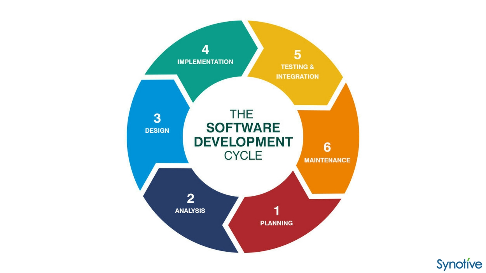
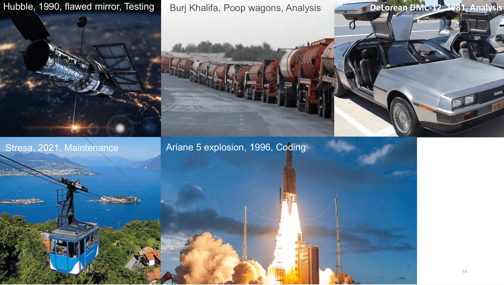
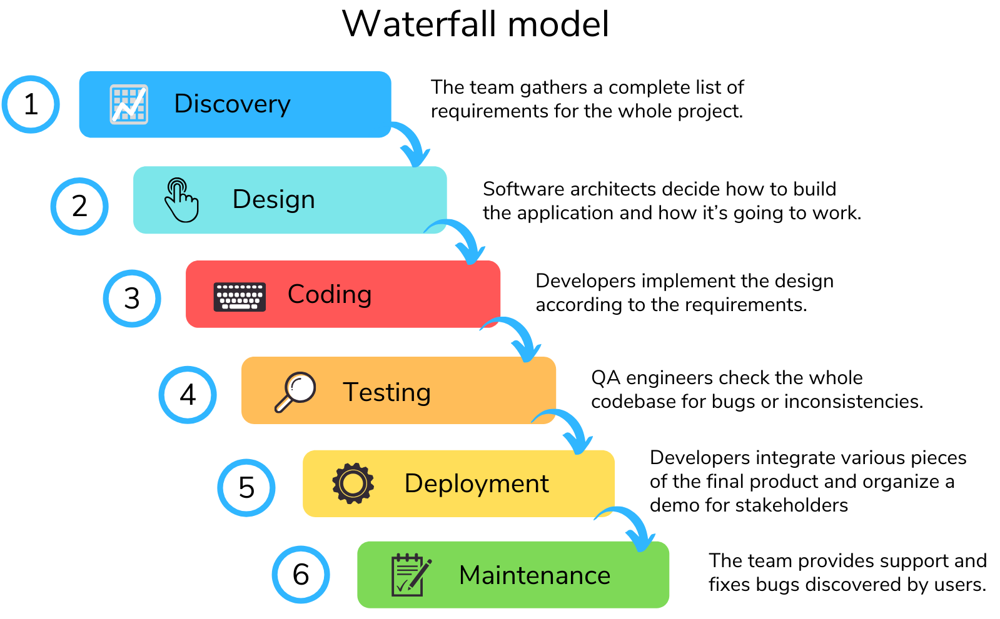
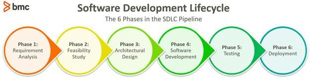
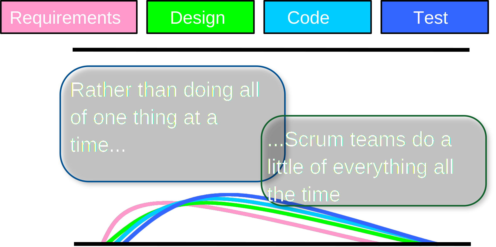
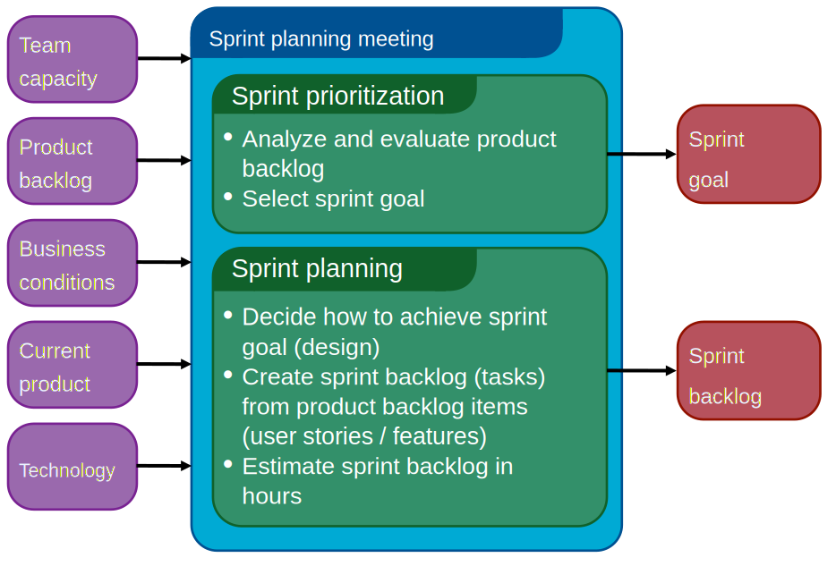
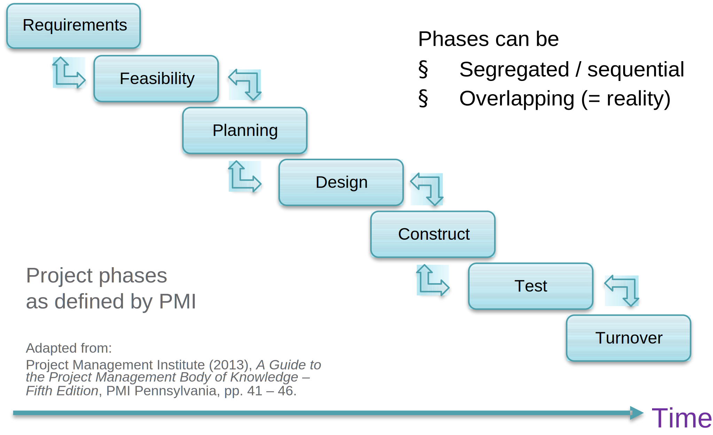

# Project Methodologie

## Het belang

A project methodology is defined as '**a system of practices, techniques, procedures, and rules used by those who work in a discipline**'.

- Laat mensen samenkomen en met elkaar praten

- Het gaat over de middelen die er beschikbaar zijn en de prioriteiten die er gesteld worden.

  - > Neel Patel needed to deliver a stop-gap solution to a malfunctioning sensor gateway. An import process started running prematurely while the customer was still uploading a CSV file. Neel wrote a PowerShell script to copy the file from folder A to B, and let the import process run on folder B. Everything was great, only Neel forgot to commit his code.
    >
    > - Instead of buying a plugin or introduce a process, perhaps we can have a human talk with Neel and discuss what happened. Maybe in combination with a new minor process change perhaps, no tooling.
    > - Bespreken “wie met wat bezig is” via een fysieke meeting en papieren kaartjes = beter dan een software platform met virtuele kaartjes en chat room

- Why?

  - People are the essential resource; they have the energy, creativity, passion, to make work happen. Systems can be built without tools and processes, but not without people
  - Tools and processes have a cost, when you don’t have the right people, incorrect interactions, you will need more process and tools. So focussing on people and interactions, lowers the need for process and tools
  - Tools and processes are easier to change // people and teams can’t always be replaced so easily

Rules and practices

>- Scrum works with timeboxing, why is that?
>- What can be a benefit of iterative and incremental development?
>- Extreme programming recommends peer programming
>- Why is a stand-up called a stand-up?
>- Why can using story points be a good practice?
>- Why do we document stuff?
>- Why is there no boss in an agile team?
>- Why are we building more and more software using cross-functional teams?
>- Why doesn’t waterfall always work?
>- …

- We gaan later veel moeten werken aan projecten.
- Er moet een juiste aanpak gehanteerd worden.
- We moeten definities en regels kennen om goed met anderen te kunnen **communiceren**.

## The System Development Life Cycle (Model) SDLC

System development methodology frameworks behoort tot de oudste methodologie voor het bouwen van information systems.

The main idea of the SDLC has been "to pursue the development of information systems in a very deliberate, structured and methodical way, requiring each stage of the life cycle––from the inception of the idea to delivery of the final system––to be carried out rigidly and sequentially"

Life cycle = levensloop, lijn, pad: a series of stages through which something passes during its lifetime.

SDLC wordt niet meer gezien als een goede methodologie maar eerder als een beschrijving voor de fases die een software ontwikkeling nodig heeft.

### Analysis

- Goal: 
  - Understand the context that surrounds the system
  - What solution must we build to cover the needs

**Requirement analysis** is one of the most important and fundamental stages of the SDLC. It is performed by the senior members of the team with inputs from the customer, the sales department, market surveys and domain experts in the industry.

It focuses on the tasks that determine the **needs to meet the new or altered product or service**, via analysing, documenting, validating and managing software or system requirements.

>Example:
>Bank X pursues wellbeing and productiveness for our employees. They acknowledge that people come in different shapes and sizes and to support that they feel that everyone should be able to decide freely where to sit, with whom, etc in our buildings we want flex desks.
>
>- The problem “how to avoid full floors and provide immediate occupancy insight to people? Customer: let’s build a dashboard that visualizes occupancy.
>
>Questions:
>
>- Explain the problem, context?
>- Do you have an idea what to achieve, a visual?
>- Do we provide the API with support, or do we build the dashboard? Or do you also want us to take care of the hardware?
>- How many displays, one, more?
>- How real time must this information be?
>- % occupied, or % free?
>- Technology limitations?
>- Is there wi-fi?
>- What in case there is a service interruption?
>- What kind of support do you need?
>- Uptime expectations?
>- Theming?
>- Do you intend to activate more buildings?
>- Can we host the dashboard? Or will the customer host it?
>- Any deadlines? Stakeholders? …

### Functional vs Non-functional requirements

**Functional requirements** define the basic system behaviour.

- How it responds to impulses
- Tells something about what the system does or must not do, and can be thought of in terms of how the system responds to inputs.
- Think of a function in math, programming: f(in) = out 

**Non-functional requirements**

- Everything else, it describes the how of the what
- Non-functional requirements are product properties and focus on user expectations.
- Non-functional requirements do not affect the basic functionality of the system (hence the name, non-functional requirements). Take them away and the product will still work (but how…)

>Functional:
>
>- Press the bttn
>- Bttn can light up
>- Bttn can make a sound
>- Bttn can call a webhook
>  Non-functional:
>- Red
>- Made of plastic
>- 2 inches wide, 2 inches high
>- Green or red led colour
>- Powered by 2x AAA batteries

### Design

 While the analyses activities provide us an understanding of the problem domain and the system of
interest = **WHAT**? Design involves all tasks that provide an answer to **HOW** we are going to build the
system?

- How it will work ‘under the hood’
- The design activities are performed at on multiple levels e.g. System, component, code level

> - How is the data base going to be build?
> - The network architecture,
> - What are the interfaces between systems and components?

- What technologies are going to be used?

> - Cloud technologies, Serverless,
> - Python/.NET Core, Java, Zigbee, Wi-fi, 5G

>- The customer already has an install base of JAVA based applications
>- Customer works with IE11, this has implications on testing
>- Customer allows the software to run on GCP, AWS, Azure, or does the software has to run on-premises?
>- What about the data, can it be hosted in US region? (GDPR)
>- Firewall blocks UDP traffic
>- Security team doesn’t allow specific (browser) plugins e.g. Java, Flash
>- End users are using Citrix: E.g. load problems big exe, visualisation, device access

> 

### Common SDLC Methodologies

Development Methodologies & Traditional Methodologies

#### Waterfall

##### Advantages

- Simplest and most intuitive model
- Results are **well documented**
  - Elaborate documentation is done at every phase of the software’s development cycle
  - Less painful to lose key members
- The project scope stays **relatively static**, meaning cost and timelines can be determined earlier on in the project.
- **Easy to sell**
- A structured approach to a project means that **everyone understands what needs to be done and when**. SMEs can effectively plan their time over the fixed period.

##### Disadvantages

- It assumes requirements are **clear** (1) and that requirements **won’t change** (2)
  - **Clear**, Requirements may be poorly explained, may be poorly understood, maybe poorly comprehended, may conflict
    - E.g.
      - Displays should have been included in occupancy case
      - I want software that writes meetings in my agenda, but the software cannot access my agenda
  - **Won’t change**, 
    - E.g.
      - Industry standards (types of maintenance)
      - Customer gets a better view on what he wants
      - Customer changes his mind
      - Changes in society (Covid)
      - Changes in legislation (Brexit, GDPR)
- Hence the requirements will be frozen, and ‘launched’ towards the software factory

> The Occupancy Dashboard Example
>
> - Original requirement:
>   - A dashboard that shows the occupancy per floor
> - Additional requirements:
>   - Logo
>   - Average building occupancy
>   - Nice 3D design
>   - A title
>   - No mouse cursor
>   - Colours for the data; from green, to orange and red
>   - Green contrast is not well, title grey contrast isn’t good
>   - Annoying PDF flicker
>   - Question about correctness of the data

- Late delivery of business value
  - In the tech industry time to market is critical, delivering fast is important

- Difficult to measure real progress

- The output of every stage is the input for the next stage, but there is no backward feedback from later stages to previous stages. This can lead to suboptimal solutions, or no solutions at all

> Example 1 - CBRE, beheerder van commercieel vastgoed, verwacht een integratie met hun eigen software packet en
> MCS. De vereisten worden gedetailleerd en de requirements fase wordt afgesloten. Het kostte 3 man-maanden voor het
> opmaken van de vereisten. De vereisten gaan naar de architect voor het opmaken van een design. De architect koppelt terug dat de ontwikkeling niet mogelijk is omdat de software geen synchrone interfacing aankan.

- Waterfall projects have a high risk because there is no room for change.

> Try hitting a moving target with a trebuchet; once launched there is no possibility to change the projectile’s course

##### When to use Waterfall? (when not?)

- Requirements are not changing frequently
- System is small and simple, requirements are clear
- When the customer works waterfall
- Applications
  - Mission critical systems
  - Enhancements

#### Spiral Model

- Boehm 1968

- Mix of waterfall and iterative approach
- Recognition that software should be iterative
- Phases
  - Planning (reqs, stakeholder, win conditions)
  - Risk analysis (risk identification, prioritization, prototypes)
  - Engineering (coding, unit acceptance testing and deployment)
  - Evaluation (stakeholder review, plan next iteration)

> **Requirements**
>
> - I want a tower
> - It must be free standing
> - You can use only the tools I provide
> - You can break all tools but not the marshmallow (must remain intact)
> - Marshmallow must be the highest element
> - It must withstand impact of a single A4 paper page
> - You get 15 minutes to build it, once the time passes, it must remain erect
> - I buy the highest tower (measured from it’s base)
> - You cannot lookup information
>   **Design**
> - Brainstorm and design using pen and paper what is the structure you are going to build
> - Sketch the design
> - You get 5 minutes
>   **Construction**
> - Build the structure, you have 10 minutes
>   **Testing**
> - Will it withstand the paper drop?

## Agile Methodologies

### SCRUM

> Scrum without a working product at the end of a sprint is a failed scrum.

Scrum is an agile methodology (werkwijze) to manage a project, usually software development, designed to help teams develop complex projects in a most efficient and effective way.

More than a methodology, it is a framework

 - It is non-descriptive
   - E.g. a sprint planning meeting is described in terms of the desired outcome: a commitment to a set of features to be developed in the next sprint, instead of a set of entry criteria, task definitions, validation criteria, exit criteria and so on, as would be provided in most methodologies.
   - It’s incomplete, it’s a foundation you can start from

- The most successful methodology used in the software development sector, however can be used for anything
  - Microsoft, Yahoo, Google, IBM, Siemens, Lockheed Martin, …

A bit of historical context..

- 1986 “The New New Product Development Game” by Takeuchi and Nonaka, observing how first-class and innovative products are developed at Honda, Canon and Fuji-Xerox, by using cross-functional teams with an ‘all-simultaneous approach’.
- Takeuchi and Nonaka compared the classic development process with a relay race. Each runner was on his own and at the end of his run passed the baton to the next runner. This approach does not necessarily lead to maximum speed and above all flexibility. As an alternative, they presented a holistic or rugby approach, in which the team covers the entire distance together, with the ball passing back and forth flexibly. In today’s competitive world, this approach promises
  more success.
- Scrum is not an acronym, but is derived from scrummage = struggle between a crowd
- I’s a method of restarting play in rugby football that involves players packing closely together with their heads down and attempting to gain possession of the ball.
- 90s Jeff Sutherland combined ideas from the article by Takeuchi and Nonaka with concepts of object-oriented programming, empirical process control, iterative and incremental development, and adapted Scrum for Software Development

#### Scrum Framework

##### Product owner

- A development team represents a significant investment on the part of the business. The product owner is responsible for **maximizing the return** the business get on this investment.
- Holds the **vision** of the product = where do we want to go with the product?
- Represents the customers and the market = VOC
- **Directs** the team towards the most valuable work (= directing away from less valuable work) which means that the PO determines the order of items on the product backlog
- No one but the PO can ask the team to do work or change the order of the work
- Responsible for **recording the requirements** in **user stories and/or use cases** and put them on the **product backlog = owns the backlog**
- Is there to make sure the team understands the requirements
- Decides on release date and content
- Accept or rejects project work

##### The scrum master (SM)

- While the product owner focuses on the product, doing everything in the product to maximize the ROI, the scrum master is the counterpart that **focusses on the people and how they work**.
- The deliverable of the scrum master is a **cohesive and highly effective team**.
- The SM is the team’s coach, good shepherd, guardian, facilitator and scrum expert
- **Helps the team learn** and **apply** scrum and agile practices
- Helps **remove any impediments** that block the team (not an assistant)
- Helps **shield** the team from external interferences

##### The team member

- Typically 7 +-2 people
  - Why not more, or less?
- Cross-functional:
  - Programmers, testers, user experience designers, etc.
- Ideally generalized specialists
- Teams are self-organizing; the team has total authority on how to do the work (who does what, what tools to use to perform the work)
- Members should be ideally full-time
- Membership should change only between sprints
- Long lived

##### Product backlog

- Cumulative list of desired deliverables for the product; features, bug fixes, documentation, anything meaningful = Backlog items
- Ordered
- Fine grained at the top, course at the bottom
- Each backlog item should have the following info
  - Who is it for?
  - What needs to be built?
  - Why does this need to be built?
  - How much work?

> A sample product backlog
>
> | Backlog item                                                 | Estimate |
> | ------------------------------------------------------------ | -------- |
> | Allow a guest to make a reservation                          | 3        |
> | As a guest, I want to cancel a reservation.                  | 5        |
> | As a guest, I want to change the dates of a reservation.     | 3        |
> | As a hotel employee, I can run RevPAR reports (revenue-per-available-room) | 8        |
> | Improve exception handling                                   | 8        |
> | ...                                                          | 30       |
> | ...                                                          | 50       |

##### Sprint backlog

- To-do list for the team for the current sprint
- Unlike the product backlog, the sprint backlog has a finite life span
- Contains all the work the team commits to

##### A sprint burndown chart

- The goal is to see if the team is on track for the sprint
- How much scope is there, how much scope is done and still to do
- Work goes down, but can exceptionally go up

##### Task board

- Visualization of all work for the team
  - Helps to make sure nothing is forgotten
  - Helps stakeholders to see the progress

##### Sprint cycle

- Consists of several meetings or ceremonies:
	✓ Sprint planning
	✓ Daily scrum
	✓ Story time
	✓ Sprint review
	✓ Retrospective

- All about rhythm, every one to few weeks we chew of bits from the product backlog and deliver it
- Is it potentially shippable?
- Does it make sense to ship it?

##### Sequential vs. overlapping development

##### Sprint planning

- Team selects items from the product backlog they can commit to completing
- Sprint backlog is created
- Tasks are identified and each is estimated (1-16 hours)
- Collaboratively, not done alone by the ScrumMaster
- High-level design is considered

##### The Daily Scrum

- Daily
- 15-minutes
- Stand-up
- Not for problem solving
  - Whole world is invited
  - Only team members, ScrumMaster, product owner, can talk
- Helps avoid other unnecessary meetings

###### 3 Questions

Everyone answers 3 questions

- These are not status for the ScrumMaster
- They are commitments in front of peers

1. What did you do yesterday? 
2. What will you do today?
3. Is anything in your way?

##### The sprint review

- Team presents what it accomplished during the sprint
- Typically takes the form of a demo of new features or underlying architecture
- Informal
- 2-hour prep time rule
- No slides
- Whole team participates
- Invite the world

##### Sprint retrospective

- Periodically take a look at what is and is not working
- Typically 15–30 minutes
- Done after every sprint
- Whole team participates
  - ScrumMaster
  - Product owner
  - Team
  - Possibly customers and others

##### Start / Stop / Continue

- Whole team gathers and discusses what they’d like to:

#### Scrum advanced

##### Product owner (PO) – Scaling the PO

In theory, the product owner is one person. But in practice, managing a larger, complex product is usually a shared effort. Can product ownership be split without resulting in **decisions by committee** and **creating a weak or inconsistent product**?

###### Option A - Feature and component owners

###### Option B - Unbundling and Product Variants

###### Option C - Strategic and Tactical Product Roles

##### Scalability

- Typical individual team is 7 ± 2 people
  - Scalability comes from teams of teams
- Factors in scaling
  - Type of application
  - Team size
  - Team dispersion
  - Project duration
- Scrum has been used on multiple 500+ person projects

##### Self-organization, but within limits

- Teams are self-organizing; the team has total authority on how to do the work e.g. who does what, what tools to use to perform the work)
  - In reality, the business may impose some limitations that must be taken into account e.g. usage of ticket tracking tool like JIRA, enforced time registration in NetSuite, IDE licenses already in place, Viso for drawing licenses, …

## Projecten identificeren

### Projecten in de bedrijfswereld

- De gedigitaliseerde wereld verandert continu
- Bedrijven moeten met deze veranderingen om competitief te blijven
  - We kunnen dit niet zien als “business as usual”: deze veranderingen vereisen een andere aanpak of zijn zodanig groot dat ze niet naast de normale bezigheden kunnen gedaan worden
- Zowel het identificeren van deze veranderingen als het correct reageren erop, vereist een goed overzicht en een gefocuste aanpak

### Enkele begrippen

- Een project wordt steeds opgestart met een bepaald doel, binnen IT is dit een (eind)product:
  - In het kader van projectmatig werken wordt het (eind)product beschreven als de kenmerken en functionaliteiten waaraan het resultaat van het project moet voldoen. Het (eind)product is de reden om een project op te starten.

- We starten dus een project op omdat we iets moeten maken, opleveren of bouwen waarvoor de huidige processen onvoldoende blijken te zijn aangepast.
- Een product is niet altijd iets fysiek, kan even goed virtueel zijn
- Voorbeelden:
  - Kennis
  - Een nieuwe organisatiestructuur
  - Een app
  - Een beter beveiligde IT-infrastructuur

- Het product bevat dus alle functionaliteiten en features, het project is de weg er naartoe 
  - Een project is de som van alle activiteiten die nodig zijn om een product, zoals beschreven in de behoefte of vraag van de organisatie, uit te werken en op te leveren. Een project brengt hiervoor de juiste kennis en expertise samen zonder rekening te houden met functionele of organisatorische grenzen.

- De activiteiten omvatten niet enkel het ontwikkelen of testen van de software, maar even goed alle activiteiten die nodig zijn om het project te ondersteunen
  - Zorgen dat er werkplekken en laptops ter beschikking zijn
  - Het inschatten van de projectrisico’s en de mogelijke acties
  - Aantrekken van de juiste teamleden
  - Communiceren met andere projecten die gelinkt kunnen zijn met het huidige project
  - ….

- Een project maakt ook gebruik van allerlei resources:

  - Een resource is een element nodig om een bepaalde activiteit te voltooien. Er bestaan verschil- lende types resources:
    - materieel, bv. computers, werkplekken;
    - menselijk, bv. teamleden, ondersteunend personeel;
    - financieel;
    - ...

### Kenmerken projecten

- Een project is uniek

  - Geen enkel project gebeurt op exact dezelfde manier

- Een project heeft een specifiek eindresultaat
- Een project heeft een duidelijke start- en einddatum
​	- Projecten hoeven daarom niet perse kort te zijn
-> Indien een initiatief niet voldoet aan bovenstaande criteria, spreken
we van dagelijks werk of operation

### Projecten herkennen

- Projecten zijn het antwoord van bedrijven op veranderingen
- Externe veranderingen
	- Vaak heeft het bedrijf hier weinig keuze: legale wijziging, competitief blijven, verouderde software,…
	- Vb1 De invoering van de euro (legale wijziging)
	- Vb2 De energieleverancier vraagt digitale communicatie (contractuele eis)
	- Vb3 Een bedrijf beslist de migreren van een eigen e-mail toepassing naar outlook (aanpassen aan de standaarden)

- Interne veranderingen
	- Strategische doelen vragen ook vaak om operationele wijzigingen
	- Vb1: de beslissing om in te zetten op online verkoop leidt onvermijdelijk tot het bouwen van een webshop
	- Vb2: de keuze om ook in het buitenland te gaan verkopen vereist aanpassingen aan de interne systemen om bijvoorbeeld in vreemde munten te kunnen gaan verkopen

### Programma’s versus projecten

- Vandaag lopen er op elk bedrijf verschillende projecten tegelijkertijd, er is dus vaak de noodzaak om deze projecten ook gezamenlijk en gestructureerd te gaan leiden
- Projecten hebben vaak invloed op elkaar: gedeelde resources, gedeelde systemen, werken op dezelfde (bedrijfs)processen
- Een groep van verschillende projecten noemen we een programma
- Een programma wordt geleid door een programmamanager

- De programmamanager heeft verschillende verantwoordelijkheden
	- De link tussen de projecten en de strategie bewaken
	- Prioriteiten bepalen en de consistentie bewaken
	- Afhankelijkheden tussen activiteiten van verschillende projecten bewaken
	- De methodologie binnen het project bewaken
	- Rapporteren aan het management
- Ook bij Agile werken is dit vaak een must (komen we later op terug

## Projecten aanpakken

### Scope

Scope beschrijft in detail de inhoud van het project. De scope bepaalt wat er door het project wordt opgeleverd. In die zin is de scope te beschouwen als de inhoudelijke grens van het project.

- De scope bepaalt wat we gaan realiseren in het project, maar even goed wat we niet gaan realiseren.
	- Zorgt voor een duidelijke aflijning van wat we willen realiseren
	- Geeft de klant ook een zekerheid over wat die kan verwachten 

### Deliverable

Een deliverable is een finaal of tussentijds product dat wordt opgeleverd als resultaat van een projectactiviteit. Het opleveren van een deliverable is vaak noodzakelijk om een activiteit, een fase of een project af te sluiten.

- Om te bepalen welke activiteiten we moeten doen in ons project, moeten we eerst bepalen wat we gaan realiseren
- Zowel de tastbare als niet-tastbare resultaten
- Zowel het eindresultaat als de tussentijdse resultaten
- Zowel de zaken die we wel opleveren als deze die we niet opleveren 

- De deliverables worden gebruikt om de doorlooptijd van het project in te schatten
	- Projectmeetings
	- Uitsturen van communicatie
	- Opleveren (deel) van de software
	- Testplan
	- Documentatie
	- Opleiding eindgebruikers
	- ...

- De deliverables organiseren het werk, zorgen dat we de vooruitgang van het project kunnen monitoren en dienen als basis om het opgeleverde werk te evalueren.
- De deliverables zullen worden opgesplitst in werkpakketten en activiteiten (zie later in de WBS) en bepalen dus de doorlooptijd van een project.

### Milestone

Een milestone is een momentopname op de projecttijdlijn dat wordt aangegrepen om de status van oplevering te monitoren. Een milestone is veelal niet gelinkt aan een individuele taak of een individuele deliverable.

- Een deliverable is een opgeleverd product, een milestone is een checkpoint op de projecttijdlijn

- Een milestone hebben dus geen doorlooptijd. Het is een momentopname in het project waarop we de status checken en kijken of we ”on track” zijn

### Projectmatig werken: 2 benaderingen

- Projectmatig werken heeft 2 benaderingen
	- Projecten uitvoeren
	- Projecten leiden
- Beide benaderingen lopen uiteraard parallel maar hebben elk een aparte set van activiteiten, deliverables en milestones

#### Pad 1: projecten uitvoeren

Projectuitvoering omvat alle activiteiten die direct bijdragen tot de oplevering van het product.
- In de projectuitvoering zitten alle activiteiten die direct gelinkt zijn met de oplevering van het product: het design, het development, het testen,…
- De projectuitvoering komt aan bod in deel 2 van het boek
- In elke projectuitvoering komen we een aantal fases tegen

##### Projectfases

- Deze projectfases zien we in principe terugkomen in elk project
- Afhankelijk van de projectmethodologie, zijn sommige fases korter of langer en kunnen ze ook parallel lopen of in een andere volgorde
- De gekozen methodologie hangt af van de context, het project, het bedrijf,..
- Er is niet één waarheid, maar er is wel een consensus over de verschillende fases (andere naam, zelfde definitie)

#### Pad 2: projecten leiden

Projecten leiden is noodzakelijk om het actieplan uit te tekenen, uit te voeren en te bewaken opdat de projectobjectieven en het product volgens de gemaakte afspraken en op de meest efficiënte wijze worden gerealiseerd.
- In projectmanagement zitten alle activiteiten die betrekking hebben op het ondersteunen en opvolgen van het project.

- Met de opkomst van agile, zelfsturende teams en andere "nieuwe" vormen van projecten uitvoeren wordt er vaak de vraag gesteld of PM echt nodig is
- Een degelijke opvolging is nodig om scope, tijd en budget te bewaken

- Noodzaak?
	- Opvolgen 6 constraints
	- Best practice
	- Probleem van kosten van veranderingen managen
- Verschillende methodologieën (PMI, Prince2,..)
	- Zorgen voor een toolbox
	- Basis is gelijk, verschillen in terminologie en uitvoering
	- Boek is gebaseerd op principes PMI

## Organiseren tot projectmatig werken

### Projectsucces

De succesvolle oplevering van een project wordt gekenmerkt door een 100 %-match met de vereisten van de klant. Daarin staat de validatie van deliverables door de klant centraal

- Visie van de klant: customer satisfaction
	- Verwachtingen, vereisten en voorwaarden
	- Wanneer aan alle 3 voldaan is, is het project een succces

### Waarom projecten falen…

- Heel veel projecten blijken niet te voldoen aan de vereisten van de klant door zowel interne als externe redenen
	- Interne redenen: binnen de bevoegdheid van de project manager
	- Externe redenen: buiten de bevoegdheid van de project manager
- Onderzoek toont aan dat er heel wat redenen zijn waarom een project faalt

### Rollen binnen een IT-project:

#### PMO

- Zorgt voor consistentie op vlak van methodologie, templates, tools en rapportering
- Staat in voor het ontwikkelen van project management expertise in de onderneming
- Zorgt voor het afstemmen van de staffing over verschillende projecten heen
- Administratieve taken: zorgen voor lokalen, computers, users,…
- Belangrijk bij de planningsfase en de projectopvolging

#### Functionele manager

- Leidt een afdeling binnen een bedrijf waar het project wordt uitgevoerd
- Balans tussen dagelijks werk en project werk
- Input voor de scope en de vereisten
- Verantwoordelijk voor de bedrijfsprocessen die aan de basis liggen van de oplossing
- Zetelt vaak in de stuurgroep van het project

#### Proceseigenaar

- De expert aangaande het business proces dat we proberen te verbeteren met het project
- Levert cruciale input tijdens de concept- en ontwerpfase
- Identificeert de mogelijke wijzigingen en verbeteringen aan het proces
- Zorgt voor een aanvaarding van de wijzigingen in de organisatie

#### Sleutelgebruiker

- De sleutelgebruiker (of keyuser of kerngebruiker) is een ervaren gebruiker van een proces of subproces
- Leveren de vereisten in de concept- en ontwerpfase
- Spelen een cruciale rol bij de oplevering omdat ze eerste aanspreekpunt zijn voor collega’s
- Staan bij go-live in voor de verificatie van de applicatie
- Voeren de eerste (functionele) testen uit
- Zijn het klankbord op de werkvloer en dragen boodschappen van het project uit naar de collega’s

#### Sponsor

- Draagt de eindverantwoordelijkheid over het project
- Stelt de middelen ter beschikking om het project te kunnen uitvoeren
- Initieert de projectvraag
- Directe communicatie tussen de project manager en de sponsor
- Zetelt meestal in de stuurgroep van het project

#### Stuurgroep

- Centraal rapporterings- en beslissingsorgaan van het project
- Wordt in principe periodiek georganiseerd (maandelijks bvb) maar er is flexibiliteit nodig om de stuurgroep samen te roepen wanneer nodig
- Rapporteren van de status
- Nemen van belangrijke beslissingen ifv het project

#### Business analyst/Functional consultant

- Ondersteunt en adviseert de business rond de optimalisatie van de processen
- Inventariseren van de wensen, vereisten en bestaande problemen (AS-IS)
- Definiëren van het te bereiken streefdoel voor alle betrokken personen en processen (TO-BE)
- Werkt aan de harmonisatie van processen en procedures
- Schrijft de business case mee uit
- Zijn vooral actief bij de start van het project

#### Developer

- Schrijven de applicatie
- Staan in voor de technische oplevering van het product
- Dragen vooral bij tijdens de implementatiefase maar kunnen ook in het voortraject betrokken worden
- Schrijven de technische specificatie
- Voeren de (technische) testen uit en lossen eventuele bugs op
- Staan mee in voor de support na go-live

#### Architect

- Bewaakt de “big picture” inzake IT-architectuur
- Zorgt ervoor dat nieuwe keuzes passen in de bestaande architectuur
- Zorgt dat de communicatie tussen verschillende systemen op een uniforme manier gebeurd
- Is vooral tijdens de eerste fases betrokken bij het project in een adviesrol

#### Testmanager

- Stelt het testplan op
- Kiest de testing tools
- Coördineert het uitwerken van testscenario’s
- Volgt het uitvoeren van de testen en de resultaten ervan op
- Zorgt ervoor dat de acceptance criteria worden gerespecteerd en gehaald alvorens het project live gaat

#### Tester

- Voert de testen uit
- Maakt in principe niet zelf de testscenario’s om objectiviteit te garanderen
- Rapporteert aan de testmanager
- Vooral aanwezig in de testfase
- Testers kunnen zowel interne als externe medewerkers zijn

#### Transitiemanager

- Bereidt het cut-over plan voor en zorgt voor de validatie ervan
- Organiseert de cut-over en waakt over de uitvoering ervan
- Werkt nauw samen met de projectmanaget tijdens de cut-over fase

#### Change Advisory Board (CAB)

- Wordt samengeroepen om wijzigingen te bespreken en goed te keuren
- Zorgt er dus voor dat scope creep onder controle wordt gehouden
- Frequentie van samenkomen is niet vast maar zal bepaald worden op basis van de vragen
- Bestaat uit de sponsor, architecten, functionele managers, team leads,…
- De projectmanager legt de vragen voor en verantwoordt ze

#### Scrum master

- Projecten die scrum-based werken hebben ook een scrum master
- Deze zorgt ervoor dat scrum teams optimaal kunnen werken en zal de zogeheten "impediments" wegnemen
- Meer later in de lessen wanneer we de scrum-methodologie in detail bekijken

## Ontwikkelstrategieën

### Beschrijving en doel

Een ontwikkelstrategie omvat de wijze waarop ontwerp, ontwikkeling en testen opgezet en ingepland zullen worden. Afhankelijk van de ontwikkelstrategie verlopen de verschillende fases sequentieel dan wel iteratief.
- Door complexere projecten die te maken krijgen met beperkte budgetten en tijd, is er vraag naar een flexibelere invulling van de verschillende projectfases
- Er bestaan verschillende ontwikkelstrategieën die elk op een ander manier omgaan met de projectfases

- De basisstructuur en de fases blijven in elk project dezelfde, maar de volgorde van de fases kan sterk verschillen
- Verschillende ontwikkelstrategieën kwamen tot stand omdat men probeerde een antwoord te bieden op steeds nieuwe uitdagingen
- Ontwikkelstrategieën evolueren ook in de tijd, binnen bedrijven en er bestaan dus ook steeds verschillende variaties
- Grote bedrijven hebben vaak een eigen invulling gegeven aan een bepaalde ontwikkelstrategie
- Strategie van “gezond verstand” is vaak de beste aanvulling

### Waterfall

- Lineair of sequentieel model
- Komt vanuit de jaren ‘70 en is gebaseerd op de principes van "engineering":

> 1. Probleemstelling: er moeten auto’s van de ene kant van de rivier naar de andere geraken.
> 2. Men maakt een bouwplan op voor een brug.
> 3. Men bouwt de brug.
> 4. Men test de brug.
> 5. De brug wordt opengesteld voor verkeer.

- Mogelijk om feedback te geven tussen twee opeenvolgende fases
- Teruggaan naar de vorige fase kan niet meer
- Niet altijd even zinvol in softwareontwikkeling
- Fases worden sequentieel doorlopen
- Overgang tussen de fases wordt gekenmerkt door uitgebreide documentatie

- Bruikbaar bij eenvoudige projecten, moeilijker voor complexe implementaties
- Toch nog vaak gebruikt omdat de sequentiële aanpak plannen makkelijk maakt
- Grote nadeel is dat men pas gaat testen op het einde van het project
- Wanneer fouten pas laat worden ontdekt, brengt dit grote kosten mee
- Omdat de klant pas laat betrokken wordt, kan het zijn dat het eindproduct niet voldoet aan de eisen van de klant.

### Incrementeel ontwikkelen

- Eerste antwoord op de toenemende complexiteit
- Opdelen van oplossing in kleinere stukjes
- Concept, planning en ontwerp gebeuren in één geheel vooraf
- Analyse, ontwikkeling en testen gebeuren in verschillende releases
- De eerste release bevat basisfunctionaliteiten en de volgende releases bouwen hier op verder
- Vaak enkel zichtbaar voor IT wat wil zeggen dat de klant nog maar enkel het volledige eindproduct te zien krijgt

- Beheersen van de complexiteit binnen IT maar contact met de klant blijft beperkt tot ontwerp-en testfase
- Er is mogelijkheid tot feedback tussen de fases binnen een release maar nog niet altijd met klanten
- Wanneer de acceptatietesten plaats vinden na elke release, is er wel mogelijkheid om klanten vroeger te betrekken

### Iteratief ontwikkelen

- Bij iteratief ontwikkelen gaan we het ganse project vanaf de ontwerpfase opsplitsen in kleinere projectjes
- In de eerste iteratie wordt de basisoplossing opgeleverd
- Na elke cyclus is er een werkende oplossing en worden er nieuwe functionaliteiten toegevoegd
- Klanten worden bij elk deelproject betrokken
- Risico dat de klant niet tevreden is met het eindproduct wordt geminimaliseerd
- Zeer flexibel omdat analyse in elk deelproject gebeurd

- Voordelen:
	- Elke iteratie levert een bruikbaar product op: geeft vertrouwen en meer flexibiliteit
	- Het risico op een slechte afloop wordt beperkt: testen gebeurt vroeger, klanten zijn meer tevreden en integratie is eenvoudiger
	- Het projectteam kan meer gefocust werken: minder complexiteit zorgt voor meer focus, meer communicatie met de klant en steilere leercurve
	- Kwaliteit van de oplossing gaat omhoog: meer validatiemomenten met de klant

- Nadelen:
	- Geen afgelijnde afspraken over wat er ontwikkeld moet worden
	- Moeilijk om een sluitend budget vast te stellen omdat analyse elke iteratie gebeurt
	- Reëel risico op scope creep
	- Projectmanagement is niet eenvoudig omwille van de hoge complexiteit

### Agile ontwikkelen

- Agile is een variant op het iteratief model
- MVP (minimum viable product) na elke iteratie
- Zeer korte iteraties
- Sterke direct communicatie
- 4 vuistregels om goede software te maken
	1. Personen en interacties boven processen en tools.
	2. Software die werkt boven lijvige documentatie.
	3. Samenwerking met de klant boven onderhandeling over het contract.
	4. Omgaan met verandering boven het volgen van een plan.

- Geen concrete planning
- Wel een overzicht van het werk per iteratie
- Continu aanpassen aan de veranderende omgeving en de vereisten van de klant
- Toch belangrijk om beperkt ontwerp op te maken om budget en doorlooptijd te kunnen bepalen
- Bekendste agile methodologie is SCRUM

#### SCRUM vs Waterfall

- SCRUM biedt veel voordelen maar ook een aantal nadelen:
- Zeer veeleisend voor het projectteam omwille van constante deadlines
- Niet alle (grote) organisaties zijn er op voobereid om SCRUM te werken. Vaak kan de IT-afdeling het wel aan, maar zijn de business-processen niet op dergerlijke mate van flexibiliteit voorbereid
- SCRUM vraagt multidisciplinaire profielen: communicatie met klanten, feedback verwerken, om kunnen gaan met verschillende rollen in het project,…

## Projectfases

Deel 5

### Testfase

Testen zijn een reeks van handelingen uitgevoerd om te bepalen of de kwaliteit van de geboden oplossing voldoet aan de vereisten en verwachtingen van de uiteindelijke gebruiker.

- De testfase is een belangrijke fase gezien het dé kwaliteitscontrole is van de ontwikkelde software
	- Traditioneel werd testen als minder belangrijk aanzien
	- Vroeger werd testen vaak enkel gedaan door de gebruikers
	- Testen gebeurt ook nog vaker ongestructureerd dan gestructureerd

#### Reden voor testen

- Verhoogde complexiteit van projecten, processen en technologieën
- Grotere concurrentie op de softwaremarkt gecombineerd met lagere budgetten
	- Bedrijven stappen sneller over naar een andere leverancier als ze het gevoel krijgen dat er prijs/kwaliteit iets niet in orde is
	- Goede kwaliteit opleveren zorgt voor een goede naam
- Steeds meer audits op softwaresystemen
	- Vooral in de financiële sector
	- GDPR
	- ISO-normen

- Software is hoe langer hoe meer geïntegreerd in het dagelijkse leven
	- Wanneer software faalt, kan het dagelijks leven verstoord geraken
	- Treinen rijden niet meer op tijd, overschrijvingen kunnen niet meer gebeuren, lonen worden niet meer uitbetaald, communicatie valt weg,…
- Redenen voor gestructureerd testen
	- Testmanagers behouden het overzicht en kunnen zorgen dat alles getest wordt
	- Maakt deel uit van het risicomanagement en zorgt ervoor dat een deel van de geïdentificeerde risico’s kunnen worden afgewend

#### Wat wordt er getest?

- Software
- Hardware
- Organisatie en procedures
- Documentatie
- Cutover
- Conversie
- ….

#### Testtypes

- Een testtype test een specifiek deel van de oplossing en heeft dus een specifiek doel:
- Functionaliteitstesten
	- Werken de functionaliteiten correct (verificatie)
	- Voldoen de functionaliteiten aan de verwachtingen en de vereisten (validatie)
	- Gebeuren door de eindgebruikers!
- Cross-platform testen (portabilitytesten)
	- De software moet kunnen functioneren op verschillende platformen
	- Kan gebeuren door geautomatiseerde tools

- Performatietesten
	- Snel werken is een must vandaag
	- Trage applicaties wekken frustratie op, hetgeen de weerstand weer groter zal maken
	- Indien nodig moet de applicatie ook getest worden op een groot aantal gebruikers of piekmomenten
- Gebruiksvriendelijkheidtesten
	- Gebruikers willen resultaat met een minimaal aantal handelingen
	- Eindgebruikers moeten dit zeker testen

- Veiligheidstesten
	- Cybersecurity wordt meer en meer belangrijk
	- Niet enkel de gegevens moeten beschermd worden, ook de rollen en autorisaties moeten getest worden
	- Rollen kunnen ook in de functionaliteitstesten meegenomen worden
- Regressietesten
	- Wanneer er wijzigingen gebeuren, moet de impact op andere functionaliteiten getest worden
	- Herbruikbaarheid is een belangrijk principe in software
	- Hertesten van alle functionaliteiten en niet enkel diegene die gewijzigd is

#### Testlevels

Een testlevel groepeert een aantal testactiviteiten binnen een bepaalde fase in de ontwikkeling:
- Unittesten
	- Controleren afzonderlijke delen van de oplossing
	- Uitgevoerd door ontwikkelaars
	- Testen technische correctheid van de oplossing
- Integratietesten
	- Samenwerking tussen de verschillende componenten

- Systeemtesten
	- Testen van de oplossing in zijn geheel
	- Niet enkel software maar alle componenten van de oplossing
- Acceptatietesten
	- Testen door de eindgebruikers om te kijken of de oplossing in gebruik kan worden genomen
	- Eindgebruikers testen zowel de correcte werking als het voldoen aan vereisten en verwachtingen

#### Rollen en verantwoordelijkheden

- Ontwikkelaars
	- Unit- en intergratietesten
	- Verbeteren van software bij bugs
- Testers
	- Integratie en systeemtesten op basis van voorafbepaalde scenario’s
	- Documenteren van de resultaten
	- Objectieve manier van testen
- Eind- en sleutelgebruikers
	- Acceptatie van de oplossing d.m.v. acceptatietesten
	- Testen functionaliteiten zoals ze ze ook dagdagelijks zouden gebruiken

- Testmanager/Projectmanager
	- Coördineren testactiviteiten
	- Opvolgen resultaten
	- Opstellen testplan en resources selecteren
	- Opstellen en valideren testscenario's

#### Deliverables

##### Testplan

- Testplan
	- Bevat een gedetailleerde beschrijving van de teststrategie en de uit te voeren testscenario’s
	- Wordt in principe al deels opgesteld tijdens de analyse
	- Resources moeten vrijgemaakt worden
- Verschillende onderdelen:

  - Testscenario’s
  	- Beschrijft de verschillende scenario’s die getest moeten worden
  	- Op basis van de business processen
  	- Zowel functionele als technische scenario’s
  	- Een testscenario bevat de verschillende stappen die moeten worden doorlopen, de inputdata en het verwachte resultaat
  	- Ook beschrijven wat er niet zal getest worden
  - Testdata
  	- Voldoende en relevante testdata nodig
  	- Vaak geanonimiseerde operationele data, maar soms ook aangemaakte data

  - Verantwoordelijkheden en planning
  	- Wie gaat de test uitvoeren en wanneer?
  	- Scenario’s met verschillende rollen moeten afgestemd worden
  	- Vaak verschillende users voor de rollen zodat alles door 1 iemand kan getest worden
  	- Niet altijd de beste beslissing
  - Testtools
  	- Beschrijving van de tools die zullen gebruikt worden bij het testen
  	- Verschillende tools die testen kunnen automatiseren
  	- Ook tools om testen op te volgen en te documenteren

  - Afspraken rond acceptatie
  	- 100% foutloos is niet mogelijk
  	- Er moeten afspraken gemaakt worden wanneer een oplossing vrijgegeven kan worden

##### Testresultaten

Testers documenteren de resultaten zodat de testmanager deze kan opvolgen en de nodige acties kan coördineren
- Bij negatief resultaat:
	- Wanneer de fout een technische oorzaak heeft, zal de ontwikkelaar deze fout herstellen
	- Wanneer de fout functioneel is, kijkt men naar de beslissing die werd genomen in de blueprint
		- Indien het anders is gebeurd dan in de blueprint werd omschreven, wordt de fout hersteld
		- Indien de functionaliteit wel werkt zoals voorzien, zal er een change request procedure moeten worden opgestart
	- Oplossingen moeten ook gedocumenteerd worden

#### Afhankelijkheden

- De resultaten van de testfase hebben een grote impact op het project
	- Wanneer er teveel fouten zijn, kan het project worden stopgezet of go-live worden uitgesteld
	- In de projecten vandaag wordt er veel vroeger getest
- Kosten van fouten liggen vaak veel hoger dan de kosten van de testen
	- Wanneer eindgebruikers merken dat het systeem niet werkt, zal het vertrouwen dalen en de weerstand toenemen
	- Zeker wanneer de applicatie extern gebruikt wordt
- Testfase is nauw verbonden met de ontwerpfase
	- Testscenario’s worden gebaseerd op de processen
	- Een deel van het testplan wordt al opgesteld bij het ontwerp

- Testen is niet altijd beperkt tot de testfase
	- Ook tijdens de bouwfase en de voorbereidende fases wordt er al één en ander getest
	- Ook na go-live zal er nog getest moeten worden bij wijzigingen of eventuele bug-fixes

#### Aandachtspunten

- Testen is een discipline op zich
	- Vereist nauwkeurigheid en het kunnen opvolgen van een scenario
	- Belangrijk om de juiste mensen te selecteren om te testen
	- Combinatie van externe en interne testers
- Testen is een repetitieve taak
	- Voor veel testen kan men testtools gebruiken
	- Minder testers nodig dus lagere kosten?
	- Initiële opzet en investering is nodig maar de tools kunnen nadien herbruikt worden
	- Wanneer men werkt met specifieke testbedrijven zijn deze tools inbegrepen

- Voldoende tijd voorzien voor testen
	- Vooral onverwachte bugs kosten veel tijd
	- Initiële scenario’s inschatten is vrij eenvouden, het aantal fouten inschattenniet
	- Uitgaan van een pessimistisch scenario

## Planning Poker

Deel 6

### Wat is planning poker?

- Elk teamlid eigen set kaarten 
- 1 is het ijkpunt
- Taak duidelijk beschrijven, vragen stellen
- Kies kaart en leg deze gedekt neer
- Omdraaien
- Maar 1 kaart verschil? Opschrijven!
- Anders: hoogste en laagste kaart babbelen
- Opnieuw
- Derde ronde geen winnende kaart? Hoogste wint (of gemiddelde)

### Epics

Een Epic in de Scrum methodologie is een taak die te groot is om in één keer op te pakken en af te leveren. Epics kunnen opgedeeld worden in User Stories die dan op de Product Backlog kunnen worden geplaatst. Een Epic is eigenlijk een User Story die te groot is om in één Sprint af te ronden.

Een Epic kan verspreid worden over meerdere Sprints en zelfs over meerdere Agile Teams. Het dient als een overkoepelende taak waar door meerdere teams tegelijkertijd aan wordt gewerkt. Stel je voor dat een aannemer huizen bouwt. Hij kan samen met zijn team meerdere huizen per jaar bouwen. De aannemer gaat natuurlijk niet elke keer opnieuw het wiel uitvinden, maar elk huis is wel anders. Zo’n taak als het bouwen van een huis kan je dan beschrijven als een Epic. Een groot project die opgedeeld zal moeten worden in kleine taken.

### User stories

User stories representeren requirements verteld vanuit het gezichtspunt van de gebruikers. User stories geven de toegevoegde waarde en de behoeften van de gebruikers weer. Ze zijn in de terminologie van de business geformuleerd.template user stories

Een user story wordt in een korte eenvoudige zin weergegeven. Bij voorkeur op de volgende manier:

> Als een <type gebruiker>
> wil ik <iets doen>
> zodat ik <er iets aan heb>

> - *Als boekkoper wil ik de beoordelingen van anderen zien, zodat ik de kwaliteit van het boek kan inschatten*
> - *Als een geregistreerde gebruiker wil ik een nieuw wachtwoord kunnen aanvragen, zodat ik toch toegang kan krijgen als ik mijn wachtwoord ben vergeten*
> - *Als marketingmanager wil ik de resultaten van oude advertentiecampagnes kunnen zien, zodat ik kan besluiten welke campagnes ik wil herhalen*
> - *Als student wil ik mijn cijfers online bekijken, zodat ik sneller weet of ik het examen heb gehaald*

- Ze stimuleren mondelinge communicatie
- Het is eenvoudiger dan traditionele requirements
- Het kost minder tijd
- Je kunt beter omgaan met voortschrijdend inzicht
- Ze hebben de juiste omvang
- Ze bevorderen de samenwerking

## Kanban

Kanban is een methode om kenniswerk-diensten (processen) te definiëren, managen, en verbeteren. Denk bijvoorbeeld aan een dienst als klachtafhandeling, softwaredevelopment, of contentproductie voor een website. De kracht van Kanban zit ‘m vooral in het onzichtbare (kenniswerk) zichtbaar maken, en in de kunst om niet alles tegelijk op te pakken. 

https://agilescrumgroup.nl/wat-is-kanban-methode/

Kanban is een implementatie van het Just in Time (JIT) werken. 

- Verandering van denken
- Vraag (demand) staat centraal

### Kanbanboard

### Kerngebruiken

1. Visualiseer wat je kunt visualiseren
2. Limiteer de hoeveelheid werk dat je tegelijkertijd oppakt
3. Manage de flow van werk
4. Maak afspraken expliciet
5. Implementeer feedback loops
6. Verbeter samen, evolueer experimenteel

### Kanban vs SCRUM

#### Scrum

- Product Owner, Scrum master

- Limiet op tijd (Sprints)

- Visualisatie

- Samenwerking

- Prioriteiten

- Daily stand-ups, demo’s, reviews

#### Kanban

- Visualisatie

- Samenwerking

- Prioriteiten

- Limiet op taken

- Kanban werkt goed met ervaren teamleden.

- Kanban heeft minder deadlines dus minder stress.

- Kanban kan sneller van richting veranderen.

- Kanban werkt goed met moeilijk in te schatten projecten (legacy code). 

- Kanban is zeer aanpasbaar (Scrumban).
